# Deepening candidates

Vocabulary: **module**, **interface**, **depth**, **seam**, **adapter**, **leverage**, **locality**. Deletion test applied throughout.

Domain (from `CONTEXT.md`): **authenticated workspace** = signed-in user's selected organization + isolated local inventory/sync (at most one active). **Update workflow** = main-process updater lifecycle (already has a provider seam — not listed as a deepen target).

Scope weighted toward uncommitted work: auth ops split, workspace `session-http`, host-access (already designed in `.architect/auth-wall` — not re-proposed), mobile inventory split, `openSyncSocket`, product/batch store, scan phase.

---

## Top recommendation

**Deepen mobile inventory as one authenticated-workspace module.** The `products.ts` → `inventory-*` split left exported session globals, a shallow barrel, and sync/mutation/lock logic without a single testable interface. Restoring one deep module for the active authenticated workspace pays back across ProductsProvider, scanner, and detail screens first.

---

## 1. Deepen mobile inventory as one authenticated-workspace module

| | |
| --- | --- |
| **Strength** | Strong |
| **Dependency** | local-substitutable |
| **Files** | `apps/mobile/src/lib/products.ts`, `inventory-session.ts`, `inventory-sync.ts`, `inventory-mutations.ts`, `inventory-snapshot.ts`, `inventory-types.ts`, `features/products/products-provider.tsx`, `lib/sync-socket.ts` |

**Problem.** The inventory cluster is many shallow modules plus mutable module-level session state. Deleting one file relocates complexity; the real bugs sit in how locks, context, and sync interact.

**Solution.** One deep module owns session context, locks, mutations, cache, and sync for the active authenticated workspace. Inject storage and sync-socket construction as adapters; stop exporting globals and the barrel as the public interface.

**Benefits.** Locality of inventory fixes; leverage for all product UI; tests through load/mutate/sync outcomes with local KV stand-ins.

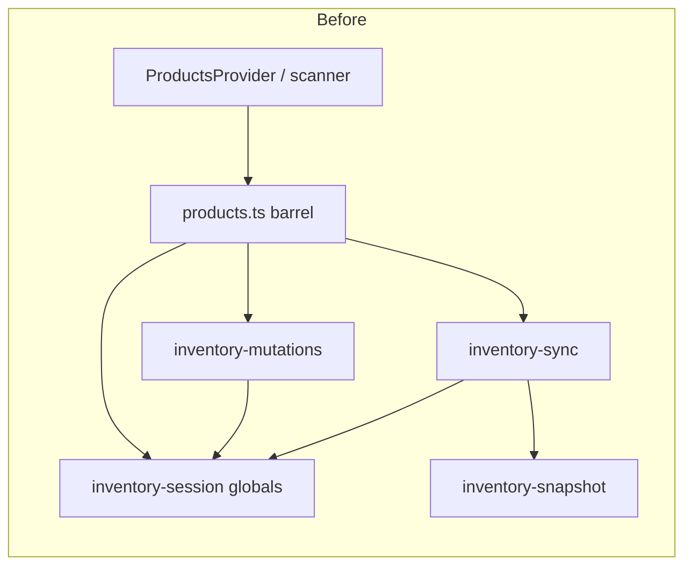

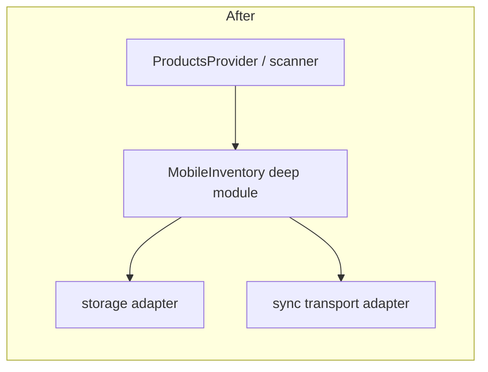

---

## 2. Deepen product scan session; stop testing phase helpers in isolation

| | |
| --- | --- |
| **Strength** | Strong |
| **Dependency** | mock |
| **Files** | `scan-phase.ts`, `use-scan-session.ts`, `test/scan-phase.test.ts`, `scan-review-sheet.tsx`, `app/(app)/products/scan.tsx`, `use-batch-writes.ts`, `batch-mutation-target.ts` |

**Problem.** Pure `scan-phase` helpers and `batchMutationTarget` fail the deletion test as pass-throughs; orchestration and pending state live in the hook. Locality of bugs is elsewhere.

**Solution.** Deep scan-session module: capture → review → save. Vision inference injected as a mockable adapter; fold target helpers into the session/write path.

**Benefits.** Phase and save races co-located; UI becomes thin; tests drive session outcomes, not helper files.

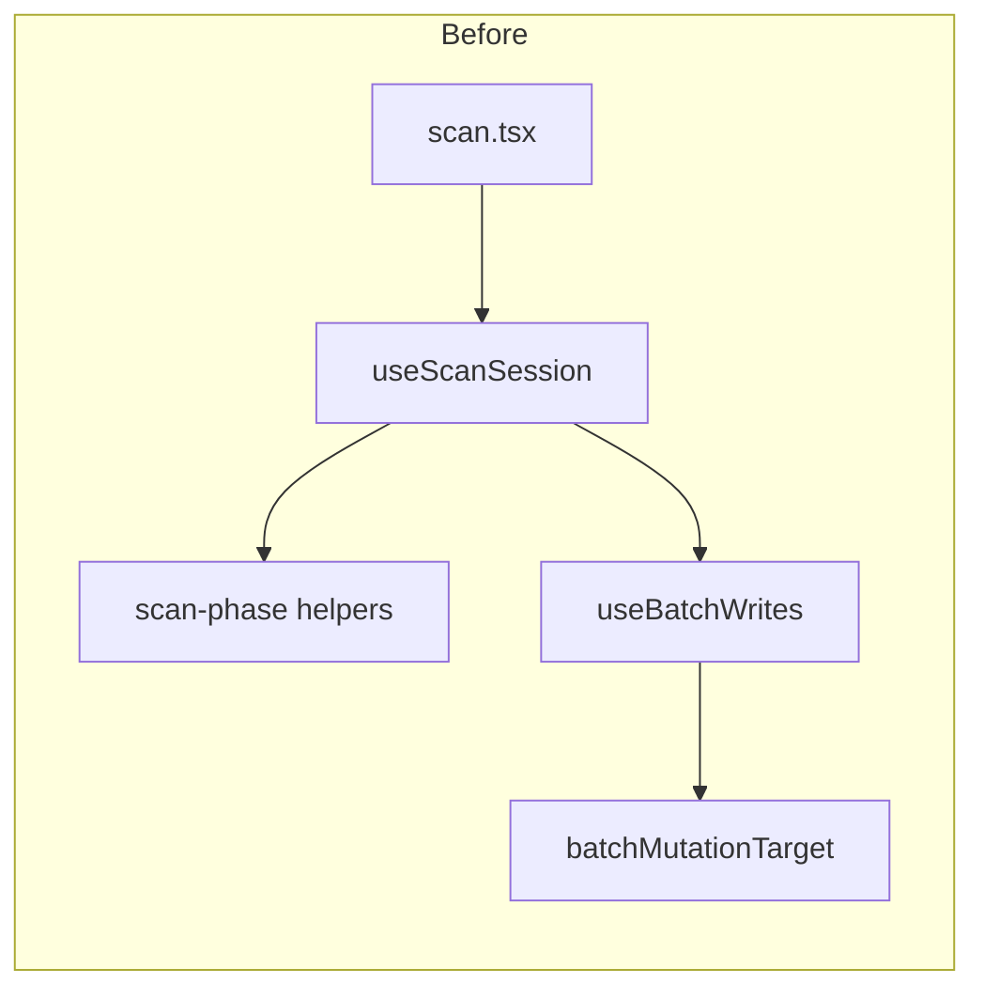

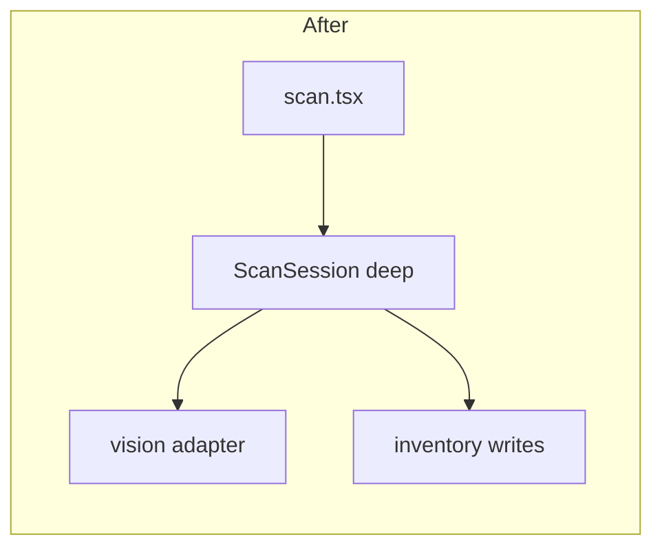

---

## 3. Keep auth ops as private implementation of AuthService

| | |
| --- | --- |
| **Strength** | Worth exploring |
| **Dependency** | local-substitutable |
| **Files** | `apps/auth/src/service.ts`, `login.ts`, `session-ops.ts`, `organization-ops.ts`, `google-identity.ts`, `crypto.ts`, `errors.ts`, `http.ts` |

**Problem.** `AuthService` is a thin wiring facade; four `make*Ops` factories are only used by `service.ts` but look like public seams. Callers already have `AuthServiceApi`.

**Solution.** Treat ops/crypto as private implementation of the AuthService layer. Test at `AuthService`; don't advertise ops interfaces.

**Benefits.** One place to learn auth-worker behaviour; leverage of a single interface; replace-don't-layer tests with D1/KV stand-ins.

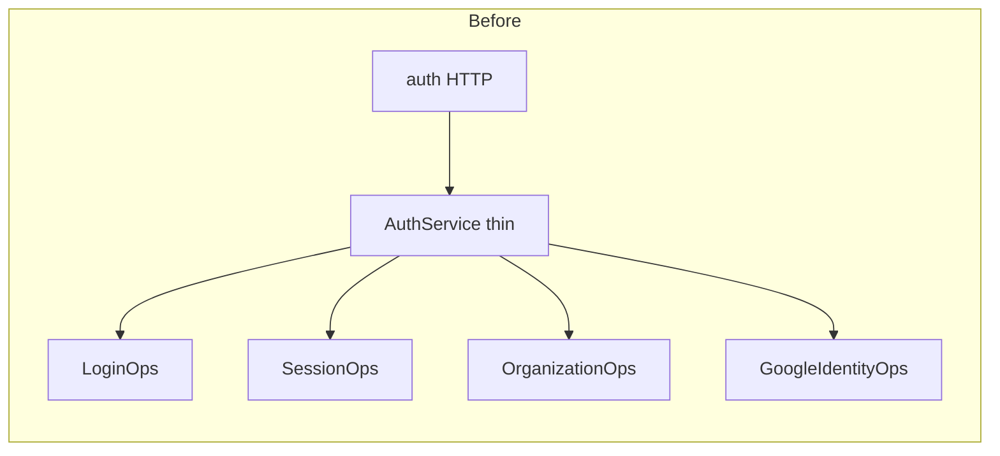

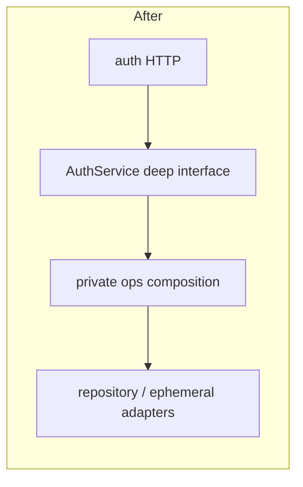

---

## 4. Deepen shared authenticated-workspace session broker

| | |
| --- | --- |
| **Strength** | Worth exploring |
| **Dependency** | ports & adapters |
| **Files** | `packages/workspace/src/session-http.ts`, `workspace.ts`, `apps/web/src/auth.ts`, `apps/desktop/electron/auth.ts`, `packages/workspace/test/session-http.test.ts` |

**Problem.** `SessionHttpClient` deepened HTTP well, but web and desktop brokers still duplicate snapshot refresh/error/publish logic beside host-specific refresh and persistence.

**Solution.** Shared session-broker module owns ensure-fresh → session fetch → publish. Hosts inject TokenStore, fetch, refresh policy, and optional persistence adapters.

**Benefits.** Session rules change once; thinner host adapters; tests on the shared broker with fake fetch.

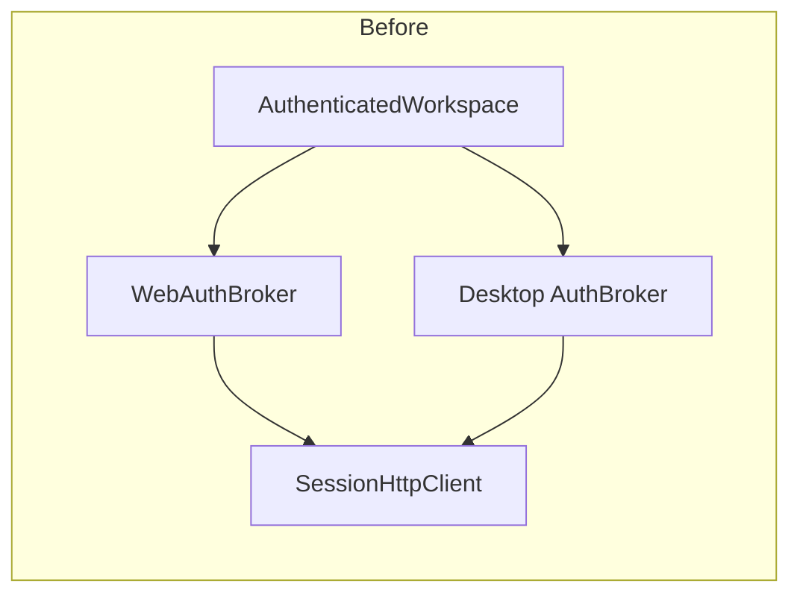

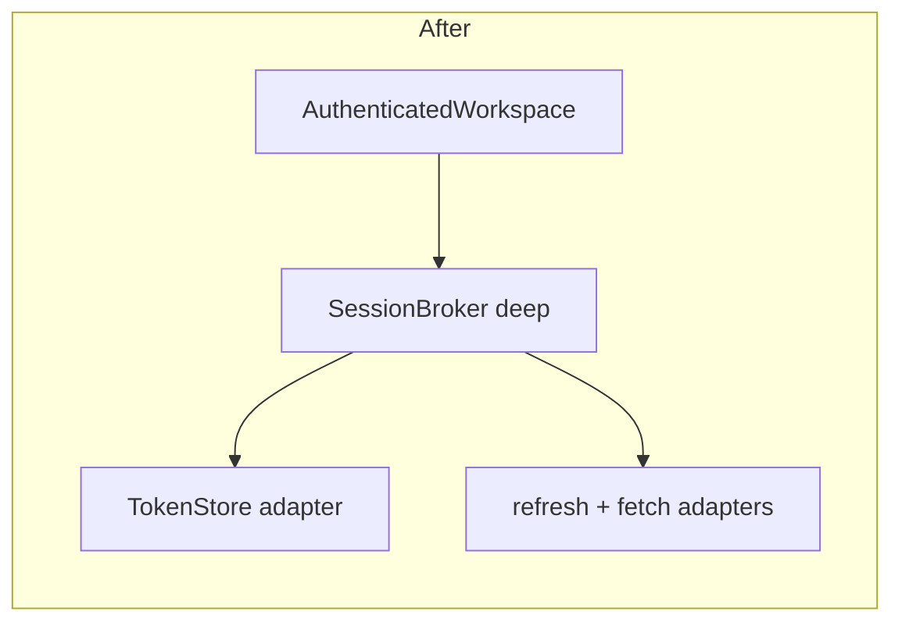

---

## 5. Separate auth HTTP transport concerns from AuthService

| | |
| --- | --- |
| **Strength** | Worth exploring |
| **Dependency** | ports & adapters |
| **Files** | `apps/auth/src/http.ts`, `apps/auth/src/service.ts` |

**Problem.** Routes interleave JSON/cookies/origins with AuthService calls; transport policy and domain logic share one module.

**Solution.** Auth HTTP transport maps HTTP ↔ AuthService commands/results; cookie vs bearer stay at that seam only.

**Benefits.** Cookie/origin locality; AuthService testable without HTTP; fake AuthService for transport tests.

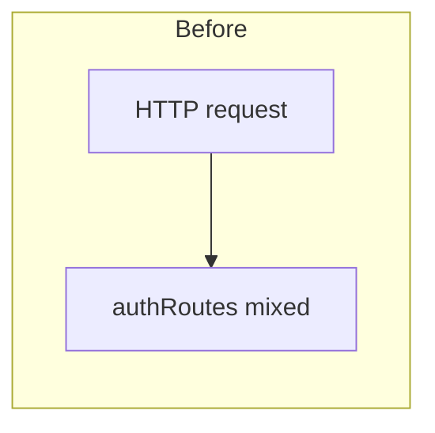

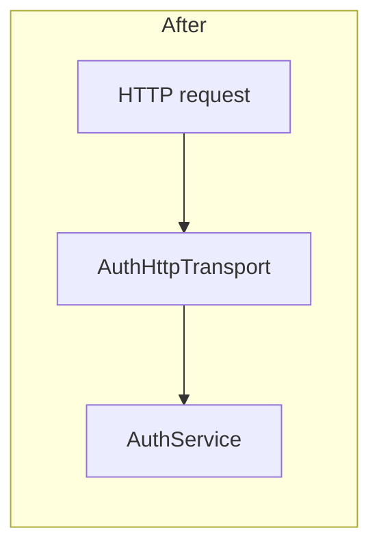

---

## 6. Align dual AuthenticatedWorkspace names with domain language

| | |
| --- | --- |
| **Strength** | Worth exploring |
| **Dependency** | in-process |
| **Files** | `packages/workspace/src/workspace.ts`, `packages/persistence/src/config.ts`, `core.ts`, `index.ts`, `CONTEXT.md` |

**Problem.** Same name for workspace activation and persistence Effect scope — seam leakage by naming, not by types alone.

**Solution.** Distinct names for activation vs store scope; update `CONTEXT.md` so authenticated workspace maps clearly to both roles.

**Benefits.** Navigability/locality of concepts; fewer cross-package mis-imports; mechanical rename.

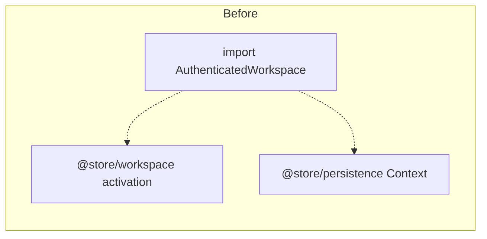

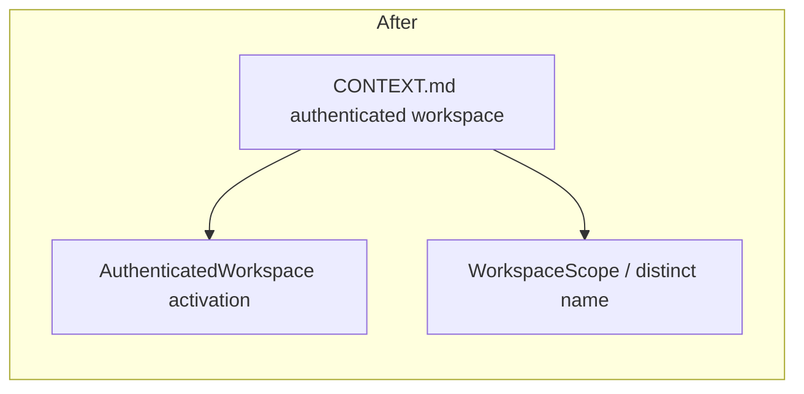

---

## 7. Revisit BatchStore extraction from ProductStore

| | |
| --- | --- |
| **Strength** | Speculative |
| **Dependency** | local-substitutable |
| **Files** | `packages/persistence/src/inventory/batch-store.ts`, `product-store.ts`, `service.ts` |

**Problem.** Single caller, `ProductStore extends BatchStore` — hypothetical seam (one adapter). Deletion mostly moves code back into product-store.

**Solution.** Fold back into one inventory implementation, or only keep BatchStore if a second adapter appears. Don't grow exported quantity-helper test surfaces.

**Benefits.** Avoid shallow internal interfaces; keep OfflineStore as the test surface.

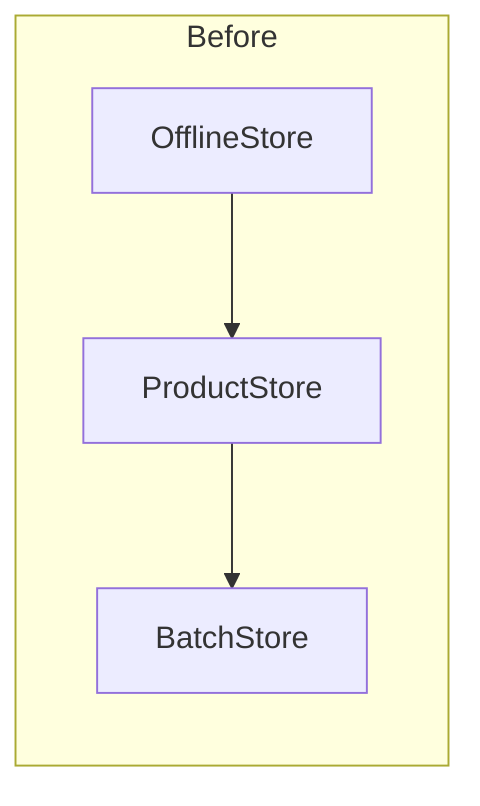

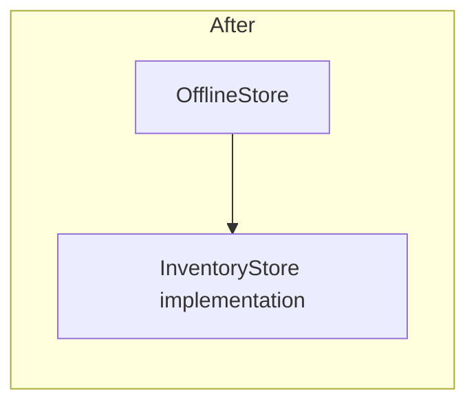

---

## 8. Leave openSyncSocket as a thin shared helper (do not deepen further)

| | |
| --- | --- |
| **Strength** | Speculative |
| **Dependency** | ports & adapters |
| **Files** | `packages/sync-client/src/open.ts`, `apps/web/src/sync-socket.ts`, `apps/mobile/src/lib/sync-socket.ts`, `apps/desktop/electron/sync-socket.ts` |

**Problem.** `openSyncSocket` is intentionally shallow; deletion does not concentrate complexity. Hosts are already correct thin adapters.

**Solution.** Do not thicken this module. Deepen `SyncSocketSession` only if reconnect/protocol needs grow.

**Benefits.** Avoids false depth; keeps the real seam at session/protocol and host `connect`.

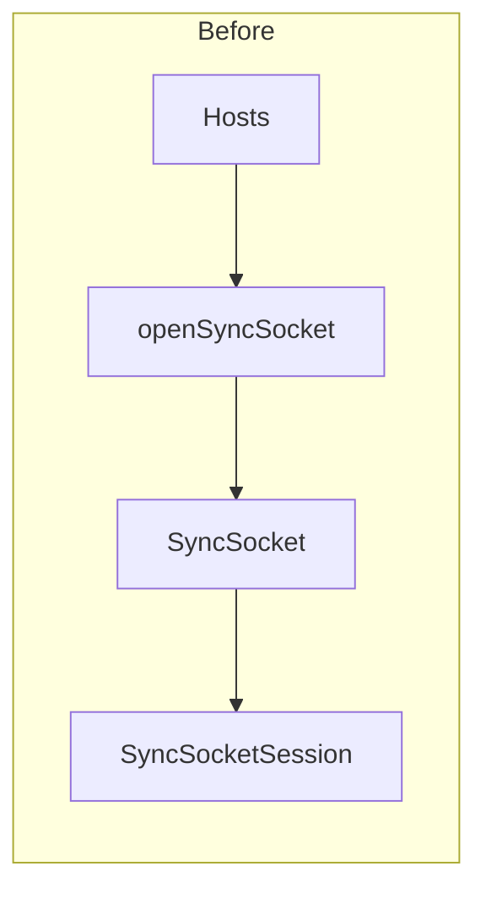

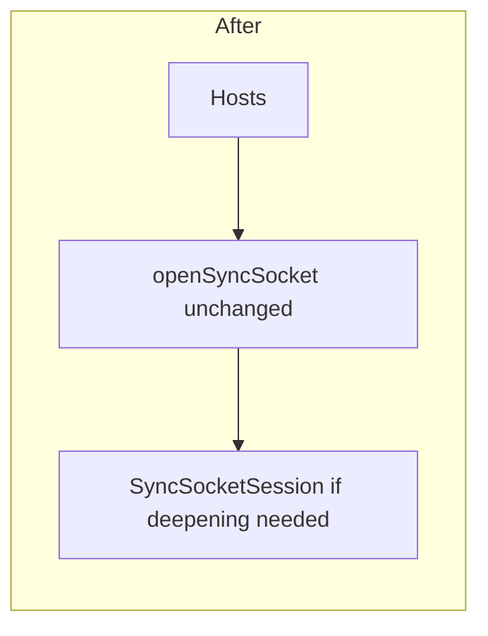

---

## Out of scope this pass

- **HostAccessPolicy** — already synthesized under `.architect/auth-wall`; implementation in flight.
- **Update workflow** — `updater-workflow` + provider adapter already deep enough relative to recent churn.
