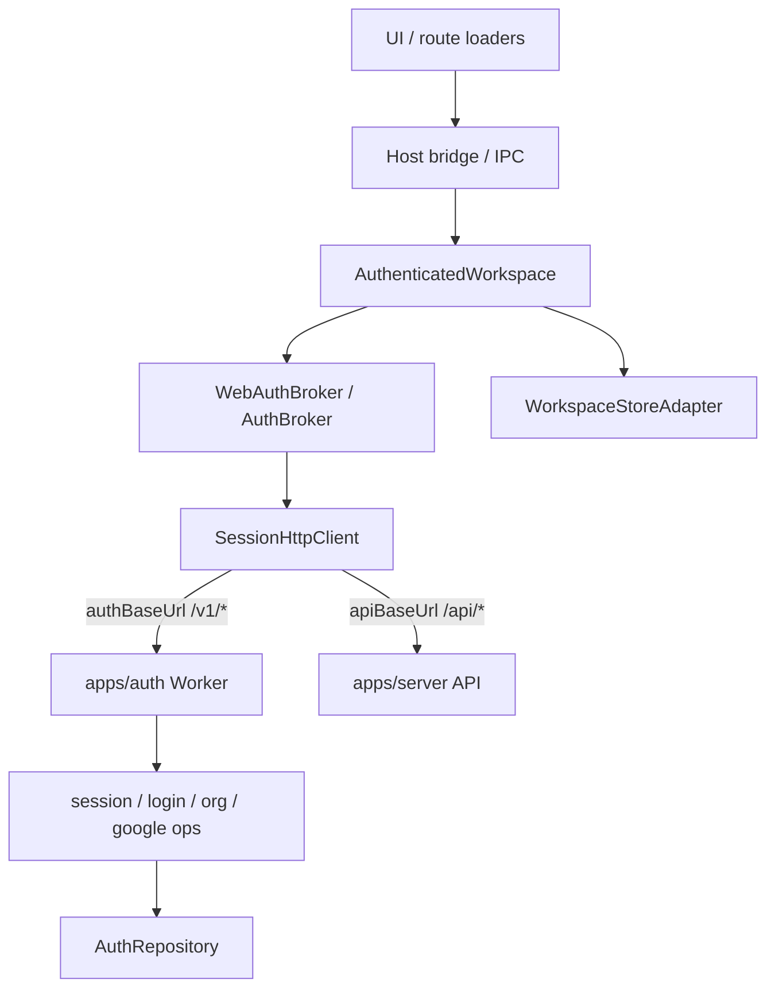

# How-critique: authenticated workspace + session HTTP + auth hosts

**Scope:** How the signed-in workspace path works after recent refactors, then
architectural critique. No implementation in this pass.

**Evidence:** Direct reads of the listed sources + three parallel explorations
(workspace/`SessionHttpClient`, host brokers, auth service/ops/repository).
Multi-model critic fan-out was unavailable (usage limits); lead judgment below
is from code + explorer findings, aligned with `.architect/deepen/candidates.md`
§3–4 and `subtract.md`.

**Line counts (approx):** `AuthRepository` 917 · `organization-ops` 362 ·
`AuthenticatedWorkspace` 241 · `SessionHttpClient` 209 · `session-ops` 209 ·
desktop `AuthBroker` 202 · `login` 158 · web `WebAuthBroker` 144 ·
`AuthService` 108.

---

## How it works now

### Overview

Web and desktop share one **activation orchestrator**
(`AuthenticatedWorkspace` in `@store/workspace`) and one **bearer JSON client**
(`SessionHttpClient`). Hosts still own the hard platform differences:
cookie-session refresh vs refresh-token rotation, Electron `net.fetch` +
`safeStorage`, and how snapshots reach the UI.

The auth worker (`apps/auth`) is a thin Effect façade over ops modules. Domain
logic lives in `session-ops` / `login` / `organization-ops` / `google-identity`.
**`AuthRepository` remains a ~917-line D1 persistence module** (~25 methods).
Mobile does **not** use this workspace package.

There is no `createAuthenticatedWorkspace` factory. Hosts construct
`new AuthenticatedWorkspace({ auth, stores, events, deviceId })`.

### Key concepts

| Concept | Role |
| --- | --- |
| **`AuthenticatedWorkspace`** | Serializes session commands; opens Locked vs Authenticated local store; publishes `WorkspaceSnapshot` / sync status. |
| **`WorkspaceAuthAdapter`** | Host contract: `snapshot`, `initialize`, `adoptSession`, `renewSession`, `signOut`, `apiRequest`, `authRequest`. |
| **`SessionHttpClient`** | Shared HTTP: dual bases (API vs auth), bearer injection, body serialize, `RequestError` parsing, refresh coalescing. Hosts inject `fetch`, `TokenStore`, `needsRefresh`, `refreshSession`. |
| **`WebAuthBroker` / `AuthBroker`** | Host adapters. Web: cookie refresh (`credentials: "include"`). Desktop: refresh-token body + `safeStorage` + `electron-origin`. |
| **`AuthService`** | Worker façade: wires ops, maps infra errors. No business logic. |
| **Ops modules** | Use-cases: session lifecycle, login, org roster/commands, Google OAuth. |
| **`AuthRepository`** | D1/Drizzle persistence + batch/compensating-delete concurrency. |

**Name collision:** `@store/persistence` also exports `AuthenticatedWorkspace`
(Effect Context for org/user/device scope). Unrelated to the workspace class.

### Layered flow



**Cold start.** Host builds broker + `AuthenticatedWorkspace` → `initialize()` →
`auth.initialize()` → `#activate(snapshot)` → publish. Web forces cookie refresh
then `GET /api/auth/session`. Desktop loads encrypted session from disk, may
rotate tokens, often returns offline snapshot first.

**Adopt / renew / sign-out.** Bridge/IPC → `workspace.execute(...)`. Adopt sets
tokens then fetches session snapshot. Renew forces access refresh so JWT claims
(org name / active org) update after rename or invite redeem. Sign-out awaits
in-flight refresh, clears tokens, host-specific logout, activates Locked.

**HTTP.** `SessionHttpClient` always uses `credentials: "omit"` + Bearer. Web
refresh/logout are **separate** `fetch` calls with cookies. Desktop refresh/
logout send refresh-token bodies via `net.fetch`.

**Org HTTP (not extracted).** Identical hand-rolls in `apps/web/src/host.ts` and
desktop `main.ts` IPC: `workspace.authRequest("/v1/organization")` (+ POST) with
Schema decode. Not on the brokers.

**Auth worker.** `http.ts` → `AuthService` (error wrap only) → ops factories →
`AuthRepository` / ephemeral / passwords / Google / access tokens. `service.ts`
(~108 lines) is a thin façade: yes.

### Where things live

| Area | Path |
| --- | --- |
| Orchestrator + adapter types | `packages/workspace/src/workspace.ts` |
| Shared session HTTP | `packages/workspace/src/session-http.ts` |
| Web adapter + bridge | `apps/web/src/auth.ts`, `apps/web/src/host.ts` |
| Desktop adapter + IPC | `apps/desktop/electron/auth.ts`, `main.ts`, `preload.ts` |
| Auth façade | `apps/auth/src/service.ts` |
| Ops | `session-ops.ts`, `login.ts`, `organization-ops.ts`, `google-identity.ts` |
| Persistence | `apps/auth/src/repository.ts` |
| HTTP entry | `apps/auth/src/http.ts` |

### Gotchas

1. Broker `onChange` / `#listeners` have **no callers**; UI listens to workspace
   `events` only.
2. Refresh failure is asymmetric: web `#refreshViaCookie` returns `null`;
   desktop `#rotateTokens` **throws** `RequestError`. Offline messaging differs
   (`workspaceError` vs silent offline).
3. `SessionHttpClient` extracted plumbing; brokers still mirror
   initialize / adopt / renew / `refresh` / signOut / `#publish`.
4. Desktop `electron-env.d.ts` drifts from preload (`renewSession`, org APIs,
   `TokenSet` typing).
5. Ops still use `Effect.fn("AuthService.*")` span names.
6. Product policy “new user gets personal org + owner” still lives inside
   `createPasswordUser` / `createGoogleUser` in the repository.

---

## Critique

### Verdict

The **right seams exist** (`WorkspaceAuthAdapter`, `SessionHttpClient` injects,
`AuthService` ↔ ops ↔ repository). The recent extract deepened the HTTP layer
well, but stopped one layer short: **session snapshot state machine** and
**org client decode** still duplicate across hosts. On the worker side, the ops
split is real (not cosmetic); the repository is fat but mostly honest
persistence — “god module” is size, not missing domain extraction.

Biggest risk is **shallow leftover modules**: two brokers that look like thin
adapters but still own ~80% of the same logic, plus two host bridges that
reinvent the same org HTTP. That is unfinished deepening, not a wrong
orchestrator.

---

### Findings (severity)

#### 1. [structural] SessionHttpClient was the right extract, wrong stopping point

**Components:** `SessionHttpClient`, `WebAuthBroker`, `AuthBroker`

**Finding:** HTTP plumbing (bearer, coalesce, `RequestError`, dual base URL) is
shared. The behaviour that actually drifts — `refresh()` against
`/api/auth/session`, online/offline/`workspaceError` mapping, adopt/renew
ordering — remains copy-pasted. Deletion test: delete either broker’s
`refresh()` and the other still has the full state machine; delete
`SessionHttpClient` and both brokers would re-grow identical HTTP code. The
HTTP module is deep; the brokers are still shallow twins.

**Evidence:** Near-identical `refresh()` / `adoptSession` / `renewSession` /
`#publish` in `apps/web/src/auth.ts` and `apps/desktop/electron/auth.ts`. Host
deltas that belong at a seam: cookie vs RT refresh, `safeStorage`,
`electron-origin`, `net.fetch`.

**Impact:** Session UX bugs (error strings, 401 clear, offline flag) get fixed
twice or only once. Next auth change (claims shape, renew after invite) touches
two apps. Matches deepen candidate §4.

#### 2. [structural] Org HTTP seam sits on the wrong side of the adapter

**Components:** `host.ts` bridge, desktop `registerAuthIpc`,
`WorkspaceAuthAdapter.authRequest`

**Finding:** Adapters already expose `authRequest`. Roster/organize only need
pathname + Schema decode, yet both hosts hand-roll the same two calls. That is
a second copy of a client that should live once (shared helper or adapter
methods), not in bridge/IPC glue.

**Evidence:**

```ts
// apps/web/src/host.ts — organizationRoster / organize
await workspace.authRequest("/v1/organization")
await workspace.authRequest("/v1/organization", { method: "POST", body: command })

// apps/desktop/electron/main.ts — auth:organization / auth:organize
// identical authRequest + Schema.decodeUnknownSync
```

**Impact:** Org contract drift between web and desktop; IPC and web bridge stay
fat; every new org command gets duplicated. Low cost to fix relative to impact.

#### 3. [concern] `refreshSession` contract is dishonest across hosts

**Components:** `SessionHttpClientOptions.refreshSession`, web vs desktop refresh

**Finding:** The shared client treats `refreshSession` as
`() => Promise<TokenSet | null>`. Web returns `null` on failure; desktop throws.
Callers of `ensureFreshAccess` therefore cannot rely on one error model.
`refreshTokenNeedsRefresh` also ignores `force`, so desktop `renewSession` bypasses
the gate and calls `#rotateTokens` directly.

**Evidence:** `WebAuthBroker.#refreshViaCookie` (null on non-OK);
`AuthBroker.#rotateTokens` (throws `RequestError`);
`renewSession` on desktop vs `ensureFreshAccess(true)` on web.

**Impact:** Hard to deepen a shared session broker until the inject contract is
one behaviour. Tests for `SessionHttpClient` cannot assert a single failure
path.

#### 4. [concern] Dead broker event surface

**Components:** `WebAuthBroker.onChange`, `AuthBroker.onChange`

**Finding:** Listener sets publish on every `#publish`, but nothing registers.
UI truth is `AuthenticatedWorkspace` → host `events.publishSnapshot`. Vestigial
API from pre-workspace-event wiring.

**Evidence:** Grep finds no `.onChange(` callers under `apps/`.

**Impact:** Misleading interface; suggests dual snapshot buses (already a theme
in `subtract.md` for sync events). Delete, don’t wire.

#### 5. [concern] AuthRepository size without a wrong seam

**Components:** `apps/auth/src/repository.ts` (~917 lines), ops modules,
`AuthService`

**Finding:** Calling this a “god module” is half-right. Domain policy (rate
limits, role gates, refresh reuse, OAuth merge) **has** moved to ops. What
remains is one D1 surface: users, memberships, invitations, sessions, plus
batch helpers and race protocols (`false` / compensatory delete). That is a
fat persistence adapter, not an unsplit service. The real layering smell is
**product policy** still inside `createPasswordUser` / `createGoogleUser`
(auto personal org + owner membership), while invite/role policy lives in
`OrganizationOps`.

**Evidence:** `AuthRepositoryApi` ~25 methods; ops call repositories; HTTP never
imports repository; `service.ts` only wires.

**Impact:** File size hurts navigation/merge conflict risk. Splitting by entity
without a caller need is low leverage. Moving “starting org” policy up into
login/google ops would clarify the ops/repository seam more than file surgery.

#### 6. [observation] AuthService façade is correctly thin — don’t “fix” it by growing it

**Components:** `service.ts`, ops factories

**Finding:** ~108 lines of dependency yield + `handle()` is the right shape for
Effect Layer composition. Ops are real modules, not cosmetic renames. Risk is
regressing by putting logic back into `AuthService`, or by advertising four ops
interfaces as public seams when HTTP only needs `AuthServiceApi`.

**Impact:** Aligns with deepen candidate §3 and `subtract.md` (“do not re-grow
a façade”).

#### 7. [observation] Host typing drift and span names

**Components:** `electron-env.d.ts`, `Effect.fn("AuthService.*")` in ops

**Finding:** Preload exposes APIs the ambient types omit/mis-type. Tracing spans
lie about module ownership after the ops split.

**Impact:** Tooling/TS friction; observability confusion. Cheap, not structural.

#### 8. [observation] Two `AuthenticatedWorkspace` names

**Components:** `@store/workspace` class vs `@store/persistence` Effect service

**Finding:** Easy wrong import; unrelated concepts share a name.

**Impact:** Onboarding tax. Rename is disruptive; alias/docs may be enough until
a persistence rename wave.

---

## Lead judgment

Categories match the ask: **Act on now** / **Later** / **Reject**.

### Act on now

| Item | Why now |
| --- | --- |
| **Shared org client helper** (or `organizationRoster` / `organize` on a small shared module used by web bridge + desktop IPC) | Two identical call sites already; tiny extract; stops drift; no platform fork. |
| **Delete broker `onChange` / `#listeners`** | Dead surface; clarifies that workspace events are the only fanout. |
| **Normalize `refreshSession` failure contract** (pick null-*or*-throw for both hosts; make `force` meaningful for RT hosts or stop advertising it) | Unblocks the next deepen of session broker; fixes dishonest inject API on `SessionHttpClient`. |
| **Align session error publishing** (at least decide: web’s `workspaceError` vs desktop silent offline — pick one policy and apply in both `refresh()` paths) | Same user-visible state machine; currently forks without a documented reason. |
| **Fix `electron-env.d.ts` to match preload** | Prevents false confidence in host APIs; part of making the adapter seam honest. |

**Preferred next deepen (not “extract more HTTP”):** shared **session broker**
that owns ensure-fresh → `GET /api/auth/session` → snapshot publish/error
mapping; hosts inject refresh + persistence only. That is candidates §4. Do
not start that until the refresh failure contract is one behaviour.

### Later

| Item | Why wait |
| --- | --- |
| **Deep shared session broker module** | Right direction; needs Act-on contract fixes first; larger than org helper. |
| **Treat ops as private implementation of `AuthService`** (candidates §3) | Clarifies public seam; no runtime bug; do when touching auth tests/exports. |
| **Lift “personal org on signup” out of repository into login/google ops** | Improves policy locality; touches signup paths carefully. |
| **Split `AuthRepository` by entity** (users / sessions / orgs) | Only if merge pain or test isolation demands it — size alone is insufficient. |
| **Auth HTTP transport vs `AuthService` separation** (candidates §5) | Real but orthogonal; cookie/CORS already concentrated in `http.ts`. |
| **Rename persistence `AuthenticatedWorkspace`** | Nice; high churn for low daily pain. |
| **Desktop initialize always revalidates `/api/auth/session`** | May be intentional offline-first; change only with product intent. |
| **Sync socket `ensureFreshAccess` before connect** | Separate reliability concern; not part of this refactor’s leftover seam. |

### Reject

| Proposal | Why reject |
| --- | --- |
| **Put cookie refresh inside `SessionHttpClient`** | Cookie vs bearer/`credentials: "omit"` is the intentional platform seam. Forcing cookies into the shared client couples Electron to browser session semantics. |
| **Collapse `AuthenticatedWorkspace` into the auth brokers** | Orchestrator correctly owns store open/sync-before-publish and command serialization. Auth adapters should not open OfflineStores. |
| **Eliminate `AuthService` / call ops from HTTP** | Breaks Effect Layer composition and the single error-mapping boundary; façade is earning its keep as wiring. |
| **Split repository “because 900 lines” without a second caller need** | Persistence is already the right module kind; mechanical file splits without interface change add shallow modules. |
| **Force mobile onto `@store/workspace` AuthenticatedWorkspace in this wave** | Mobile has a separate inventory/session stack; unification is a product/architecture project, not a cleanup of the SessionHttpClient extract. |
| **Re-introduce broker `onChange` as a second UI bus** | One snapshot fanout (workspace events) is enough; dual buses were already a subtract target elsewhere. |
| **Grow `AuthService` with domain logic again** | Undoes the ops split; `subtract.md` already warns against this. |

---

## Sound / preserve

Keep these; critique is about unfinished depth, not wrong pillars:

1. **`WorkspaceAuthAdapter` + host-injected refresh** — real two-adapter seam
   (cookie vs RT).
2. **`SessionHttpClient` as shared bearer/coalesce layer** — correct depth for
   HTTP; finish the *next* layer, don’t undo this one.
3. **`AuthenticatedWorkspace` store activation** (sync-before-publish, Locked
   recover, command serialize) — core product invariant for “one active org
   workspace.”
4. **Auth HTTP → AuthService only; ops own domain; repository owns D1** —
   post-split layering is sound.
5. **Bearer omit + host-owned cookie refresh/logout on web** — security/
   platform boundary, not accidental duplication.

---

## Suggested order of work (when implementing)

1. Delete dead `onChange`; fix desktop ambient types; unify refresh failure +
   session error policy.
2. Extract shared org roster/organize client used by web + desktop IPC.
3. Deepen shared session broker behind `WorkspaceAuthAdapter` (hosts shrink to
   refresh + persistence adapters).
4. Only then consider repository policy lifts / AuthService privacy / entity
   file splits.

Do not implement in this document’s pass.
