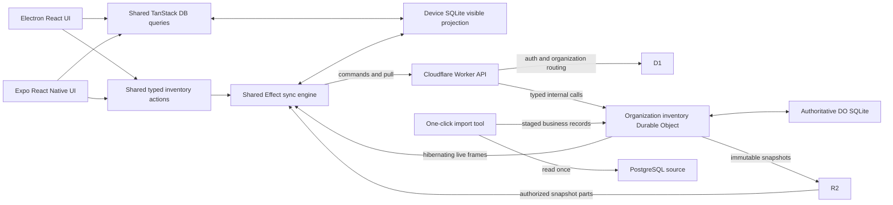

# Cloudflare inventory, Expo, and offline sync implementation plan

Status: proposed implementation. Updated 2026-09-15 for Cloudflare storage, Expo, and a one-click PostgreSQL import. This document replaces the previous PostgreSQL-authoritative design.

Revised 2026-09-16 against four comparable systems and the replication literature. LiveStore, Electric, PowerSync, Replicache with Zero, and Linear's engine were each studied for what to adopt and what to refuse, alongside the invariant-confluence and CALM results. The central choice, an authoritative command executed in one serializable transaction, was confirmed from three independent directions and is unchanged. What changed is the surrounding protocol: overlays are reservations rather than asserted quantities, a published snapshot may lag head, replicas carry a state digest so divergence behind a plausible cursor is detectable, the authority declares its incarnation so a restore is not silently misread, one command is in flight per replica so the gap check means what it says, live frames are held while a catch-up hole is open, a deterministically failing command reaches a terminal decision, and receipt retention has a closed compaction scheme. Each of those is stated where it belongs below. The research notes and the design synthesis behind this revision are recorded in the agent store rather than here.

## 1. Target architecture

Use **one SQLite-backed Durable Object per organization as the inventory authority**. Keep authentication, membership, and organization routing metadata in D1. Electron and Expo share the TypeScript command contracts, Effect sync engine, and TanStack DB query layer. Each device persists its replica and pending commands in local SQLite.

PostgreSQL is the source for a one-time import. The finished application has no PostgreSQL, Neon, Hyperdrive, or PowerSync dependency. Expo replaces the native Kotlin application. New clients start with fresh databases seeded from the imported Cloudflare data.

The release uses a clean replacement: one new protocol and one supported data path. Remove old client compatibility, PowerSync queue translation, legacy receipt handling, dual writes, shadow replication, and stale-cache migration from implementation scope. The importer copies committed business records from PostgreSQL; it does not import device caches or old sync bookkeeping. Historical invoices, movements, and audit fields remain business data and are included in the import.

### Why an authoritative command, and what that costs

A coordination-free replicated type cannot decide which of two concurrent last-unit sales wins. The accurate statement of the constraint is narrower than "CRDTs cannot count": a bounded counter is a perfectly good replicated type and does preserve a floor, but it does so by partitioning decrement rights in advance, and when only one unit remains there is exactly one right to hold. Either a replica already owns it, or acquiring it is coordination. Operational transformation has the same problem from the other side: transforming two "sell the last unit" operations either applies both and goes negative, or drops one, which is a server veto wearing a different hat.

This is the invariant-confluence result. Coordination-freedom, transactional availability, and convergence are simultaneously achievable exactly when the invariant is I-confluent, and a numeric floor under concurrent decrements is the canonical case that is not. Unique dense invoice numbers are likewise not I-confluent, which is why the authority allocates them; had uniqueness alone been sufficient, client-generated identifiers from disjoint namespaces would have been I-confluent and cheaper. A sale that reads a batch while another actor may delete it is also not I-confluent, which is why the read, the decision, and the writes share one transaction.

Sources: Bailis et al. on invariant confluence, the CALM result on monotonicity, Shapiro et al. on strong eventual consistency being incomparable to serializability, Balegas et al. stating plainly that enforcing a stock limit on eventually consistent counters is impossible without bounded counters, and O'Neil's escrow method as the pre-CRDT form of the same idea.

Three published engines were reviewed against this design and none of them can enforce the stock invariant without an authoritative command: Electric and PowerSync both replicate rows and leave writes to the application, and LiveStore's own maintainers wrote the proposal that says so, listing an architecture like this one as the alternative they declined on scope grounds rather than on correctness. Replicache is the closest published relative of this protocol, and Jepsen's review of it notes that the one capability it never exposed was a serializable transaction, achievable only by blocking for server acknowledgement. That is precisely what this design's synchronous single-writer command provides, so this is the specific extension that protocol family lacks rather than a reinvention of it.

### What the single writer costs

One serializable writer per organization bounds command throughput at roughly the reciprocal of the command transaction duration for that organization. Measure that duration directly and treat it as the capacity number; do not infer capacity from Worker request rates. Organizations do not contend with each other.

The object commits, serves pull, exports snapshots, and fans out live frames. Storing a change log and serving one are different problems, and the published experience of engines that grew past this point is that serving gets separated from writing. That separation is not required at this scale and is deliberately out of scope, but record the exit: the change log can be shipped to an object index for serving while SQLite remains the sole writer, and pull CPU on the object is the signal to take it.

### D1 versus Durable Object SQLite

| Design                                                           | What it provides                                                                                                     | Decision                                                                                                           |
| ---------------------------------------------------------------- | -------------------------------------------------------------------------------------------------------------------- | ------------------------------------------------------------------------------------------------------------------ |
| D1 owns inventory; a DO owns live delivery                       | Central SQL access and D1 read replication; inventory commits and delivery coordination span two services            | Viable alternative, but adds an event handoff and makes application-driven read/validate/write transactions harder |
| One DO owns an organization's SQLite inventory and live delivery | Local stock checks, atomic receipts/log writes, per-organization ordering, and hibernating sockets in the same owner | Selected                                                                                                           |
| Both D1 and a DO own mutable inventory                           | Two copies that must agree on stock and command outcomes                                                             | Excluded                                                                                                           |

D1 supports atomic batches of prepared statements. It must not be described as lacking transactions. Its batch API takes a prepared sequence; it does not provide an arbitrary JavaScript read/branch/write callback inside that batch. The existing invoice allocator is a better fit for the DO's local transactional database. This is an application design choice. [D1 database API](https://developers.cloudflare.com/d1/worker-api/d1-database/#batch), [DO SQLite transactions](https://developers.cloudflare.com/durable-objects/api/sqlite-storage-api/).

D1 owns users, sessions, memberships, organization profiles, and the active inventory object identity. The DO owns inventory policies and numbering, products, categories, batches, invoices, invoice items, stock movements, command decisions, replication history, and inventory snapshots. Settings that affect a stock transaction live with that transaction's data. R2 stores immutable export/snapshot parts and existing binary assets. A future cross-organization report can use a derived reporting store without becoming an inventory writer.

Organization-local transactions are the operating boundary. A sale cannot atomically spend stock from two organizations. Measure the largest organization's storage and command rate before implementation. Current documented storage caps are 10 GB per DO on Workers Paid and 1 GB on Free; D1 is also bounded per database. Reserve capacity for logs, indexes, and snapshot staging. Do not adopt unlimited retention or automatic sharding as unstated assumptions. [DO limits](https://developers.cloudflare.com/durable-objects/platform/limits/), [D1 limits](https://developers.cloudflare.com/d1/platform/limits/).

## 2. Latest Effect, Alchemy, and Drizzle

Resolve releases again when Phase 0 begins, then pin exact versions across the workspace. Use the newest Effect v4 release candidate, Alchemy v2, and Drizzle v1 release candidate. Generic npm `latest` currently selects older stable major versions for Effect and Drizzle.

Registry results checked on September 15:

| Dependency                           | Target candidate                                               | Required verification                                                       |
| ------------------------------------ | -------------------------------------------------------------- | --------------------------------------------------------------------------- |
| Effect and used `@effect/*` packages | `4.0.0-rc.115`                                                 | Align the core, SQL adapters, platform packages, and test adapters          |
| Alchemy                              | `2.0.0-beta.77`                                                | Init/event lifetimes, resource discovery, D1, DOs, SQL bundling, and alarms |
| Drizzle ORM and Kit                  | `1.0.0-rc.5-5935859`, newest published RC build found for both | Match ORM and Kit; test DO, D1, and Expo drivers and generated migrations   |
| Expo                                 | SDK 57, `expo@57.0.22`                                         | Resolve Expo-compatible React Native, React, and native modules together    |
| Expo SQLite                          | `57.0.3`                                                       | Install through Expo's version-aware installer; verify on Android and iOS   |

Alchemy beta.77 currently declares an exact peer for the older Drizzle `1.0.0-rc.5-ab785fc`. The new Drizzle candidate therefore needs explicit compatibility work. Resolve that constraint through an upstream update or a tested, narrowly scoped integration change. Do not silently keep the older Drizzle or present an unchecked peer override as compatibility evidence. The current checkout also still pins Effect RC111, below Alchemy's declared minimum RC112.

Sources: [Effect registry](https://registry.npmjs.org/effect), [Alchemy registry](https://registry.npmjs.org/alchemy), [Drizzle ORM registry](https://registry.npmjs.org/drizzle-orm), [Drizzle Kit registry](https://registry.npmjs.org/drizzle-kit), [Expo registry](https://registry.npmjs.org/expo).

Use Alchemy's Effect-native DO/D1 integrations where the chosen versions support them. Expo's `drizzle-orm/expo-sqlite` adapter is a host-specific boundary wrapped by Effect services. `@effect/sql-sqlite-react-native` currently targets `op-sqlite`; it is not an `expo-sqlite` adapter. Do not add a second native SQLite engine solely to make this boundary Effect-native.

## 3. One-click PostgreSQL import

### Operator experience

Provide one operator command, exposed by a single migration action if a UI is useful:

```text
vp run migrate:cloudflare

Check source and destination
Pause inventory writes
Export PostgreSQL business data
Import organizations into Cloudflare
Validate records and stock totals
Publish the new dataset
Report completion
```

The action runs the entire sequence and exposes progress and a migration ID. The same action resumes an interrupted run. Chunking, retries, and validation are internal implementation details; the operator does not manually copy tables or run a sequence of SQL commands.

### Source and destination contract

- Import all selected organizations from a consistent, committed PostgreSQL dataset. Preserve entity IDs, organization ownership, invoice numbers, historical stock movements, business timestamps, and actor audit information.
- Translate PostgreSQL types to explicit SQLite representations. Validate money precision, quantity units, nullable values, booleans, foreign keys, and deleted records needed by retained history. Use the current schema as the source specification, not a dump replayed blindly against SQLite.
- Start new sync epochs, replica registrations, cursors, and command receipts. Initialize row revisions consistently for the new protocol. Preserve historical operation identifiers only where they are business audit fields.
- Import into newly created, unpublished organization objects. Their state is `importing`; normal clients cannot read or write them. Reject import attempts against an already active target.
- Use a fresh local database namespace on both clients. The new application never opens PowerSync databases, the old sale journal, or Kotlin app storage.

The migration covers data committed in PostgreSQL at the export boundary. This is the agreed input dataset. There is no old-client outbox recovery feature in the new application.

### Internal workflow

1. Create a durable migration record with source identity, schema versions, selected organizations, and target object names. Run capacity, relationship, and conversion checks before pausing writes. Keep source credentials in the operator environment.
2. Put the source application into maintenance mode, reject old inventory writes, and wait for in-flight writes to finish. Include imports, jobs, and direct writers in that boundary. The source remains frozen through activation; no change-data-capture service is needed.
3. A Node/Effect migration runner reads PostgreSQL with a consistent read transaction and streams bounded, ordered chunks into private R2 objects. PostgreSQL libraries live only in this temporary operator tool. The production Worker never acquires a PostgreSQL connection.
4. Finalize an immutable export manifest containing schema/mapping versions, organization/table identities, row counts, checksums, and aggregate validation values. Import only complete manifests. An interrupted partial export can restart from the still-frozen source.
5. Call protected import methods on each target DO with bounded chunks. In one DO SQLite transaction, apply the chunk and record its manifest/chunk identity. Repeating an identical chunk is harmless; different content under the same identity is rejected. Preserve foreign-key order or use an explicit staging schema until relationships validate.
6. Validate the target against the export: per-table counts and canonical hashes, invoice totals, batch quantities, movement conservation, foreign keys, and organization ownership. Compare normalized values after the documented type mapping. Compute large validations incrementally and persist progress.
7. Mark each validated object `ready` with its immutable import identity and initial sync epoch. Produce the initial device snapshot while writes are still paused. A failed organization remains unpublished; the action reports the exact incomplete step.
8. Publish the verified organization-to-object mappings and set the D1 dataset release to `active`. Clients can reach inventory only through that active release. Pre-stage the directory rows and change one release pointer after all requested organizations are ready, so the Worker cannot route clients into a partially imported dataset.
9. New Electron and Expo clients sign in, acquire fresh replica IDs, download the initial snapshot, and start the new protocol. Retire the old inventory routes and disable the importer after completion.

D1 publication and DO preparation are separate commits. Ordering makes retries safe: prepare and verify every target first, then publish. If the runner loses the publication response, read the release record before retrying. Repeating the action after completion returns the completed migration result and never overwrites active inventory.

An object being `ready` permits the Worker to route to it only when its import identity matches the active D1 release. The Worker supplies that checked release identity through its internal call; public callers cannot supply trusted routing context. Publication does not require a second activation write to every object.

Before publication, failure leaves the old source intact and new objects private. After publication, Cloudflare receives all new writes. Keep the PostgreSQL export/source backup for the agreed retention period; source destruction is a separate operational step. There is no automatic fallback to PostgreSQL after Cloudflare accepts new commands.

## 4. Runtime and module ownership



### Main interfaces

| Module                 | Caller-facing contract                                                          | Owned behavior                                                             |
| ---------------------- | ------------------------------------------------------------------------------- | -------------------------------------------------------------------------- |
| Inventory workspace    | Submit a typed command; observe a query or command status; close workspace      | Local save, pending projection, sync lifecycle, query publication          |
| Organization inventory | Execute authorized command; pull a range; open a live session; acquire snapshot | Stock rules, transactions, receipts, ordering, replication and delivery    |
| Device storage         | Transactional local operations and bounded observable queries                   | Host SQLite connection, migrations, commit versions, query invalidation    |
| Import tool            | Start/resume one migration and read progress                                    | Source freeze/export, deterministic chunks, target validation, publication |

Example caller usage, in pseudocode:

```text
saved = await inventory.actions.issueInvoice(input)
// saved contains operationId and localCommitVersion after durable local save.
observe inventory.commandStatus(saved.operationId)
// pending -> accepted-awaiting-integration -> integrated, or rejected
```

Callers do not coordinate `enqueue`, `applyOverlay`, `upload`, and `invalidate` themselves. Domain validation and allocation remain reusable pure functions. Framework components never import Cloudflare resources or own SQL transactions.

### Proposed module map

```text
packages/contracts/src/sync/
  protocol.ts               commands, receipts, frames, cursors, limits
  api.ts                    shared public HttpApi contract
  fixtures/                 protocol and domain examples

packages/db/src/inventory/
  schema.ts                 authoritative SQLite inventory and sync tables
packages/db/src/replica/
  schema.ts                 local confirmed rows, overlays, outbox, coverage
packages/db/migrations/inventory/
packages/db/migrations/replica/

apps/server/src/inventory/
  organization.ts           Alchemy organization DO and event handlers
  commands.ts               atomic command decisions and domain operations
  log.ts                    bounded immutable log reads
  snapshots.ts              snapshot jobs, parts, and retention
  live.ts                   attachments, flow control, ticket consumption
apps/server/src/http/
  sync.ts                   authenticated routing to the organization DO

packages/sync/src/
  engine.ts                 shared Effect upload/download workflows
  commands.ts               durable local command lifecycle
  replica.ts                apply, overlay reconciliation, snapshot activation
  transport.ts              shared HTTP and live transport contract

packages/client-db/src/
  open.ts                   workspace lifetime
  queries.ts                bounded SQLite queries and projections
  collections.ts            custom TanStack DB collection adapter
  reactivity.ts             single post-commit publisher

packages/inventory-react/src/
  provider.tsx              shared workspace and DbProvider integration
  queries.ts                hooks shared by Electron and Expo

apps/desktop/               Electron host, existing UI, browser-worker SQLite
apps/mobile/                Expo app, native UI, expo-sqlite and auth adapters
scripts/migrate-cloudflare/ temporary PostgreSQL importer
```

Introduce files as behavior lands. Keep platform storage/network/lifecycle adapters in their hosts. The shared packages must not import DOM globals, Electron, Node-only modules, Cloudflare bindings, or React Native directly. Share data logic and hooks; retain platform-appropriate screen components.

The existing `apps/android` implementation supplies a feature checklist and the current application identity. It is replaced by `apps/mobile`, not ported as a second sync implementation. Preserve the Android application ID `com.tabaaq.mobile` and signing identity when replacing the existing Play application. iOS uses an explicitly configured bundle identity and auth redirect.

## 5. Alchemy resources, Effect scopes, and migrations

### Cloudflare composition

Declare the organization DO with `Cloudflare.DurableObject`, host it in the server Worker, and acquire its namespace during Worker Init. Use stable class/resource IDs and deterministic organization object names. The D1 directory selects the active object identity after import. Every object checks its stored organization identity against the internal request context.

Use typed internal methods through `getByName(...)`. Public clients use the shared HTTP/JSON protocol and authenticated WebSocket upgrade route. Keep imports for the object implementation out of binding-only consumers. [Alchemy Durable Objects](https://alchemy.run/cloudflare/compute/durable-objects/).

Resolve resources, Config, secrets, and reusable route composition during Init. Run request authorization and event-bound I/O in the event scope. Keep the current actor out of shared mutable services. The DO activation Effect opens its local database and reconstructs socket metadata; each fetch, message, and alarm performs bounded work. No permanent Effect fiber owns authoritative progress.

Alchemy's bridge gates activation with `blockConcurrencyWhile`. Keep construction limited to local schema migration and state restoration. Do not perform the PostgreSQL import, R2 export, or a whole-catalog bootstrap in the constructor. Never put `blockConcurrencyWhile` around every command.

### Migration ownership

| Storage                | Drizzle and lifecycle                                                                   |
| ---------------------- | --------------------------------------------------------------------------------------- |
| D1 auth/directory      | Existing auth schema plus directory/release metadata; Alchemy D1 migrations             |
| DO inventory           | `dialect: "sqlite"`, `driver: "durable-sqlite"`; checked-in SQL and generated bundle    |
| Expo local replica     | SQLite schema, Expo-compatible migration bundle, run before opening workspace queries   |
| Electron local replica | Same logical replica schema and migration sequence through the worker's storage adapter |

For DO activation, use `Drizzle.DurableObject({ migrations })` from `alchemy/Drizzle/Cloudflare` with the selected compatible versions. Each object applies migrations when it activates. Alchemy handles namespace/class deployment metadata separately. SQL migration files must be committed and bundled; a failed migration prevents that object from serving requests. [Alchemy Drizzle migrations](https://alchemy.run/sql/drizzle/migrations/#durable-object-migrations).

Share compatible SQLite domain column definitions where useful, but keep authoritative sync metadata and local overlay/outbox tables separate. Neither is a mirror of the old PostgreSQL table declaration. Test generated DDL, foreign keys, indexes, and type mappings against real SQLite.

### Transaction behavior to prove first

Two Drizzle SQLite drivers are relevant and only one of them belongs in the command path. Alchemy's `Drizzle.DurableObject` helper opens the Effect SQL driver, whose queries return Effects. Adopting it would mean either duplicating the stock and receipt decision or threading Effect SQL mechanics through every domain helper, which is two command implementations either way. Instead open `drizzle-orm/durable-sqlite` directly on `state.raw.storage`. That driver's database and `better-sqlite3`'s both extend `SQLiteAsyncDatabase<"sync", …>` with a synchronous transaction, so one command library runs unchanged in the object and under Node tests.

Command transactions may therefore contain synchronous local SQL and pure computation only. Fetch, sleep, async hashing, socket sends, and other suspending work belong outside. A transaction API that looks Effect-native does not make an async callback safe.

Use one database adapter and a single transaction owner. Pass the explicit transaction handle into domain helpers. Do not nest independent transaction wrappers or issue raw `BEGIN`/`SAVEPOINT` through DO SQL, which `sql.exec` refuses in any case.

Prove atomicity rather than reading it. The failure mode worth naming is not a driver that errors, it is an intermediate layer that swallows transaction control and leaves writes individually auto-committed. A published Cloudflare SQLite adapter does exactly that, suppressing `BEGIN`, `COMMIT`, `ROLLBACK`, `SAVEPOINT`, and `RELEASE` by string prefix, and its own documentation accepts the consequence that a partially failed batch leaves earlier rows behind. That trade is defensible when state is rebuildable from an append-only log and indefensible here, because a suppressed transaction does not raise: it leaves the invoice written, the stock decrement missing, and a receipt saying accepted.

The driver selected above does not have that behavior. Its session emits no transaction-control statements at all and routes `transaction` through `storage.transactionSync`, which is the supported API. That was verified by inspection of the pinned package, which is necessary but not sufficient. Phase 0 must assert the negative on real workerd: begin a command, force a failure after the first domain write, and assert that write is gone. Run the same assertion under `better-sqlite3` so a driver swap cannot silently remove it.

Record one more platform constraint. The SQLite session extension is unavailable inside a Durable Object; applying a changeset through the public storage API throws. The immutable change log must therefore carry explicit row images, which is a requirement rather than a design preference.

[Cloudflare SQLite transaction rules](https://developers.cloudflare.com/durable-objects/api/sqlite-storage-api/#transactionsync).

## 6. Authoritative organization database

### Tables and data representation

| Table group                           | Required content                                                                                 |
| ------------------------------------- | ------------------------------------------------------------------------------------------------ |
| Domain tables                         | Categories, products, batches, invoices, invoice items, stock movements                          |
| `inventory_state`                     | Organization identity, import/ready state, sync epoch, current commit sequence, retention floor  |
| `replicas`                            | Device identity, owner user, last processed client sequence                                      |
| `command_receipts`                    | Operation ID, replica/client sequence, canonical payload hash, decision, commit sequence, result |
| `transactions` and `changes`          | Ordered transaction header, scoped decision, immutable row images/removals, byte counts          |
| `delivery_state`                      | Highest pending live target and retry deadline                                                   |
| `snapshot_jobs` and snapshot metadata | Job phase, copy/repair/export position, pinned log horizon, published manifest                   |
| `consumed_tickets`                    | Single-use ticket nonce and expiry                                                               |
| Import metadata                       | Migration identity, chunk hashes, progress, validation result; read-only after activation        |

Keep tenant identity checked even inside one tenant's object. Use primary keys, uniqueness, checks, and foreign keys to enforce receipt identity and domain relationships. Index pulls by epoch/sequence/ordinal and UI-oriented lookups by their actual predicates.

Keep monetary values and quantities in documented exact representations. Use a bounded safe-integer range for counters with explicit overflow checks, or verified lossless 64-bit driver support. Encode cursors as canonical decimal strings and compare numerically. Do not store large sequences as imprecise JavaScript numbers. Entity revisions, organization commit sequences, replica command sequences, and local publication versions are distinct types.

### Atomic command algorithm

Before the transaction, the Worker authenticates and checks membership, and the DO validates the bounded command envelope, actor scope, epoch, canonical hash, and generated IDs. Collect any external evidence before entering local SQL.

The object then performs one transaction:

1. Check that the object is `ready` and that the Worker-verified active release matches its organization and import identity.
2. Find an existing receipt. Return it for an identical retry; reject reuse of the identity with different content.
3. Require the next replica sequence and verify ownership. A sequence gap is a recoverable protocol response, not permission to skip commands.
4. Read current stock/configuration and calculate the domain decision. Complete expected business validation before writing domain rows.
5. If accepted, write the full invoice/catalog transaction. If rejected, leave domain rows unchanged and record the rejection as the decision.
6. Advance the organization commit sequence in the same transaction. Write immutable row changes and the scoped operation decision.
7. Store the receipt, advance replica progress, and raise the durable delivery target.
8. Commit. Return a decision only after the storage operation succeeds; send live frames after commit.

Unexpected storage failure rolls the whole operation back and remains retryable or observable. It does not become an invented business rejection. There is no PostgreSQL row lock, `nextval`, advisory lock, Hyperdrive connection, or cross-database delivery outbox in this path.

One object routes an organization's calls, but asynchronous handlers can still interleave. Do not claim that one in-flight call prevents the next from starting; awaits interleave, and whole-handler serialization is not what makes the last-unit case correct. The proof is the explicit coordination permit plus the storage transaction. Keep the read, decision, and write section inside that transaction and coordinate command and alarm metadata through one local owner. Organization A must not wait on organization B's work.

Actor identity and role come from the Worker's verified session, never from a field in the command envelope. This is the same rule already stated for routing and release identity, and it matters more here, because the actor is what the authorization half of the stock decision depends on.

### Inventory conflict rules

- Revalidate stock and pack/unit conservation when issuing an invoice. Accept or reject the entire sale.
- Use expected revisions for absolute counts, configuration changes, and destructive edits.
- Use per-field last-writer-wins, ordered by commit sequence, for fields that carry no invariant: display names, category assignment, aisle, and sort order. Requiring an expected revision for these costs a rejection the user cannot act on. Keep rejection and expected revisions for stock, the prices used in a sale, and destructive edits. This is the register-plus-veto split that comparable engines settled on.
- Use unique movements for receipts and adjustments; corrections create compensating business records.
- An edit based on another pending edit carries a predecessor-operation reference, resolved through its receipt.
- Persist commands immutably. Conflict resolution creates a new command ID.

Reusing an operation identity with a different canonical payload hash is a permanent error, not a retry. Answer it as such and never execute it.

A command that deterministically fails must reach a terminal decision. Insufficient stock already produces a durable rejection, but a command that passes envelope validation and then fails inside the transaction on every attempt would otherwise block that replica's queue forever, and the visible symptom is a till that silently stops selling. After a bounded number of identical failures, record a terminal decision for that operation, advance the replica sequence past it, and surface it. A poison command must not be able to wedge a device.

These are rules for concurrent commands in the new application. They do not require importing any old sync history.

## 7. Replication and hibernating live delivery

### Public protocol

Use one shared TypeScript HttpApi/schema definition for Electron, Expo, and the Worker. Start with bounded JSON messages. The initial protocol needs commands, receipt lookup, replica registration, pull, snapshot acquisition/parts, live tickets, and a WebSocket upgrade.

A frame identifies organization, epoch, subscription, from/to sequence, schema version, and complete transaction groups. Validate bytes, counts, hashes where used, required fields, and actor scope at the boundary. A cursor advances only with the rows and decisions it covers.

The first subscription covers the operational catalog and current stock. Historical invoices/movements use explicit date/key partitions and coverage metadata. A query reports available coverage; an empty complete partition differs from a partition not downloaded yet. Network subscriptions remain predefined and are independent of TanStack's local query expression.

Every replica in an organization receives the same rows. Pull output is not scoped by actor. A version-based cursor cannot convey a change in read authorization, because granting a user access does not modify the row and so does not advance its version; an actor-scoped pull would therefore never deliver a role change. Authorization is enforced at the boundary that admits the replica, not by filtering the log.

Bound the first payload rather than assuming the catalog is small. The stated envelope of ten thousand products and fifty thousand batches is at the size where comparable engines measured client hydration becoming the bottleneck and moved to lazy loading. Hydrate the sell-path subset first, which is products, current batch quantities, and the configuration a sale reads, and fetch the rest on demand with coverage metadata describing what is present. Treat an eager whole-catalog subscription as a measured decision, not a default.

Pull captures a fixed horizon and returns bounded complete transactions. If a valid transaction needs multiple transport parts, stage all parts before atomic local apply. Log metadata and returned rows must be read consistently with retention. A reconnect outside retained history receives a fresh snapshot while preserving commands created by the new client.

### Detecting a divergent replica

An ordered cursor proves a replica applied a contiguous range. It does not prove the replica holds the right rows. A defect that omits, duplicates, reorders, or partially applies a change, or storage corruption beneath the replica, leaves a device sitting at a perfectly plausible cursor with wrong stock and no way to notice. Comparable engines validate replicated state with a checksum for exactly this reason, and treat a mismatch as a reason to refetch.

At complete horizons the authority returns a canonical digest per subscription partition, computed from the same row images the log carries. The replica persists the digest beside its cursor and recomputes it locally. A mismatch is not an error to log: it forces bounded repair of the affected partition, which is a refetch of that partition followed by re-verification. Coverage already distinguishes a partition awaiting a snapshot from one downloaded through a sequence, so the digest belongs with it.

Also declare the incarnation of the authority. A restore, a wipe, or a rebuild that resets an object's storage leaves replicas holding cursors from a history that no longer exists, and nobody remembers to advance an epoch by hand. Give each authority incarnation an identity generated when it initializes, return it on registration and every pull, and have the replica compare it. A mismatch means the replica's cursor cannot be interpreted. The default response is to stop and surface it, not to self-wipe, because a till must never discard an unsent outbox on its own. The same check covers a point-in-time restore that moves the authority's record of a replica backward, which otherwise leaves that replica looking permanently ahead of the authority with no defined recovery.

On opening a replica, assert that the authority's head is not behind the local applied cursor. If it is, refuse to open and surface it rather than proceeding.

### Durable delivery without an external outbox

The same DO commits inventory and the delivery target. It can publish committed frames directly to its connected devices. The old PostgreSQL-to-DO dispatcher, lease scanner, and remote target handoff disappear.

One alarm owner schedules pending delivery, authorization expiry, snapshot continuation, and bounded cleanup. Ensure a durable wake exists before a command can leave committed delivery work behind. With the synchronous Drizzle transaction path, pre-arm an alarm before committing work while holding the local coordination permit; preserve any earlier deadline. Alarm scheduling and completion use the same permit, so a handler cannot clear that wake between scheduling and commit. An unused wake is harmless. After each bounded pass, re-read durable targets before marking progress or rescheduling, including work committed during outbound I/O. Test a crash between every scheduling and commit boundary. Do not rely solely on a post-commit `waitUntil` attempt.

The shared permit is what makes the ordering safe, and a token proving the arm completed is not a substitute for it. A value that can only be produced by arming the alarm is still worth having, because it lets the commit function refuse to run without one and makes the ordering a compile-time rule rather than a convention. But the token alone proves `setAlarm` returned at some point, not that the alarm still exists when the transaction commits: without the shared permit, an alarm pass can run in between, observe no work, and clear the wake. Require both, and add a test-only fold that asserts the armed deadline is never later than the earliest obligation the same transaction created.

Publish before acknowledging. A caller must not observe an advanced commit sequence before the frame covering it exists to be read. Hold admission through publication under a single non-interruptible permit, and emit the acknowledgement only after publication completes.

If the selected adapter can atomically combine the SQL update and alarm through supported storage APIs, prove that and keep it within the storage adapter. Do not add an async alarm call inside Drizzle's synchronous transaction callback.

Alchemy's `processScheduledEvents` removes one-shot events before returning them to the caller in the inspected beta.77. Keep authoritative work in explicit database rows until it completes. Use one direct alarm owner instead of combining that helper with independent `setAlarm` calls.

### Hibernation and authentication

Accept connections through `Cloudflare.upgrade()`. Use the returned socket wrapper with bounded message handlers. Restore `state.getWebSockets()` and decode versioned attachments on every activation. Attachments contain identity, subscription correlation, lease expiry, and acknowledged position; they do not contain tokens or catalog data. Close the socket rather than guessing when an attachment fails to decode. [Alchemy hibernatable WebSockets](https://alchemy.run/cloudflare/compute/hibernatable-websockets/).

Separate the two facts that look like one. A socket's acknowledged position belongs in that socket's attachment, needs to survive hibernation of that socket, and dies with it. How far the authority has actually published belongs in a durable row, because that is what a wake has to reconcile after the socket is gone. Storing only the first loses delivery obligations; storing acknowledgement durably writes on every message for no benefit.

Bound the frame payload well below one megabyte. Frames just under that limit are reported to fail on hibernated Durable Object sockets, so cap the transport payload around nine hundred thousand bytes and treat the cap as a protocol constant rather than a tuning knob discovered in production.

Hold live frames until an outstanding catch-up is complete. A replica that applies a live frame while an HTTP pull hole is still unfilled can overwrite a newer row with an older one, and this is a mistake engines in this family have made and documented. Model the feed as catching-up or following, apply live frames only while following, and drop or queue them otherwise. Socket delivery is an optimization over authoritative HTTP pull, so a socket failure must never be a correctness failure.

Treat an unknown field or an unknown variant as a declared policy rather than an accident. An unrecognized column on a row image is ignored with telemetry, because a replica one release behind should keep selling. An unrecognized decision or transaction kind fails and refuses to advance the cursor, because guessing there means diverging silently.

Tickets are short-lived, single-use, scoped to the user and organization, and consumed transactionally in the target DO. Recheck the authorization lease before protected delivery after wake. D1 auth and inventory commits are separate boundaries; document and test the allowed membership-revocation interval. Keep auth refresh coordinated across upload and download.

Bound frame size, fan-out work, buffered bytes, and unacknowledged frames per socket. A slow client resumes through HTTP. Socket send success is not a durable device ACK. After losing in-memory send-window state, require resume from the client's persisted cursor. Deployment reconnect and subscription registration during a commit must not lose a range.

Preserve the earliest alarm deadline across activation and retries. Re-arm explicitly after a transient failure. Release event-bound outbound resources so idle objects can hibernate. [Cloudflare alarms](https://developers.cloudflare.com/durable-objects/api/alarms/), [WebSocket lifecycle](https://developers.cloudflare.com/durable-objects/best-practices/websockets/).

## 8. Shared local engine and TanStack DB

### Durable local state

Electron and Expo run the same Effect engine and command state machine. Host adapters supply SQLite, authenticated HTTP, WebSockets, connectivity, lifecycle, and secure session storage.

Local SQLite owns confirmed rows, sparse optimistic overlays, pending commands, receipt/integration state, coverage, and the applied cursor. Every local transaction also increments a publication version. Scope databases by environment, user, and organization. Keep a workspace ownership token and snapshot generation separate from the local publication version.

Submitting a command persists its canonical payload, IDs, replica sequence, and optimistic projection in one transaction. Return saved status after local commit. Storage failure cannot leave a permanent successful-looking mutation. Persist `pending`, `sending`, `accepted-awaiting-integration`, `integrated`, and `rejected` states as appropriate. Recover interrupted sending by receipt lookup or identical retry.

A receipt is not integration. A command leaves `accepted-awaiting-integration` only when the replica has applied the commit sequence the receipt names. Treating the HTTP receipt as completion makes the interface flicker between the receipt and the row, and it reports a sale as settled before the stock effect is locally visible.

Upload at most one command per replica at a time. The authority rejects a sequence gap, correctly, so a client that fires every pending command concurrently manufactures gap errors under ordinary packet loss: a later sequence arrives first and is refused for a hole that only exists in flight. One in-flight command makes the gap check mean what it says. Claim the lowest pending sequence durably before sending, and on an uncertain outcome look the receipt up before retrying identically.

Settle the claim with an Effect finalizer, not a generator `try/finally`. A `finally` block inside a generator does not run when the fiber is interrupted, so an interrupted upload would leave a command marked as sending forever. Use `Effect.acquireUseRelease` or `Effect.ensuring` so the release path returns a still-matching claim to pending with its outcome recorded as uncertain.

Never hold the local database permit across network work. Acquire it, commit, release it, then send.

A newly minted replica identity must not orphan an outbox. Opening local storage under a new identity while unsent commands remain either adopts the previous identity's queue or refuses to open. Silently starting fresh loses sales that were durably accepted locally and never sent.

Apply a remote transaction's authoritative rows, operation decisions, overlay reconciliation, coverage, and cursor together. Publish query changes after commit. Applying the same transaction twice cannot decrement stock twice.

An overlay is a relative reservation, not an asserted absolute quantity. Visible stock is the confirmed row plus the sum of that batch's pending reservations, so an overlay never masks a concurrent authoritative change.

Example: confirmed stock is 10 and a local sale reserves 1, so the visible value is 9. The server accepts the sale while the client still holds the prior confirmed version; the visible value stays 9. When the accepted row arrives, write confirmed stock 9 and retire that sale's reservation atomically. Never show 8 by counting both effects.

Storing the overlay as an absolute value instead would pass that example and still be wrong. If another terminal's sale of 3 lands first, confirmed becomes 7, and an absolute overlay would keep displaying 9 while only 6 are available. The cashier would then ring up sales the authority rejects one at a time. Because this release deliberately has no client-side rebase, nothing recomputes an asserted value, so the relative form is the only correct one. Test a third party's decrement arriving during a pending local sale, not only interleavings of the device's own command.

Upload and download run independently. Domain rejection updates that command and its dependants; it does not stop downloads. Use bounded retry bursts, jitter, deadlines, and connectivity/foreground wakeups. Sliding queues may coalesce wake signals; they may not discard commands or committed frames.

### Effect lifetimes

Use one `ManagedRuntime` for the active workspace in each client, with explicit acquisition/disposal of listeners, database ownership, and scoped workers. Use `Context.Service`, explicit Layers, `Effect.gen`/`Effect.fn`, and Schema boundary decoding from the selected v4 release. Keep pure domain helpers as functions.

Layers acquire dependencies and start scoped consumers, then return; opening a workspace must not await the first remote sync. Use one owner for local transactions and one for auth refresh. Never hold the database permit while waiting for HTTP or a socket. Interruption around a native operation must settle its transaction before releasing ownership or publishing status.

### TanStack's role on both platforms

Retain `@tanstack/db` and `@tanstack/react-db` for shared reactive queries and React subscriptions. Replace `powerSyncCollectionOptions` with a custom adapter over the visible SQLite projection. Use one `DbClient` per workspace on both Electron and Expo.

The selected design uses SQLite for durable commands and TanStack for disposable query state. TanStack's own persistence and offline transaction packages are viable alternatives, but would replace the corresponding client storage/outbox machinery. They are not additional queues layered over it. Expo makes shared TypeScript ownership possible, so any future evaluation should compare both clients using the same durability fixtures. [TanStack persistence](https://github.com/TanStack/db/tree/main/packages/db-sqlite-persistence-core), [offline transactions](https://github.com/TanStack/db/tree/main/packages/offline-transactions).

The custom collection adapter:

1. Acquires a bounded initial SQL result and its change subscription together, returning the workspace token, replica generation, and local publication version.
2. Publishes validated changes through `begin` / `write` / `commit`. Await the selected version's commit visibility receipt before declaring a subset loaded.
3. Uses on-demand collections for products, batches, invoices, items, and movements. Translates only supported predicates, ordering, and windows into indexed local queries; named SQL projections cover complex aggregates.
4. Tracks overlapping query acquisitions, refills windows after membership/order changes, and releases only the matching acquisition on unload. Bound rows, bytes, indexes, and pending notifications.
5. Reconstructs memory from SQLite after restart and discards results belonging to a disposed workspace. Collection cleanup never deletes the durable outbox.

The database owner publishes one post-commit invalidation event. SQL subset subscriptions feed TanStack's incremental query graph. Do not also rerun Drizzle React live queries or TanStack Query refetches for the same records. Use Effect state subscriptions for connection and progress state. [TanStack collection adapter contract](https://tanstack.com/db/latest/docs/guides/collection-options-creator).

UI actions submit domain commands directly. TanStack does not create an additional optimistic mutation for the same sale. `$synced` and a TanStack persistence promise do not establish server acceptance; explicit command receipts do.

For transaction-sensitive invoice/stock views, return one combined SQL projection from one local read transaction and publish it as one result collection. Separate collection commits and React batching alone do not prove a consistent cross-collection generation.

### Query changes

| Existing behavior                                         | Target                                                               |
| --------------------------------------------------------- | -------------------------------------------------------------------- |
| Six eager collection preloads                             | Open local storage first; acquire screen subsets on demand           |
| Product/invoice detail calls a full-list hook and `.find` | Identity-filtered source query                                       |
| Product lists nest every batch                            | Windowed rows with stock summaries; load batches for detail/checkout |
| Unbounded invoice and movement history                    | Indexed date/key windows and explicit coverage                       |
| Suggestions and dashboard scan loaded catalog arrays      | Indexed distinct/aggregate SQL projections                           |

Share query definitions and hooks through `packages/inventory-react`; platform screens choose their rendering. Keep child results bounded, and measure the effect of `toArray` on parent updates. SQLite indexes and TanStack indexes solve different work and must be chosen separately. [TanStack live queries](https://tanstack.com/db/latest/docs/guides/live-queries).

## 9. Expo and Electron integration

### Expo

Create `apps/mobile` with Expo Router and React Native. Scope the release to Android and iOS; Expo web is not required. Implement sign-in, organization selection, dashboard, products, batches, stock changes, invoices, imports/scan where supported, and sync status using the shared inventory actions and queries.

Use `expo-sqlite` for the local replica with Drizzle schema/migrations. Bundle generated SQL through Metro's supported configuration and run migrations before workspace data queries. Configure connection pragmas deliberately, including foreign keys and journaling. [Expo SQLite](https://docs.expo.dev/versions/latest/sdk/sqlite/), [Drizzle Expo setup](https://orm.drizzle.team/docs/sqlite/connect-expo-sqlite).

The inspected latest Drizzle Expo driver executes synchronous native SQLite operations. Keep each transaction and query bounded, wrap failures at the Effect adapter boundary, and yield between snapshot-import chunks. Do not pass an async callback to its synchronous transaction path. Measure JS-thread blocking on real low-end devices.

If the measured work requires async native queries, implement the same storage contract using `expo-sqlite` asynchronous operations and `withExclusiveTransactionAsync`, with Drizzle-generated/compiled statements where appropriate. Route every transaction statement through the provided transaction connection. Ordinary `withTransactionAsync` can include concurrent queries outside its callback; do not assume it isolates the workspace from other users of the connection. This adapter choice must be settled by Phase 0 tests, not by adding another SQLite runtime.

Persist refresh credentials with Expo SecureStore; keep inventory rows and pending commands in SQLite. Reuse first-party auth and implement native OAuth redirects/deep links. Do not copy Electron's main-process credential broker into mobile. [Expo SecureStore](https://docs.expo.dev/versions/latest/sdk/securestore/).

Use AppState and connectivity events to pause live transport in the background and resume from persisted cursors in the foreground. Optional Expo background tasks perform bounded catch-up and share the same database ownership rules. The operating system schedules these tasks opportunistically; correctness cannot depend on a continuously running background socket. [Expo background tasks](https://docs.expo.dev/versions/latest/sdk/background-task/).

Test Metro resolution, Hermes behavior, hashing, crypto IDs, AbortSignal, WebSockets, Effect runtime disposal, and the selected React/TanStack versions on Android and iOS. Keep React Native's Expo-compatible React version independent of desktop's pin when required, while preventing duplicate React within either application bundle.

### Electron

Keep the current React UI and secure main-process auth broker. Replace renderer PowerSync with the shared engine and a browser-worker SQLite adapter. Keep database operations off the renderer's main thread where possible.

Allowlist the new sync endpoints and approved headers in the broker. Preserve trusted sender checks, cancellation, bounded responses, and token injection. Obtain scoped live tickets through the broker; do not expose refresh tokens to the renderer. Use a fresh replica namespace when this release starts.

Both platforms show distinct saved-locally, pending confirmation, caught-up, rejected, and storage-error states. Reading an existing replica and rendering the app shell must not wait for a remote connection.

## 10. Snapshots, retention, and recovery

Initial migration snapshots come from the imported dataset before public writes begin. New devices later need reusable snapshots of an active organization, so the DO owns a bounded snapshot job:

1. Capture a starting sequence and pin the necessary log range in a local transaction.
2. Copy rows into a staging generation with indexed key pagination. Commit each page and its progress together.
3. Capture a final horizon and replay immutable changes through that horizon into staging. This repairs concurrent writes during the copy.
4. Freeze the staged generation, export bounded deterministic R2 parts, and verify hashes and counts.
5. Publish the manifest only after every part exists. Include empty-table/partition evidence and the exact horizon.
6. A client imports parts into a replacement generation, catches up, reconciles its current pending commands, and atomically activates it.

A published snapshot is allowed to lag the log head, and that is what keeps it cheap. It is stamped with the sequence it reflects, and the client always pull-completes from that sequence to head after importing. This is the shape Raft snapshots, Linear's dumps, and Electric's snapshot boundary all use, and it means the job does not have to present a paged copy as an instantaneous view of now.

Capture the repair horizon after the copy finishes, not before it. Fixing the horizon first and replaying forward only through that earlier point cannot remove rows created after it or restore rows deleted after it, so the staged generation would keep content the authority no longer has. Either capture the horizon after the copy, or read the copy from a genuinely historical view.

Only one job owns a generation. A job token fences late completions, and repeated R2 exports must match the expected content. Network I/O occurs outside SQL transactions. The DO alarm schedules bounded continuation; the caller never keeps one HTTP request open to copy the organization.

Snapshot staging competes with inventory for the DO's storage and event time. Cap staging size, retained log bytes, job duration, and per-event work. If the largest tenant cannot fit a verified snapshot build with headroom, revise export/storage design before launch.

Advance the retention floor only past the ranges still required by a build or active download lease. A client that has selected a snapshot horizon and is still downloading holds a durable lease on it; retention must not pass a leased horizon and strand a client mid-import. Delete physical rows in bounded batches.

Collapse successive images of the same row between snapshots. A new replica needs only the latest image of a row, so repeated updates can compact to one, provided a replica already in flight never skips an insert or a delete. This cuts how often a snapshot is needed at all.

Close the retention question for receipts and tickets rather than leaving it open. Per-command receipts are not needed forever: maintain a compacted per-replica processed watermark, answer a replay at or below it as already processed rather than re-executing it, and delete receipts below it. Consumed tickets expire on their own lifetime. Tie retention to replica registration rather than a fixed window, so a device left in a drawer does not get its evidence collected and then double-sell on return, and so an abandoned replica does not pin storage forever. A socket acknowledgement is flow control, not global permission to erase recovery evidence.

Use DO point-in-time recovery and tested exports for authoritative recovery, with D1 backup/recovery for auth and routing. After an authoritative restore, establish a new sync epoch and reconcile commands from the new protocol before resuming writes. This is an operational recovery rule for Cloudflare data, not a legacy migration mechanism.

## 11. Implementation phases

### Phase 0: verify the latest stack and storage boundaries

- Resolve and pin the latest candidate versions in section 2. Align root dependencies, catalog, overrides, and direct Effect adapters.
- Resolve the Alchemy/Drizzle peer mismatch with verified source compatibility and runtime tests.
- Prove DO Drizzle commit/rollback and alarm recovery on workerd. Build and activate a migrated object.
- Assert the atomicity negative on workerd: force a failure after the first domain write inside a command transaction and prove that write is gone. Run the same assertion under `better-sqlite3`. A suppressed transaction does not raise, so only this test distinguishes a real transaction from individually auto-committed statements.
- Measure the command transaction duration, which is the organization's throughput bound.
- Prove an Expo SQLite transaction and TanStack query on Android/iOS with the shared Effect runtime. Measure synchronous driver blocking and choose the local adapter.
- Measure source tenant size, command rate, invoice size, device count, retention needs, and import duration against Cloudflare limits.

Exit: a verified dependency set and working DO/Expo database slices; architecture limits measured against representative data.

### Phase 1: Cloudflare inventory authority

- Add the SQLite domain schema, receipts, replicas, ordered changes, delivery state, and migrations.
- Implement catalog and stock commands, starting with the hardest invoice transaction and allocation rules.
- Route authenticated commands to the active organization's DO through the new Worker API.
- Implement bounded HTTP pull and receipts before live transport.

Exit: two concurrent buyers cannot both consume the last unit; duplicate requests have one business effect; all command rows commit or roll back together.

### Phase 2: shared durable clients and TanStack queries

- Implement `packages/sync`, local SQLite state, command projection, transactional apply, and scoped upload/download workflows.
- Replace the PowerSync collection bridge with bounded TanStack collections.
- Prove one invoice/stock flow in Electron and Expo, including restart after local save and after server acceptance.
- Share protocol, domain fixtures, query definitions, and React hooks.

Exit: Electron and Expo converge through HTTP after disconnects and restarts with one visible stock effect.

### Phase 3: hibernating delivery and snapshots

- Add ticket auth, hibernating sockets, attachment restoration, ACK windows, and alarm scheduling.
- Add reusable R2 snapshots, client generation activation, coverage, and bounded retention.
- Test deployment reconnect, overlapping snapshot/live updates, slow devices, and scheduling failures.

Exit: committed work recovers after a handler crash, snapshot imports resume, and live delivery stays within memory/CPU bounds.

### Phase 4: finish Expo and desktop product flows

- Build Expo screens against the shared data layer and port the required native feature set.
- Complete invoice support on mobile rather than inheriting the old Android app's incomplete invoice scope.
- Replace eager desktop queries, wire the broker, and complete the new status/error UX.
- Verify Android/iOS auth callbacks, secure storage, app lifecycle, production bundles, and desktop packaging.

Exit: required user flows work offline and online on actual supported devices.

### Phase 5: one-click import and release

- Implement the single start/resume action, maintenance boundary, source export, DO chunk import, validation, and D1 release publication.
- Rehearse the entire workflow against a representative PostgreSQL copy, including interruption before and after publication.
- Run the real import into new objects and publish only after validation passes.
- Release fresh Electron/Expo clients and retire the old inventory endpoints.

Exit: all requested organizations operate from Cloudflare; the import report matches the source business dataset and repeated invocation is harmless.

### Phase 6: remove replaced infrastructure and code

- Remove PostgreSQL/Neon/Hyperdrive bindings, runtime adapters, credentials, and CI dependencies. Retain the frozen source under the backup retention policy; prevent an Alchemy resource removal during cutover from destroying it prematurely. Retire the provisioned source separately when retention ends.
- Remove PowerSync SDKs, endpoints, connectors, configuration, logical replication integration, and old replica/journal code.
- Remove the Kotlin application after the Expo replacement is ready. Keep the Android app identity/signing configuration in Expo.
- Remove import endpoints and temporary PostgreSQL dependencies after migration is closed; retain a manifest/report and backup according to the agreed retention period.
- Replace migration guards with checks for the new authority boundary. Update AGENTS.md, CONTEXT.md, READMEs, and package boundaries.

Exit: one Cloudflare authority path, one shared TypeScript sync implementation, and no production dependency on the replaced stack.

## 12. Required tests and performance evidence

| Test                                        | Required evidence                                                                                                    |
| ------------------------------------------- | -------------------------------------------------------------------------------------------------------------------- |
| DO transaction failure                      | Invoice, items, stock, receipt, and log all commit or all roll back                                                  |
| Async work inside DO transaction            | Unsupported suspension fails before an accepted outcome; transaction boundary remains explicit                       |
| Same operation retried after lost response  | One business effect and the same durable receipt                                                                     |
| Concurrent last-unit sales                  | One accepted sale; the other receives a domain rejection                                                             |
| Separate organizations                      | One organization's work does not block another's command execution                                                   |
| Local process death                         | Original command identity and projection survive on Electron and Expo                                                |
| Receipt-first and delta-first delivery      | The local stock projection integrates once without flicker/double decrement                                          |
| Query subscription handoff/unload           | No missed local version, retained orphan query, or unbounded memory growth                                           |
| Mixed collection publication                | Combined invoice/stock result observes one committed local version                                                   |
| Hibernation, expiry, and deploy             | Checked attachments, bounded authorization lifetime, and complete resume                                             |
| Alarm/commit interruption                   | Committed delivery work always has a durable recovery path                                                           |
| Snapshot/import interruption                | Resume or restart preserves the manifest identity and pending new-client commands                                    |
| Migration validation                        | Mapped business rows, totals, stock, and relationships match the source                                              |
| Migration replay                            | Repeated chunks/action do not duplicate or overwrite active data                                                     |
| Publication-response loss                   | Read-back identifies the active release; no second cutover                                                           |
| Expo lifecycle                              | Foreground resume works after background suspension and process termination                                          |
| Storage failure                             | No false saved/accepted outcome; durable work remains recoverable                                                    |
| Suppressed transaction control              | A forced mid-command failure leaves no earlier domain write behind, under both drivers                               |
| Third-party decrement during a pending sale | Visible stock is confirmed plus reservations, never an asserted absolute                                             |
| Poison command                              | A command that always fails reaches a terminal decision and does not wedge the replica's queue                       |
| Divergent replica                           | A partition digest mismatch is detected and repaired; missing, duplicate, reordered, and corrupted frames are caught |
| Authority incarnation change                | A wiped or restored authority is detected and the replica stops rather than discarding its outbox                    |
| Replica ahead of authority                  | Opening refuses when the authority head is behind the local applied cursor                                           |
| New replica identity with a pending outbox  | The queue is adopted or opening refuses; unsent commands are never silently dropped                                  |
| Live frame during catch-up                  | A live frame never overwrites a newer row while a pull hole is outstanding                                           |
| Frame size ceiling                          | A frame at the transport cap is delivered on a hibernated socket                                                     |
| Retention against a download lease          | Retention does not pass a horizon a client is still importing                                                        |
| Receipt compaction                          | A replay at or below the processed watermark is answered as already processed, not re-executed                       |
| Unknown field and unknown variant           | An unknown column is ignored with telemetry; an unknown decision kind refuses to advance the cursor                  |
| Publication before acknowledgement          | No caller observes a commit sequence before the frame covering it is readable                                        |

Use real workerd storage tests for DO behavior and real SQLite for client transactions. Use Effect test clocks for engine retries, not as evidence that Cloudflare's alarms ran. Test the latest adapters' transaction semantics directly. Run Android and iOS development/production builds; TypeScript checking alone cannot prove native module compatibility.

Initial benchmark envelope: 10,000 products, 50,000 batches, 100,000 movements, and 20 active devices in one organization, plus larger fixtures and the actual largest imported organization. Measure local-save latency, first usable screen, DO command CPU and wall time, query rows scanned, fan-out bytes, snapshot duration, import duration, JS-thread blocking, and total storage headroom.

Retain sub-10-ms Worker CPU as an optimization target to measure on the relevant request paths. Record DO event budgets separately using the actual Cloudflare plan; do not transfer the old PostgreSQL request assumptions to DO execution. Keep imports and snapshots chunked regardless of the selected event ceiling.

For implementation phases, run `vp check`, `vp test`, and relevant package scripts via `vp run`. Run `vp run lint:design` for desktop UI changes. Keep Metro/Expo native builds in Expo's toolchain, exposed through workspace scripts, while Vite+ continues to run repository checks. Add dependency-boundary checks that prevent PostgreSQL, PowerSync, and host-only modules entering production/shared bundles.

## 13. Evidence and preparation limits

This revision is a plan update. No data was migrated, dependencies upgraded, infrastructure deployed, or Expo application created by this document.

Preparation checks passed: `vp install`, `vp check`, `vp run check` across all nine packages, and `vp test` with 57 test files and 349 tests. These validate the current checkout; the proposed dependency upgrades, migration, and new runtimes still require the phase-specific evidence above.

Inspected existing source includes `packages/db/src/postgres/schema.ts`, its infrastructure, `apps/server/src/inventory/mutation-database.ts` from the prior review, current client collection/open/action/query modules, and the native Android feature summary. Existing schemas and domain rules inform the import and replacement; the old protocol is not retained.

Alchemy beta.77 source was checked for the DO bridge, Drizzle DO/D1 adapters, WebSockets, and scheduled events. The newest published Drizzle RC5 package was inspected for DO and Expo transaction behavior. Registry metadata establishes the candidate versions and peer mismatch; it does not establish that the full upgraded stack passes tests.

Key guides used throughout the plan:

- [Alchemy Durable Objects](https://alchemy.run/cloudflare/compute/durable-objects/), [hibernatable WebSockets](https://alchemy.run/cloudflare/compute/hibernatable-websockets/), [Drizzle migrations](https://alchemy.run/sql/drizzle/migrations/#durable-object-migrations), and [D1 integration](https://alchemy.run/sql/drizzle/d1/).
- [Cloudflare SQLite storage](https://developers.cloudflare.com/durable-objects/api/sqlite-storage-api/), [D1 batches](https://developers.cloudflare.com/d1/worker-api/d1-database/#batch), and the platform limits linked in section 1.
- [Expo SQLite](https://docs.expo.dev/versions/latest/sdk/sqlite/), [Drizzle Expo](https://orm.drizzle.team/docs/sqlite/connect-expo-sqlite), [SecureStore](https://docs.expo.dev/versions/latest/sdk/securestore/), and [background tasks](https://docs.expo.dev/versions/latest/sdk/background-task/).
- [TanStack custom collections](https://tanstack.com/db/latest/docs/guides/collection-options-creator) and [live queries](https://tanstack.com/db/latest/docs/guides/live-queries).
