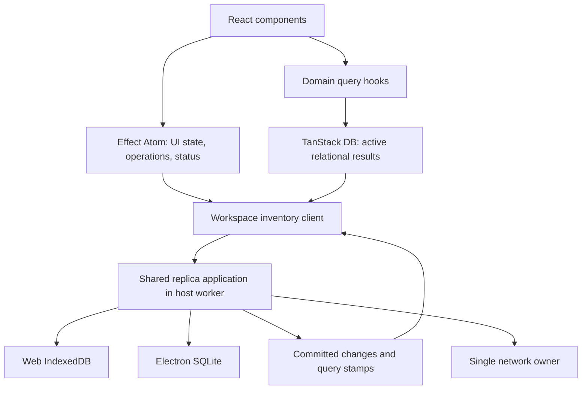

# Frontend reactivity with Effect Atom

Proposed design, researched on 2026-09-22. This extends [the polymorphic replica plan](./polymorphic-replica-storage.md). No application code or dependencies are changed here.

Use Effect Atom for frontend application state and Effect operations. Keep TanStack DB as the relational query engine initially. Make both consume the same workspace client, durable command path, and committed change feed. Storage selection remains in the host composition: IndexedDB for web, SQLite for Electron.

The performance boundary is the query subscription. A component should subscribe to the data it displays, and changes should stop propagating when that value is unchanged. Choosing an atom library does not establish those properties by itself.

## What LiveStore actually does

LiveStore has its own reactive graph with `signal()`, `computed()`, and `queryDb()`. Its internal `Atom` is a graph node, not Effect Atom. Live SQL queries establish dependencies on the tables they read. A commit batches changed table references; dependent queries rerun and equality checks can stop downstream propagation. This is table-aware query invalidation, not a guarantee of row-level incremental SQL execution. Schema-derived result equality has exceptions, including mapped results in the inspected implementation.

Live query instances are shared and reference-counted. This lets multiple consumers reuse a query and release its resources when no longer needed. These are useful design principles independent of SQLite. [Reactivity documentation](https://docs.livestore.dev/building-with-livestore/reactivity-system/), [graph implementation](https://github.com/livestorejs/livestore/blob/bf25b4d9b7bf0a8be73d61e68f8f2c8af439be2d/packages/%40livestore/livestore/src/reactive.ts), [query implementation](https://github.com/livestorejs/livestore/blob/bf25b4d9b7bf0a8be73d61e68f8f2c8af439be2d/packages/%40livestore/livestore/src/live-queries/db-query.ts).

The user's recollection about Effect Atom is also correct: LiveStore documents an optional `@effect-atom/atom-livestore` adapter as an alternative to its React integration. The adapter calls `store.subscribe(query, callback)`, publishes results into atoms, and registers unsubscribe as a finalizer. LiveStore still owns query execution and database dependencies. [Effect integration guide](https://github.com/livestorejs/livestore/blob/bf25b4d9b7bf0a8be73d61e68f8f2c8af439be2d/docs/src/content/docs/patterns/effect.mdx), [adapter source](https://github.com/tim-smart/effect-atom/blob/main/packages/atom-livestore/src/AtomLivestore.ts).

Version boundaries matter. The inspected LiveStore main commit is `bf25b4d9b7bf0a8be73d61e68f8f2c8af439be2d` (`0.5.0-dev.0`); its published documentation identifies itself as `0.4.0`. Its embedded Effect Atom examples pin `0.3.0`. The published adapter inspected separately, `@effect-atom/atom-livestore@0.7.0`, declares `effect: ^3.22.1`. Do not copy those imports or add that adapter to this Effect v4 application. The adapter is evidence for the subscription pattern, not a dependency recommendation.

LiveStore also has synchronous reads from session SQLite. Our worker-backed IndexedDB reads and durable writes are asynchronous. React must render a cached snapshot with explicit initial-loading and error states; a synchronous hook does not imply synchronous persistence. A command becomes locally accepted only after its storage transaction completes.

## Responsibility boundaries

| Owner            | Responsibility                                                                                         |
| ---------------- | ------------------------------------------------------------------------------------------------------ |
| Effect Atom      | Filters, selection, command execution state, sync status, derived display values, scoped subscriptions |
| TanStack DB      | Existing incremental relational queries, joins, ordering, nested results, active collection membership |
| Workspace client | Host-neutral commands, queries, cancellation, stamped change delivery                                  |
| Replica worker   | Durable state, domain validation, atomic operations, storage queries                                   |
| Sync owner       | Uploads, pulls, retries, recovery, authentication lifecycle                                            |

Database records remain owned by the replica. TanStack materializes active query results. Do not create a second writable entity store in atoms. A read-only atom over an existing query can be useful when it participates in an atom computation, but it must share that query's subscription and lifecycle. Do not wrap every `useLiveQuery` result merely to make every hook have an atom-shaped API.

The initial decision is to retain TanStack because the installed `@tanstack/db@0.9.0` already has an incremental relational graph, including correlated materialization. Effect Atom supplies dependency tracking and subscriptions; it does not replace those query operators. Replacing TanStack is a separate measured decision, not a prerequisite for IndexedDB or Effect Atom.

## Effect RC117 mapping

Use `effect/unstable/reactivity/Atom` and `AsyncResult`, with `@effect/atom-react@4.0.0-rc.117`. Match the repository's Effect release and satisfy the React/scheduler peer dependencies. RC117's React hooks use `useSyncExternalStore` and support selected atom values. [React hooks](https://github.com/Effect-TS/effect/blob/effect%404.0.0-rc.117/packages/atom/react/src/Hooks.ts), [package metadata](https://github.com/Effect-TS/effect/blob/effect%404.0.0-rc.117/packages/atom/react/package.json).

| API                                              | Intended use                                                       |
| ------------------------------------------------ | ------------------------------------------------------------------ |
| `Atom.make`, `Atom.map`                          | UI state and pure derived values                                   |
| `Atom.family`                                    | Stable per-entity or per-query atom identity                       |
| `Atom.runtime`, runtime `.atom` / `.fn`          | Effect-based observations and commands through the existing client |
| `AsyncResult`                                    | Initial load, success, refresh, and typed failure                  |
| `Atom.withEquality`                              | Suppress updates when the selected value is unchanged              |
| `Atom.setIdleTTL`                                | Short reuse window for recently unmounted query subscriptions      |
| `Atom.batch`                                     | Publish synchronous related atom changes together                  |
| `RegistryProvider`, `useAtomValue`, `useAtomSet` | Scoped React integration and narrow subscriptions                  |

The default atom equality is `Object.is`. Returning a fresh array or object on every update defeats that cutoff. Preserve unchanged row references and ordered ID arrays; use deliberate equality for bounded results. Include pending-overlay changes in equality: a server row version alone cannot identify a locally changed stock value. Avoid deep-comparing a full catalog on each commit. [Atom source](https://github.com/Effect-TS/effect/blob/effect%404.0.0-rc.117/packages/effect/src/unstable/reactivity/Atom.ts).

Create one registry per authenticated workspace UI scope and dispose it on workspace/account changes. Build parameterized atoms from canonical keys, including organization and query arguments; freshly allocated plain objects are not reliable family keys. Own query subscriptions with finalizers and bounded idle lifetimes. Do not permanently retain every visited entity using `keepAlive`.

Provide an already-open `InventoryClient` to frontend Effect layers. Do not build the storage/sync layer again inside `Atom.runtime`, which would create another owner. Cancelling a component observation may release its query; it must not delete a durable command or stop the workspace's outbox drain. Rapid command invocations need explicit per-operation results and domain ordering, not accidental concurrency semantics inherited from a button atom.

`Atom.withReactivity` can connect explicit invalidation keys to refreshes. It does not infer IndexedDB query dependencies, coordinate tabs, or make several asynchronous reads an atomic snapshot. Use the existing committed change path as the single invalidation source.

## Query design and correctness

First fix the current subscription breadth in `apps/desktop/src/lib/inventory/queries.ts`: `useCatalogProduct(id)` calls the whole product-list hook and then `.find()`, and `useInventoryInvoice(id)` does the same for invoices. Replace these with queries constrained by ID, with only their required relations. Paginate lists and movement histories. Fetch nested batches or invoice items only where the screen needs them. Give dashboard totals dedicated aggregate queries rather than requiring every invoice in React.

Then fix `packages/client-db/src/replica/collection.ts`: it currently refreshes every acquisition for a relevant entity notice, and `publishWindow` writes every returned row even if unchanged. Preserve row references, publish actual inserts/updates/deletes, deduplicate equivalent query windows, and coalesce pending refreshes to the newest required commit version.

Define dependencies in query descriptors. A detail query can depend on a product ID, its category, and batches for that product. A list depends on its filter, ordering, joined sources, and page boundaries. Do not invalidate a list only when an already-visible ID changes: an offscreen row can enter the filter or top page, and deletes can require a refill. A category change can affect many product views. Use indexed membership checks where justified, and conservatively refresh the bounded window when the notice cannot prove it is unaffected.

Subscribe before reading the initial snapshot. Pair results with a commit stamp from the same database read. Reconcile notices newer than that stamp, reject results from obsolete workspace/query generations, and unsubscribe on cancellation. No lost notification may leave a query permanently stale: use persisted commit versions to recover after suspension, reconnect, or an event gap.

Each UI-visible relational result must represent a coherent commit. An invoice, its items, and stock cannot be exposed in partially updated combinations. Coordinate affected collection publication and query settlement; where a multi-collection atomic boundary is unavailable, return a composite stamped domain projection or gate publication until the required sources settle. `Atom.batch` alone cannot make separately awaited worker reads consistent. Verify this against the actual TanStack version before choosing the publication mechanism.

For large tables, separate list membership from row presentation: the list subscribes to ordered IDs, and memoized rows subscribe to the fields they show. Unrelated edits should not replace that ID array or rerender unaffected rows. Sorting/filter membership changes legitimately update the list. Virtualization bounds mounted rows; component subscriptions are still React subscriptions, not automatic per-DOM-node updates.

## Network and platform consequences

Rendering, atom refreshes, filters, and opening another component must query the local replica. They must not call the sync endpoints directly. Missing replica coverage may request synchronization through the shared scheduler, which deduplicates the demand. The same query requested by ten components must not start ten pulls or ten worker queries.

Batch local notifications and worker messages per committed change set. Transfer only demanded query results or useful deltas. Preserve network leadership independently of component mounts. Both web and Electron use the same frontend hooks and Effect services; only their host client layers differ. Atoms improve UI subscriptions, while network efficiency remains a property of the shared scheduler and protocol.

## Delivery and acceptance criteria

1. Record baselines for catalog scrolling, product detail, invoice detail, a stock update, and a large pull. Count database reads, rows scanned, worker bytes, query emissions, React commits, live subscriptions, and network requests.
2. Introduce the workspace-scoped Atom registry and client layer. Move shared filters, sync status, and command execution state to atoms. Keep simple component-local state local.
3. Narrow detail queries and bound list/history queries. Add stable row identity, equivalent-window sharing, safe dependency invalidation, and coherent publication to the existing query path.
4. Build one bounded comparison: a product detail plus stock badge using an Atom family over a typed domain query subscription, versus the corrected TanStack path. Run both on real IndexedDB and Electron SQLite. Choose one production owner for that query, and remove the comparison implementation after deciding.
5. Replace the relational engine only if the comparison and a representative joined-list workload establish better latency, memory, and maintainability without losing query correctness. Otherwise retain TanStack and Atom in their distinct roles.

Required outcomes:

- Ten subscribers to the same canonical query share one underlying active query in a renderer.
- An unrelated product edit causes no product-detail result emission or component commit; relevant joined changes do update it.
- A stock-only change preserves a name-sorted list's ID array and leaves unaffected memoized rows unchanged.
- A row entering a filter or page boundary appears correctly, including after deletion and joined-record changes.
- React never observes a partially published invoice transaction.
- Rapid filter changes cannot publish stale responses. Scope changes cannot expose the previous account's results.
- Last-subscriber removal releases resources after the configured idle lifetime; Strict Mode remounts do not leak workers or subscriptions.
- Component mounting, rerendering, and local filters issue zero sync requests while coverage is complete.
- Reload after locally accepted offline work recovers it from durable storage; a storage failure never reports acceptance.

This research inspected upstream sources and the application's existing query paths. No performance improvement is claimed without the above measurements. Documentation formatting is the only new validation required for this planning change; application benchmarks and React tests remain implementation work.
