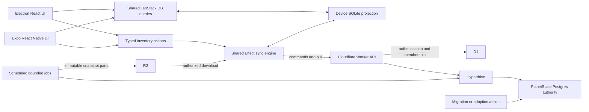

# PlanetScale Postgres, Expo, and offline sync implementation plan

Status: implementation in progress; see [sync-migration-status.md](./sync-migration-status.md) for the measured state per phase and the amendments A1–A9 (catalog commands, pending projections, digest on request, scheduled retention, browser boundary, dead authority removal, Effect SQL on Electron, hard deletes). Updated 2026-09-21 to make PlanetScale Postgres the inventory authority and review the latest Effect and Alchemy releases. This revision supersedes the Durable Object storage plan from September 15–16. It updates the target architecture, not the deployed infrastructure.

Electron and Expo keep the shared Effect sync engine, TanStack DB queries, local SQLite replicas, and durable pending commands. The command protocol retains atomic decisions, relative stock reservations, replica digests, authority epochs, and resumable snapshots.

## 1. Target architecture

PlanetScale Postgres owns inventory and the complete record of each command's outcome. Cloudflare Workers authenticate requests and execute PostgreSQL transactions through Hyperdrive. Durable Objects have no role in the target inventory, replication, or scheduling path.

D1 remains the existing authentication and membership store. Moving authentication is a separate decision. Inventory settings, numbering, receipts, replica progress, change history, migration state, and snapshot metadata all live in PlanetScale with the business rows they govern. R2 stores immutable snapshot parts and binary assets. Each device stores its replica and outbox in SQLite.

The current checkout still contains the DO implementation and Neon provisioning. Treat those as migration inputs. The user's selected database is PlanetScale Postgres; neither existing code nor the old plan changes that decision.

| Component            | Responsibility                                                                                          |
| -------------------- | ------------------------------------------------------------------------------------------------------- |
| PlanetScale Postgres | Authoritative catalog, stock, invoices, command receipts, organization ordering, sync history, and jobs |
| Cloudflare Worker    | Authentication, tenant authorization, command execution, pull, and optional streamed updates            |
| Hyperdrive           | Worker connections to PlanetScale, with query caching disabled for inventory and sync                   |
| D1                   | Existing users, sessions, memberships, and organization profiles                                        |
| R2                   | Immutable snapshot parts, exports, and binary assets                                                    |
| Device SQLite        | Confirmed rows, pending reservations, durable commands, and local cursor                                |

Use an organization-scoped transaction to decide which concurrent sale can consume the last unit. Lock that organization's `inventory_state` row before reading stock. Every catalog, invoice, stock, and configuration writer follows the same rule. The lock replaces the DO's local coordination permit and works across Worker isolates.

This initial design deliberately orders commands within an organization. Other organizations use different rows, though they still share database capacity. Measure lock wait time and transaction duration before considering finer-grained stock locks. Cross-organization stock transactions remain outside the product scope. [PostgreSQL row locks](https://www.postgresql.org/docs/current/explicit-locking.html#LOCKING-ROWS).

The production path keeps PostgreSQL and Hyperdrive. Retire Neon provisioning only after confirming the selected source data has reached PlanetScale. Keep PowerSync removal and the Expo replacement from the earlier plan; changing the authority does not create another sync implementation.

## 2. Latest Effect, Alchemy, and Drizzle

### Verified upgrade targets

Registry metadata and upstream release notes were checked on September 21, 2026. These are implementation targets; this document does not upgrade dependencies.

| Dependency                             | Current workspace pin                       | Target and compatibility                                                                                                              |
| -------------------------------------- | ------------------------------------------- | ------------------------------------------------------------------------------------------------------------------------------------- |
| `effect` and used `@effect/*` packages | `4.0.0-rc.111`                              | Align on `4.0.0-rc.117`, including SQL, platform, and test adapters                                                                   |
| `alchemy`                              | `2.0.0-beta.77`                             | `2.0.0-beta.79`; requires Effect and relevant SQL/platform peers at RC115 or newer                                                    |
| `@effect/sql-pg`                       | Add explicitly for the selected server path | `4.0.0-rc.117`, aligned with core                                                                                                     |
| `drizzle-orm` and `drizzle-kit`        | `1.0.0-rc.5-ab785fc`                        | Keep this matched pair for the initial slice; beta.79 still declares these exact peers                                                |
| Expo and `expo-sqlite`                 | Resolve when creating `apps/mobile`         | Recheck Expo's compatible SDK/native-module set in Phase 0; the old September 15 candidate list is not a current compatibility result |

Use the V4 `rc` channel to resolve Effect candidates. Pin exact versions after verification, including catalog entries, overrides, direct dependencies, and transitive platform adapters. A peer range accepting RC117 is not evidence that the whole stack works. Upgrade Drizzle separately if a newer pair is needed, with explicit Alchemy compatibility evidence.

Sources: [Alchemy package metadata](https://registry.npmjs.org/alchemy/2.0.0-beta.79), [Effect RC117 release](https://github.com/Effect-TS/effect/releases/tag/effect%404.0.0-rc.117), and [SQL adapter metadata](https://registry.npmjs.org/@effect/sql-pg/4.0.0-rc.117).

### Release changes to use

| Capability                                                      | Plan decision                                                                                                                                    | Required proof                                                                                                    |
| --------------------------------------------------------------- | ------------------------------------------------------------------------------------------------------------------------------------------------ | ----------------------------------------------------------------------------------------------------------------- |
| Effect's native PostgreSQL client, introduced in RC113          | Use the RC117 `@effect/sql-pg` path through Alchemy and Drizzle's `effect-postgres` driver                                                       | Real workerd → Hyperdrive → PlanetScale queries, rollback, cancellation, and codecs                               |
| SQL fixes through RC117                                         | Include prepared-statement namespacing, savepoint cleanup, migration `regclass` decoding, and retirement of sessions with uncertain cancellation | Reused backend sessions cannot mix statement identities or leak cancellation into a later checkout                |
| Experimental schema AOT compiler in RC116                       | Benchmark generated decoders for commands, pull frames, and snapshots; adopt where they reduce measured CPU                                      | Same accepted values, errors, and decoded values as the interpreter, plus Worker, Electron CSP, and Hermes builds |
| RC116 HTTP API parse options and SSE codec changes              | Declare parse policy at protocol boundaries and use typed SSE only for optional wake hints                                                       | Strict command decoding, compatible row-image decoding, correct optional SSE IDs, and disconnect cleanup          |
| Improved schema-derived arbitraries                             | Generate command/retry/interruption sequences and exact-number boundary cases                                                                    | Shrunk failures become saved regression fixtures                                                                  |
| Alchemy beta.78 development runtime and Worker previews         | Use the layer-4 relay and shared sidecar; add isolated preview smoke tests                                                                       | Direct dev and deployed Hyperdrive paths both pass; preview bindings cannot point at production inventory         |
| Alchemy beta.79 Worker environment and runtime dependency fixes | Upgrade to beta.79 for the initial implementation slice                                                                                          | Worker bundling, binding inference, and actual startup succeed                                                    |

The native SQL client removes the older `fromPool`, `fromClient`, and `makeWith` constructors. It uses `make` or `makeClient`, a `PgTypes.Registry`, explicit `sql.json` values, and single-statement query strings. Audit SQL adapters and migration execution for these changes. [SQL RC113 release](https://github.com/Effect-TS/effect/releases/tag/%40effect%2Fsql-pg%404.0.0-rc.113).

RC116 changed timestamp decoding to `Date` with millisecond precision. Define exact date, timestamp, numeric, bigint, JSON, enum, and array mappings before producing canonical hashes. Preserve microseconds with an explicit text or codec representation where the source needs them. RC117 also fixes prepared-statement collisions and pooled cancellation handling; an interrupted commit can still have an uncertain outcome, so receipts remain necessary. [SQL changelog](https://github.com/Effect-TS/effect/blob/effect%404.0.0-rc.117/packages/sql/pg/CHANGELOG.md).

Generate AOT modules at build time with the exported `SchemaAOTCompiler/Build` entrypoint. Keep its filesystem dependencies out of runtime bundles. Do not enable global JIT in Workers or the Electron renderer. Keep interpreter fallback until parity and performance tests justify adoption. Audit the RC116 `SchemaGetter`, `SchemaTransformation`, Stream, and SSE breaking changes before upgrading. [Effect RC116 release](https://github.com/Effect-TS/effect/releases/tag/effect%404.0.0-rc.116).

Alchemy beta.78 also fixes regressions around the new SQL client and development runtime. Its new preview support is useful here, but a Worker preview alone does not isolate an external database. Give each preview an explicitly selected non-production PlanetScale branch. [Alchemy beta.78](https://github.com/alchemy-run/alchemy/releases/tag/v2.0.0-beta.78), [beta.79](https://github.com/alchemy-run/alchemy/releases/tag/v2.0.0-beta.79).

Cluster and Workflow improvements are worth revisiting for a future persistent job host. They are not required for stock correctness, and an Effect fiber in a Worker is not a durable scheduler. The initial job design uses PostgreSQL rows and scheduled bounded workers.

## 3. PlanetScale adoption and data cutover

### Determine the actual source before copying data

PlanetScale is the chosen destination. Phase 0 records the source of committed inventory for each environment and organization. The checkout describes different paths for nightly and dev/prod, so do not assume a Neon export includes newer DO sales.

- If the complete committed dataset is already in PlanetScale, retain it and add the new transactional sync metadata through reviewed migrations. Do not re-import it.
- If the authoritative dataset is in another PostgreSQL service, copy from a consistent snapshot into a private PlanetScale target.
- If an organization has newer committed DO data, export that business dataset before retiring its object. If sources overlap or disagree, resolve the ownership and reconciliation rule before activation.

Preserve business IDs, organization ownership, invoices and their numbers, historical stock movements, timestamps, and actor audit fields. Do not import PowerSync device caches or old client bookkeeping. New clients use a fresh local namespace. Start a new sync epoch and replica registrations for the selected protocol.

### One operator action

Replace the existing `vp run migrate:cloudflare` action with a start/resume action named `vp run migrate:planetscale` during implementation. The new command is proposed, not present in this revision.

```text
Check source identity and PlanetScale target
Pause all source inventory writers
Export or adopt committed business data
Apply and validate the target schema
Validate records, invoice totals, and stock
Publish the new protocol release
Report completion
```

Persist a migration ID, source identity, schema version, manifest hashes, chunk progress, and validation results in PlanetScale. Resume by this identity. An identical retry is harmless; different content under an existing identity fails.

1. Inventory source writers, record the selected source, and run capacity and type checks. Keep credentials in operator configuration.
2. Freeze old inventory writes and drain in-flight work, including jobs, imports, and direct writers. Keep this boundary closed until activation succeeds or the attempt is abandoned before publication.
3. For a copy, export a consistent committed dataset into bounded private R2 parts. For existing PlanetScale data, record and validate an adoption checkpoint instead.
4. Apply reviewed PostgreSQL migrations. Import chunks into an unpublished target in foreign-key order, recording each chunk and its rows in the same transaction.
5. Validate counts, canonical hashes, foreign keys, tenant ownership, invoice numbering, stock quantities, and movement conservation. Use documented PostgreSQL-to-wire mappings and explicit DO SQLite-to-PostgreSQL conversions where needed.
6. Initialize organization state, epoch, row revisions, and the new protocol's starting horizon. Produce the initial snapshot while inventory writes remain paused.
7. Mark all selected organizations ready and publish one active release record in PlanetScale. Every new inventory route checks that record. No client reaches a partly imported dataset.
8. Start new clients against PlanetScale and retire old write routes. A lost activation response is resolved by reading the release record, not repeating the migration blindly.

Before publication, a failed attempt leaves copied targets private and the source intact. After publication, PlanetScale owns all new writes. Returning to an older database then requires explicit data reconciliation. Retain source backups and export reports through the agreed retention period. Resource cleanup must not destroy the source during cutover.

## 4. Runtime and module ownership



| Module              | Caller-facing contract                                 | Owned behavior                                                  |
| ------------------- | ------------------------------------------------------ | --------------------------------------------------------------- |
| Inventory workspace | Submit command; observe query or command status; close | Local save, reservations, sync lifetime, query publication      |
| Inventory authority | Execute authorized command; pull; acquire snapshot     | PostgreSQL transactions, stock rules, receipts, ordered changes |
| Device storage      | Local transaction and bounded observable query         | Host SQLite connection, migrations, invalidation                |
| Snapshot worker     | Claim, advance, or resume one bounded job              | Fencing, staging, R2 export, publication, retention             |
| Migration tool      | Start/resume migration; read progress                  | Source freeze, adoption/export, validation, activation          |

```text
packages/db/src/postgres/  authoritative Drizzle schema and migrations
apps/server/src/inventory/
  commands.ts             one PostgreSQL command transaction owner
  log.ts                  bounded immutable change-log reads
  snapshots.ts            leased snapshot jobs and retention
apps/server/src/http/
  sync.ts                 authenticated commands, pull, optional SSE hints

packages/sync/src/
  engine.ts               shared Effect upload/download workflows
  commands.ts             durable local command lifecycle
  replica.ts              apply, reservations, snapshot activation
  transport.ts            shared HTTP contract and optional wake stream

packages/client-db/src/    workspace SQLite and TanStack collections
packages/inventory-react/  shared hooks and provider
apps/desktop/             Electron host and browser-worker SQLite
apps/mobile/              Expo host and expo-sqlite
```

These are target responsibilities, not a claim that every file already exists. Introduce files as behavior lands. Keep Cloudflare, Node, Electron, DOM, and React Native dependencies in their host adapters. Share domain logic and queries; use platform-appropriate screens.

The existing `apps/android` supplies the replacement feature checklist. Preserve Android application ID `com.tabaaq.mobile` and signing identity in Expo. Configure iOS identity and auth redirects explicitly.

## 5. Alchemy resources, Effect scopes, and migrations

### PlanetScale and Hyperdrive composition

Use Alchemy's published `alchemy/Planetscale` resources for databases, branches, and roles where Alchemy owns provisioning. For an existing database, reference its identity and configure its credentials without silently replacing it. Keep stable resource IDs and separate long-lived production resources from preview branches.

Wire the application role's direct `origin` to `Cloudflare.Hyperdrive.Connection`. Alchemy documents `pooledOrigin` for local development, which bypasses Hyperdrive. Use a separate migration role and explicit stage bindings. Do not reset an existing default role merely to adopt the database. [Alchemy PlanetScale Postgres](https://alchemy.run/planetscale/data/postgres/).

Disable Hyperdrive query caching on the inventory binding. Stock checks, receipts, head cursors, pull pages, and retention decisions must read the primary's committed state. Use transaction pooling without session-affine assumptions, persistent temporary tables, or session-level advisory locks. [Hyperdrive caching](https://developers.cloudflare.com/hyperdrive/concepts/query-caching/), [connection pooling](https://developers.cloudflare.com/hyperdrive/concepts/how-hyperdrive-works/).

Prefer `Drizzle.Postgres` with `drizzle-orm/effect-postgres` for the server schema. `SQL.PostgresLayer` is available when a service needs the generic SQL client. Choose one pool and one transaction owner for a command; do not instantiate both helpers independently and assume they share a transaction.

Beta.79's published helpers defer connection acquisition and memoize it on the current execution scope. Their finalizers close the pool when that scope ends. Resolve bindings and reusable service composition at Init, while keeping request I/O and actor identity in the event scope. Test this with actual workerd requests through Hyperdrive. [Alchemy Drizzle Postgres](https://alchemy.run/sql/drizzle/postgres/), [SQL Postgres](https://alchemy.run/sql/effect-sql/postgres/).

### Migration ownership

| Storage               | Migration owner                                                                                                     |
| --------------------- | ------------------------------------------------------------------------------------------------------------------- |
| PlanetScale inventory | Reviewed PostgreSQL SQL from the authoritative Drizzle schema; apply once through the deployment/migration workflow |
| D1 authentication     | Existing D1 migrations                                                                                              |
| Expo replica          | SQLite migration bundle before workspace queries                                                                    |
| Electron replica      | Same logical replica schema through the browser-worker adapter                                                      |

Alchemy can generate Drizzle migrations and apply PlanetScale migration files. Keep migration SQL reviewable before release, use one execution path, and test restart after a partial deployment. Do not run schema changes on every request. Client SQLite and server PostgreSQL have separate schemas with explicit wire mappings. [Alchemy migration support](https://alchemy.run/planetscale/data/migrations/).

## 6. Authoritative PostgreSQL transactions

### Tables and representation

| Table group                  | Required content                                                                                 |
| ---------------------------- | ------------------------------------------------------------------------------------------------ |
| Domain tables                | Tenant-scoped categories, products, batches, invoices, items, movements, settings, and numbering |
| `inventory_state`            | Organization ID, readiness, active release, incarnation/epoch, commit sequence, retention floor  |
| `replicas`                   | Organization, device identity, owner user, processed client sequence                             |
| `command_receipts`           | Operation identity, replica sequence, canonical hash, decision, commit sequence, result          |
| `transactions` and `changes` | Ordered transaction header, scoped decision, immutable row images and removals                   |
| Snapshot jobs and leases     | Generation, fenced owner, progress, pinned history, manifests, download leases                   |
| Migration metadata           | Source identity, chunk hashes, validation, and release activation                                |

Include `organization_id` in tenant-owned keys, uniqueness constraints, and foreign-key relationships. A client-supplied entity ID must never cross tenants. Index pulls by organization, epoch, sequence, and ordinal. Scope receipt identities and replica sequence uniqueness explicitly.

Use exact PostgreSQL numeric/integer representations with documented limits. Encode large counters as canonical decimal strings on the wire, compare numerically, and never coerce them through an imprecise JavaScript number. Keep row revisions, commit sequences, replica sequences, and local publication versions as distinct types.

### Atomic command algorithm

The Worker authenticates, checks membership, and decodes the bounded command before starting SQL. Actor identity comes from the verified session. Generate stable IDs and canonical hashes before retries. External API calls stay outside the transaction.

Execute one `READ COMMITTED` PostgreSQL transaction on one checked-out connection:

1. Lock the organization's `inventory_state` row with `SELECT ... FOR UPDATE`. Check readiness, active release, and epoch while holding the lock.
2. Read the receipt and replica watermark. Return an identical existing decision; reject identity reuse with different content. Never re-execute a compacted command.
3. Verify replica ownership and require the next client sequence.
4. Read stock, settings, and numbering after acquiring the organization lock. Compute the domain decision and finish expected validation before writing business rows.
5. For acceptance, write the entire invoice or catalog change. For a domain rejection, leave business rows unchanged and record the decision.
6. Increment the organization's transactional counter. Store immutable changes, the decision, receipt, and replica progress in the same transaction.
7. Commit. Return the receipt only after commit succeeds. Every returned sequence must already have a readable log frame.

All business writers acquire the organization lock first, in the same order. PostgreSQL's fresh statement snapshots at `READ COMMITTED` then let a waiting command read the previous writer's committed stock. In-process semaphores cannot provide this guarantee across Workers. Enforce the writer boundary for jobs and imports too. [PostgreSQL isolation](https://www.postgresql.org/docs/current/transaction-iso.html#XACT-READ-COMMITTED).

Use the transactional organization counter for commit ordering and invoice allocation where gap-free numbering is required. PostgreSQL sequences such as `nextval` are not a commit-order cursor and do not roll back. An uncommitted lower sequence must never be skipped because a higher transaction commits first.

Storage, connection, and timeout failures roll back or leave an uncertain outcome. Resolve uncertainty with the original operation ID and receipt before retrying. Bound deadlock and serialization retries around the whole transaction. Never turn an infrastructure failure into an insufficient-stock decision. Do not retry a commit by generating a new identity.

### Conflict rules

- Revalidate stock and pack/unit conservation when issuing an invoice. Accept or reject the whole sale.
- Require expected revisions for absolute counts, sale prices, configuration changes, and destructive edits.
- Use commit-order last-writer-wins for fields without stock invariants, while still validating foreign keys and allowed values.
- Keep unique movements for receipts and adjustments. Corrections create compensating records.
- Record predecessor-operation references for dependent edits. Conflict resolution creates a new immutable command.
- Persist deterministic domain rejections so one invalid command cannot block a replica forever. Repeated database failures are not proof of a deterministic rejection; repair the failure or use an explicit, audited terminal-resolution path after ruling out an earlier commit.

## 7. Replication and live updates without Durable Objects

### Public protocol

Keep one typed HTTP API/schema contract for Electron, Expo, and the Worker. It defines command submission, receipts, replica registration, bounded pull, snapshot acquisition, and snapshot parts. The durable protocol is HTTP pull from the PostgreSQL change log.

A frame identifies organization, incarnation/epoch, subscription, from/to sequence, schema version, and complete transaction groups. Decode required fields, byte counts, hashes, and scope at the boundary. Persist rows and the cursor they cover in the same local transaction.

Every authorized replica receives the same rows for its declared subscription partitions. Authorization admits the replica to the organization; it does not silently filter a shared log by actor. Role-specific row visibility would require a separate subscription protocol and remains outside this plan.

Hydrate the sell-path subset first: products, current stock, and sale configuration. Fetch invoice and movement history through explicit date/key partitions. Coverage distinguishes an empty complete partition from one not downloaded. TanStack query expressions do not become arbitrary remote subscriptions.

Read head, retention floor, and complete log transactions from one short consistent database snapshot per pull page. Bound bytes and transaction groups. Stage multipart transactions before local apply. If retention has passed a client's cursor, offer a fresh snapshot while preserving its pending commands.

### Live delivery

Foreground clients use bounded polling with jitter and adaptive idle backoff. Wake immediately after upload, reconnect, and foreground entry. Set the acceptable remote-sale visibility latency in Phase 0 and measure database reads per connected device against it.

If polling cannot meet that latency economically, add authenticated SSE wake hints through the Worker using Effect's HTTP/SSE facilities. A hint only names a newer horizon; the client fetches authoritative rows through pull. Each stream must have a bounded lifetime, authorization lease, polling cost, and cancellation cleanup. No database transaction or checked-out connection remains open while sleeping or waiting on a slow client.

This replaces the previous DO hibernating-socket design. There is no assumption that Worker isolates share a connection registry. An SSE implementation that polls PostgreSQL is still polling; measure it before claiming a fan-out benefit. PostgreSQL `LISTEN/NOTIFY` requires a separately designed persistent, session-affine listener and cannot be assumed to work through transaction-pooled Hyperdrive.

The committed log is the recovery path. A notification failure never changes a command outcome. No delivery outbox is required for polling. If a future external notification service needs durable dispatch, write its outbox row with the business transaction and drain it with an idempotent worker.

Do not apply a live hint as a data frame or advance a cursor from it. If direct streamed frames are added later, hold them while a catch-up hole is open. Unknown additive row fields can be ignored with telemetry; unknown decision or transaction variants stop cursor advancement. Declare this policy explicitly through the selected codecs.

Recheck membership on authenticated requests and periodically on any live stream. D1 authorization and PostgreSQL inventory commits are separate boundaries, so record and test the maximum allowed revocation interval.

### Divergence and restore detection

At complete partition horizons, return a canonical digest computed from the same committed state as the rows. A mismatch triggers bounded partition repair and re-verification. A plausible cursor alone cannot prove the local stock is correct.

Return the authority's incarnation and epoch on registration and pull. After a restore, the recovery workflow must write a fresh epoch before opening traffic; a restored backup contains its old identity and cannot detect its own restoration. Also reject a server head behind the client's applied cursor.

A mismatch stops synchronization and surfaces recovery status. Preserve unsent commands and their identities. Do not silently wipe a till's outbox or create a new replica identity over an existing queue.

## 8. Shared local engine and TanStack DB

### Durable local state

Electron and Expo run the same Effect engine and command state machine. Host adapters supply SQLite, authenticated HTTP, optional SSE, connectivity, lifecycle, and secure session storage.

Local SQLite owns confirmed rows, sparse optimistic overlays, pending commands, receipt/integration state, coverage, and the applied cursor. Every local transaction also increments a publication version. Scope databases by environment, user, and organization. Keep a workspace ownership token and snapshot generation separate from the local publication version.

Submitting a command persists its canonical payload, IDs, replica sequence, and optimistic projection in one transaction. Return saved status after local commit. Storage failure cannot leave a permanent successful-looking mutation. Persist `pending`, `sending`, `accepted-awaiting-integration`, `integrated`, and `rejected` states as appropriate. Recover interrupted sending by receipt lookup or identical retry.

A receipt is not integration. A command leaves `accepted-awaiting-integration` only when the replica has applied the commit sequence the receipt names. Treating the HTTP receipt as completion makes the interface flicker between the receipt and the row, and it reports a sale as settled before the stock effect is locally visible.

Upload at most one command per replica at a time. The authority rejects a sequence gap, correctly, so a client that fires every pending command concurrently manufactures gap errors under ordinary packet loss: a later sequence arrives first and is refused for a hole that only exists in flight. One in-flight command makes the gap check mean what it says. Claim the lowest pending sequence durably before sending, and on an uncertain outcome look the receipt up before retrying identically.

Settle the claim with an Effect finalizer, not a generator `try/finally`. A `finally` block inside a generator does not run when the fiber is interrupted, so an interrupted upload would leave a command marked as sending forever. Use `Effect.acquireUseRelease` or `Effect.ensuring` so the release path returns a still-matching claim to pending with its outcome recorded as uncertain.

Never hold the local database permit across network work. Acquire it, commit, release it, then send.

A newly minted replica identity must not orphan an outbox. Opening local storage under a new identity while unsent commands remain either adopts the previous identity's queue or refuses to open. Silently starting fresh loses sales that were durably accepted locally and never sent.

Apply a remote transaction's authoritative rows, operation decisions, overlay reconciliation, coverage, and cursor together. Publish query changes after commit. Applying the same transaction twice cannot decrement stock twice.

An overlay is a relative reservation, not an asserted absolute quantity. Visible stock is the confirmed row plus the sum of that batch's pending reservations, so an overlay never masks a concurrent authoritative change.

Example: confirmed stock is 10 and a local sale reserves 1, so the visible value is 9. The server accepts the sale while the client still holds the prior confirmed version; the visible value stays 9. When the accepted row arrives, write confirmed stock 9 and retire that sale's reservation atomically. Never show 8 by counting both effects.

Storing the overlay as an absolute value instead would pass that example and still be wrong. If another terminal's sale of 3 lands first, confirmed becomes 7, and an absolute overlay would keep displaying 9 while only 6 are available. The cashier would then ring up sales the authority rejects one at a time. Because this release deliberately has no client-side rebase, nothing recomputes an asserted value, so the relative form is the only correct one. Test a third party's decrement arriving during a pending local sale, not only interleavings of the device's own command.

Upload and download run independently. Domain rejection updates that command and its dependants; it does not stop downloads. Use bounded retry bursts, jitter, deadlines, and connectivity/foreground wakeups. Sliding queues may coalesce wake signals; they may not discard commands or committed frames.

### Effect lifetimes

Use one `ManagedRuntime` for the active workspace in each client, with explicit acquisition/disposal of listeners, database ownership, and scoped workers. Use `Context.Service`, explicit Layers, `Effect.gen`/`Effect.fn`, and Schema boundary decoding from the selected v4 release. Keep pure domain helpers as functions.

Layers acquire dependencies and start scoped consumers, then return; opening a workspace must not await the first remote sync. Use one owner for local transactions and one for auth refresh. Never hold the database permit while waiting for HTTP or a live stream. Interruption around a native operation must settle its transaction before releasing ownership or publishing status.

### TanStack's role on both platforms

Retain `@tanstack/db` and `@tanstack/react-db` for shared reactive queries and React subscriptions. Replace `powerSyncCollectionOptions` with a custom adapter over the visible SQLite projection. Use one `DbClient` per workspace on both Electron and Expo.

The selected design uses SQLite for durable commands and TanStack for disposable query state. TanStack's own persistence and offline transaction packages are viable alternatives, but would replace the corresponding client storage/outbox machinery. They are not additional queues layered over it. Expo makes shared TypeScript ownership possible, so any future evaluation should compare both clients using the same durability fixtures. [TanStack persistence](https://github.com/TanStack/db/tree/main/packages/db-sqlite-persistence-core), [offline transactions](https://github.com/TanStack/db/tree/main/packages/offline-transactions).

The custom collection adapter:

1. Acquires a bounded initial SQL result and its change subscription together, returning the workspace token, replica generation, and local publication version.
2. Publishes validated changes through `begin` / `write` / `commit`. Await the selected version's commit visibility receipt before declaring a subset loaded.
3. Uses on-demand collections for products, batches, invoices, items, and movements. Translates only supported predicates, ordering, and windows into indexed local queries; named SQL projections cover complex aggregates.
4. Tracks overlapping query acquisitions, refills windows after membership/order changes, and releases only the matching acquisition on unload. Bound rows, bytes, indexes, and pending notifications.
5. Reconstructs memory from SQLite after restart and discards results belonging to a disposed workspace. Collection cleanup never deletes the durable outbox.

The database owner publishes one post-commit invalidation event. SQL subset subscriptions feed TanStack's incremental query graph. Do not also rerun Drizzle React live queries or TanStack Query refetches for the same records. Use Effect state subscriptions for connection and progress state. [TanStack collection adapter contract](https://tanstack.com/db/latest/docs/guides/collection-options-creator).

UI actions submit domain commands directly. TanStack does not create an additional optimistic mutation for the same sale. `$synced` and a TanStack persistence promise do not establish server acceptance; explicit command receipts do.

For transaction-sensitive invoice/stock views, return one combined SQL projection from one local read transaction and publish it as one result collection. Separate collection commits and React batching alone do not prove a consistent cross-collection generation.

### Query changes

| Existing behavior                                         | Target                                                               |
| --------------------------------------------------------- | -------------------------------------------------------------------- |
| Six eager collection preloads                             | Open local storage first; acquire screen subsets on demand           |
| Product/invoice detail calls a full-list hook and `.find` | Identity-filtered source query                                       |
| Product lists nest every batch                            | Windowed rows with stock summaries; load batches for detail/checkout |
| Unbounded invoice and movement history                    | Indexed date/key windows and explicit coverage                       |
| Suggestions and dashboard scan loaded catalog arrays      | Indexed distinct/aggregate SQL projections                           |

Share query definitions and hooks through `packages/inventory-react`; platform screens choose their rendering. Keep child results bounded, and measure the effect of `toArray` on parent updates. SQLite indexes and TanStack indexes solve different work and must be chosen separately. [TanStack live queries](https://tanstack.com/db/latest/docs/guides/live-queries).

## 9. Expo and Electron integration

### Expo

Create `apps/mobile` with Expo Router and React Native. Scope the release to Android and iOS; Expo web is not required. Implement sign-in, organization selection, dashboard, products, batches, stock changes, invoices, imports/scan where supported, and sync status using the shared inventory actions and queries.

Use `expo-sqlite` for the local replica with Drizzle schema/migrations. Bundle generated SQL through Metro's supported configuration and run migrations before workspace data queries. Configure connection pragmas deliberately, including foreign keys and journaling. [Expo SQLite](https://docs.expo.dev/versions/latest/sdk/sqlite/), [Drizzle Expo setup](https://orm.drizzle.team/docs/sqlite/connect-expo-sqlite).

The previously inspected Drizzle Expo driver executes synchronous native SQLite operations. Keep each transaction and query bounded, wrap failures at the Effect adapter boundary, and yield between snapshot-import chunks. Do not pass an async callback to its synchronous transaction path. Measure JS-thread blocking on real low-end devices.

If the measured work requires async native queries, implement the same storage contract using `expo-sqlite` asynchronous operations and `withExclusiveTransactionAsync`, with Drizzle-generated/compiled statements where appropriate. Route every transaction statement through the provided transaction connection. Ordinary `withTransactionAsync` can include concurrent queries outside its callback; do not assume it isolates the workspace from other users of the connection. This adapter choice must be settled by Phase 0 tests, not by adding another SQLite runtime.

Persist refresh credentials with Expo SecureStore; keep inventory rows and pending commands in SQLite. Reuse first-party auth and implement native OAuth redirects/deep links. Do not copy Electron's main-process credential broker into mobile. [Expo SecureStore](https://docs.expo.dev/versions/latest/sdk/securestore/).

Use AppState and connectivity events to pause live transport in the background and resume from persisted cursors in the foreground. Optional Expo background tasks perform bounded catch-up and share the same database ownership rules. The operating system schedules these tasks opportunistically; correctness cannot depend on a continuously running background connection. [Expo background tasks](https://docs.expo.dev/versions/latest/sdk/background-task/).

Test Metro resolution, Hermes behavior, hashing, crypto IDs, AbortSignal, streaming HTTP, Effect runtime disposal, and the selected React/TanStack versions on Android and iOS. Keep React Native's Expo-compatible React version independent of desktop's pin when required, while preventing duplicate React within either application bundle.

### Electron

Keep the current React UI and secure main-process auth broker. Replace renderer PowerSync with the shared engine and a browser-worker SQLite adapter. Keep database operations off the renderer's main thread where possible.

Allowlist the new sync endpoints and approved headers in the broker. Preserve trusted sender checks, cancellation, bounded responses, and token injection. Route authenticated pull and optional SSE through the broker; do not expose refresh tokens to the renderer. Use a fresh replica namespace when this release starts.

Both platforms show distinct saved-locally, pending confirmation, caught-up, rejected, and storage-error states. Reading an existing replica and rendering the app shell must not wait for a remote connection.

## 10. Snapshots, retention, and recovery

PlanetScale stores snapshot job state. A scheduled Worker claims a bounded step with a lease and fencing token, performs it, and commits progress. Repeated scheduled invocations recover expired claims. Optional queue wakes reduce delay, but PostgreSQL job rows remain discoverable if enqueue fails.

1. Capture a starting sequence and pin the required log range while coordinating with the organization's writer lock.
2. Copy rows into a staging generation using immutable-key pagination. Commit each page and its progress together.
3. After copying finishes, capture a final horizon under the same writer lock and replay changes through that horizon into staging.
4. Freeze staging, export deterministic R2 parts outside SQL transactions, and verify hashes and counts.
5. Publish the manifest only after all parts exist. Include schema version, exact horizon, digest, and empty-partition evidence.
6. Import into a replacement client generation, catch up, reconcile pending reservations, and activate atomically.

A published snapshot may lag head. Clients pull from its horizon after import. Capturing the repair horizon after copying is required: an earlier horizon cannot repair rows observed during later pages. Log images must be sufficient to replay both additions and removals.

Do not hold an MVCC snapshot or transaction open across an entire R2 export. Job leases use database time. A fencing token prevents a timed-out worker from publishing progress after another worker takes ownership. Cap per-step work, staging size, retained bytes, and job duration. Test mutations between copy pages and at final-horizon capture.

Retention respects snapshot builds and active download leases. Publish a new floor transactionally before deleting old history in bounded batches, and coordinate pull reads so no response silently crosses a deleted range. Compact row images only in snapshot construction or below the retained-history floor; retained transaction groups stay immutable.

Receipt compaction retains a per-replica processed watermark and enough accepted-versus-rejected evidence to reconcile outstanding commands. A replay below that watermark is never re-executed. If detailed decisions are removed, require a completed reconciliation checkpoint first. Retired replicas must re-register and reconcile; they do not reset their old sequence and replay it as new work.

Configure PlanetScale backups and rehearse restoration into a private target. Validate business totals and references, set a new incarnation/epoch, reconcile new-protocol commands, and only then reopen writes. Keep D1 authentication recovery separate and verify organization membership references after recovery. R2 exports supplement database backups; they do not replace testing a database restore.

## 11. Implementation phases

### Phase 0: verify the selected stack and data source

- Record authoritative inventory sources for dev, nightly, and prod, including committed DO-only data.
- Resolve and pin Alchemy beta.79 and aligned Effect RC117 packages. Keep the Drizzle pair compatible and audit the release changes in section 2.
- Build one real workerd → Hyperdrive → PlanetScale transaction slice. Verify connection cleanup, TLS, caching disabled, exact codecs, and migration restart.
- Prove forced rollback after the first write, concurrent last-unit sales, prepared-statement reuse, and interruption before/during/after commit.
- Benchmark schema AOT versus interpreter decoding with identical fixtures.
- Prove local SQLite transactions and TanStack queries on Android/iOS. Measure synchronous driver blocking.
- Measure the largest tenant, transaction time, lock wait, database capacity, snapshot space, migration duration, and acceptable sync latency.

Exit: compatible dependencies, a working PostgreSQL command slice, an identified source dataset, and measured client/runtime boundaries.

### Phase 1: PlanetScale inventory authority

- Add reviewed PostgreSQL migrations for receipts, replicas, organization state, change log, and snapshot jobs.
- Implement the invoice transaction first, including stock checks, invoice allocation, and duplicate-command handling.
- Route all catalog and stock writers through the same PostgreSQL transaction owner.
- Add authenticated receipt lookup and bounded pull before live optimizations.

Exit: concurrent buyers cannot both consume the last unit; retries have one effect; domain rows, receipts, and history commit together.

### Phase 2: shared durable clients

- Implement the shared engine, SQLite outbox, reservations, atomic apply, and scoped upload/download.
- Replace the PowerSync collection bridge with bounded TanStack collections.
- Prove the same invoice flow in Electron and Expo across disconnect and restart.
- Share protocol, domain fixtures, queries, and React hooks.

Exit: both clients converge through HTTP with one visible stock effect and preserved pending commands.

### Phase 3: snapshots and live latency

- Add leased PostgreSQL snapshot jobs, scheduled continuation, immutable R2 parts, and retention.
- Ship bounded foreground polling and measure remote-sale visibility and database load.
- Add typed SSE wake hints only if the measured product requirement warrants them.
- Test process interruption, slow clients, concurrent snapshot changes, and auth expiry.

Exit: snapshot imports resume, lost wakes recover, and live behavior meets the measured latency/cost envelope without DOs.

### Phase 4: Expo and desktop product flows

- Build the mobile feature set and complete invoice support.
- Replace eager desktop queries, update the auth broker, and show local-save, pending, accepted, rejected, and storage-error states.
- Test native auth redirects, app lifecycle, production bundles, and desktop packaging.

Exit: required offline and online flows work on actual supported devices.

### Phase 5: adopt or migrate and release

- Implement `vp run migrate:planetscale` with source selection, maintenance, validation, activation, and resumable reporting.
- Rehearse against representative source data, including any DO exports and publication-response loss.
- Adopt the existing PlanetScale dataset or import the verified source. Activate only after all selected organizations validate.
- Release fresh clients and disable replaced write routes.

Exit: all selected organizations use PlanetScale and repeated migration invocation is harmless.

### Phase 6: remove replaced infrastructure

- Remove inventory DO classes, namespace bindings, SQLite server adapters, alarm code, and old live delivery paths after source retention requirements are met.
- Remove Neon provisioning and credentials once no environment depends on them. Preserve PlanetScale, Hyperdrive, D1 authentication, and R2.
- Remove PowerSync SDKs, connectors, configuration, old queue translation, and legacy client replica code.
- Retire Kotlin after Expo preserves application identity, signing, and required functionality.
- Retire temporary import endpoints; retain migration reports and backups.
- Update AGENTS.md, CONTEXT.md, READMEs, scripts, and dependency-boundary guards to describe the actual deployed authority.

Exit: one PlanetScale inventory authority and one shared TypeScript client sync implementation.

## 12. Required tests and performance evidence

| Test                                              | Required evidence                                                                                         |
| ------------------------------------------------- | --------------------------------------------------------------------------------------------------------- |
| Forced mid-command failure                        | Invoice, items, stock, receipt, replica progress, and log all roll back                                   |
| Concurrent last-unit sales across Worker isolates | One acceptance and one stock rejection                                                                    |
| Lost commit response and identical retry          | One business effect and the original durable decision                                                     |
| Transactional cursor ordering                     | No committed higher cursor lets pull skip an uncommitted earlier command                                  |
| Separate organizations and foreign keys           | No cross-tenant records; no application-global lock                                                       |
| Hyperdrive consistency                            | Stock, receipt, and pull reads cannot return cached stale data                                            |
| New native SQL client                             | Prepared statements, cancellation, TLS, numbers, dates, enums, JSON, and arrays pass on the deployed path |
| Migration control                                 | Ordered statements run transactionally where required; replay cannot half-apply a migration               |
| Worker lifecycle                                  | Request pools close without cross-request I/O or leaked checked-out connections                           |
| AOT boundary decoding                             | Interpreter parity, supported runtime bundles, and measured CPU benefit                                   |
| Local process death                               | Original command identity and reservation survive on both clients                                         |
| Receipt-first, delta-first, and third-party sale  | Stock integrates once and reflects concurrent decrements                                                  |
| Query handoff and combined projections            | No missed local version, stale workspace results, or mixed invoice/stock generation                       |
| Poll/SSE reconnect and auth expiry                | Complete pull recovery, bounded resources, and tested revocation interval                                 |
| Scheduled job crash and lease expiry              | Another worker resumes safely; stale owners cannot publish                                                |
| Snapshot copy and concurrent writes               | Staging matches its declared final horizon, including inserts and deletes                                 |
| Retention during pull or download                 | Valid lease remains usable; expired cursor receives explicit snapshot recovery                            |
| Source adoption/import replay                     | Business rows, stock, totals, and references match the selected source                                    |
| Release-response loss                             | Read-back identifies the active release without a second cutover                                          |
| Replica digest or epoch mismatch                  | Detect divergence or restore and preserve pending commands                                                |
| Replica ahead of authority                        | Stop synchronization and expose recovery state                                                            |
| New replica identity with pending outbox          | Adopt/reconcile the queue or refuse to replace its identity                                               |
| Receipt compaction                                | Never re-execute processed commands or lose unresolved decision evidence                                  |
| Unknown protocol variant                          | Refuse cursor advancement rather than guessing                                                            |
| Expo lifecycle and storage failure                | Resume after termination; never report false local save or server acceptance                              |

Use real PostgreSQL for server transaction tests and a deployed non-production PlanetScale/Hyperdrive slice for provider behavior. SQLite or PGlite alone cannot establish that path's semantics. Use real SQLite for client transactions and native Android/iOS builds for host compatibility. Effect test clocks verify retry policy; an actual scheduled invocation verifies deployed job recovery.

Initial benchmark envelope: 10,000 products, 50,000 batches, 100,000 movements, and 20 active devices in one organization, plus the actual largest tenant. Measure local-save latency, first usable screen, Worker CPU, SQL round trips, commit latency, lock wait, pool pressure, polling reads, snapshot duration, retained bytes, migration duration, and JS-thread blocking.

Treat sub-10-ms Worker CPU as a measured optimization target. PostgreSQL network and lock time are separate latency costs. AOT, batching, and native SQL are candidates to measure, not evidence that the target is already met.

Run `vp check`, `vp test`, and required package scripts through `vp run` during implementation. Run `vp run lint:design` after desktop UI edits. Dependency guards permit PostgreSQL on the server while excluding server credentials, Cloudflare bindings, and host-only modules from shared/client bundles.

## 13. Evidence and limits of this revision

This change updates the plan only. It does not migrate data, upgrade package versions, deploy resources, or create the Expo application.

Research inspected the current workspace pins, npm release metadata, Effect RC113–117 SQL changes, Effect RC116–117 core changes, Alchemy beta.78–79 release notes, and beta.79's published PostgreSQL/Drizzle/Hyperdrive helpers. It also checked current Alchemy PlanetScale documentation and Cloudflare/PostgreSQL connection and transaction documentation. Published APIs and accepted peer ranges still require the Phase 0 runtime checks.

The older plan's successful test counts are historical and are not validation of this architecture. Record checks from the actual implementation revision rather than carrying those counts forward.

Reference entry points:

- [Alchemy PlanetScale](https://alchemy.run/planetscale/data/postgres/), [Hyperdrive](https://alchemy.run/cloudflare/data/hyperdrive/), [Drizzle](https://alchemy.run/sql/drizzle/postgres/), and [preview branches](https://alchemy.run/planetscale/guides/preview-branches/).
- [Effect release history](https://github.com/Effect-TS/effect/releases) and [SQL client changelog](https://github.com/Effect-TS/effect/blob/effect%404.0.0-rc.117/packages/sql/pg/CHANGELOG.md).
- [Cloudflare PlanetScale integration](https://developers.cloudflare.com/hyperdrive/planetscale/) and [PostgreSQL transaction isolation](https://www.postgresql.org/docs/current/transaction-iso.html).
- [Expo SQLite](https://docs.expo.dev/versions/latest/sdk/sqlite/), [SecureStore](https://docs.expo.dev/versions/latest/sdk/securestore/), and [background tasks](https://docs.expo.dev/versions/latest/sdk/background-task/).
- [TanStack collections](https://tanstack.com/db/latest/docs/guides/collection-options-creator) and [live queries](https://tanstack.com/db/latest/docs/guides/live-queries).
