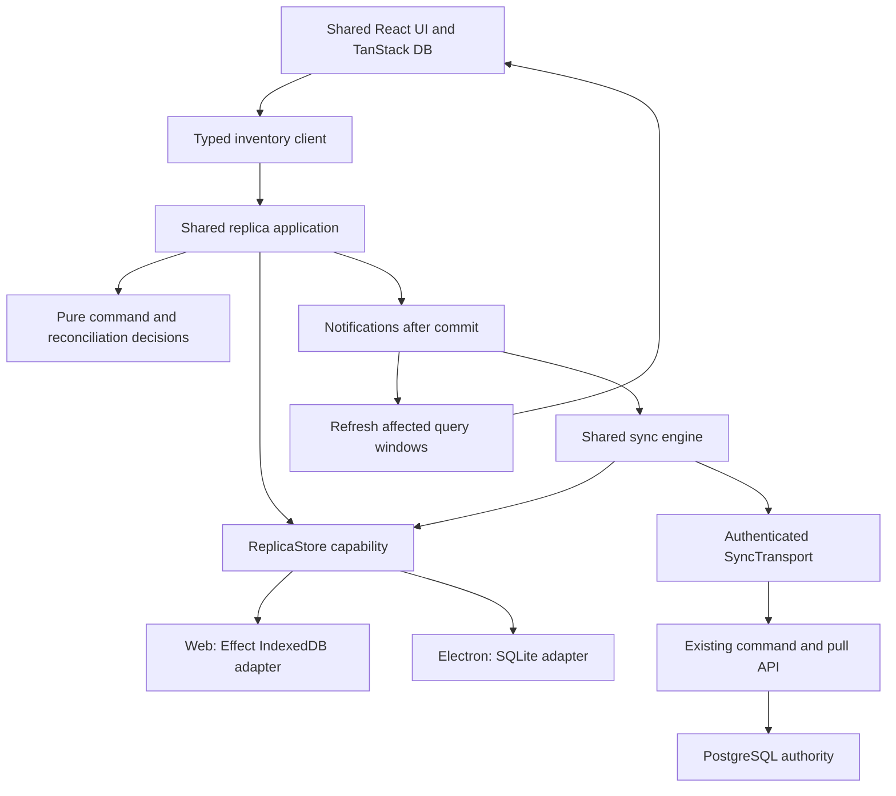

# Polymorphic replica storage and efficient synchronization

Proposed implementation, researched on 2026-09-22 against Effect `4.0.0-rc.117`. This is a design and implementation plan. It does not change application behavior. It supplements `planetscale-postgres-expo-sync.md` and replaces its assumption that every client replica uses SQLite.

Build one replica application with interchangeable storage and host adapters. Web stores its replica in IndexedDB. Electron stores its replica in SQLite. Commands, state transitions, synchronization, query semantics, and tests are shared. PostgreSQL remains the authority for accepted inventory operations.

Use explicit commands for actions that must succeed or fail together. Publish events after those actions commit to wake synchronization and refresh affected queries. The durable outbox preserves work across crashes. A notification stream does not own business state.

The [frontend reactivity plan](./frontend-reactivity-livestore.md) adds the LiveStore research and Effect Atom design. Use Atom for frontend application state, commands, and status; retain TanStack's relational query engine initially. Both consume the same workspace client and committed change feed.

## Architecture and ownership



The UI calls `issueInvoice(input)`, receives the result of durable local acceptance, and observes command status separately. Local acceptance and authoritative acceptance are distinct states. Preserve an explicit way to await the server receipt where a workflow requires it. An offline provisional invoice must not appear server-confirmed.

| Owner                 | Responsibility                                                                                | Must not know                            |
| --------------------- | --------------------------------------------------------------------------------------------- | ---------------------------------------- |
| Domain functions      | Allocation, command identity, legal status transitions, receipt validation, row-version rules | SQL, IndexedDB, React, HTTP              |
| Replica application   | Coordinate commands, publish committed changes, expose queries and command status             | Physical tables and browser globals      |
| `ReplicaStore`        | Atomic replica operations and consistent reads                                                | Network calls and UI components          |
| Storage adapters      | Read required records, invoke shared decisions, commit their results, map storage errors      | Server retry policy                      |
| Existing `SyncEngine` | Outbox draining, receipts, cursor catch-up, recovery                                          | SQL statements and DOM events            |
| Host composition      | Database lifetime, credentials, workers, network ownership, suspension                        | Inventory decisions                      |
| TanStack adapter      | Query windows, subscriptions, row membership, collection updates                              | Storage technology and upload scheduling |

Start with the existing sync engine, collection adapter, and commit publisher. Refactor those owners instead of adding a generic message bus, repository framework, and separate browser sync implementation.

Proposed module ownership is below. Keep platform implementations in leaf entrypoints so importing the shared client cannot pull in another host's dependencies.

| Location                                                          | Change                                                                                                |
| ----------------------------------------------------------------- | ----------------------------------------------------------------------------------------------------- |
| `packages/contracts/src/sync/replica-model.ts`                    | Shared storage-independent row schemas, command states, and commit/query stamps                       |
| `packages/sync/src/replica/store.ts`                              | `ReplicaStore` service and atomic operation contracts                                                 |
| `packages/sync/src/replica/decisions.ts`                          | Pure enqueue, receipt, overlay, and integration decisions, split by existing domain modules if needed |
| `packages/sync/src/replica/sqlite/`                               | SQLite implementation, physical mappings, query lowering, and migrations                              |
| `packages/sync/src/replica/indexeddb/`                            | Effect IndexedDB tables, migrations, indexed reads, and atomic writes                                 |
| `packages/sync/src/engine.ts` and `transport.ts`                  | Shared synchronization orchestration and authenticated transport capability                           |
| `packages/sync/src/scheduler.ts`                                  | Coalesced wakeups, ownership-aware network scheduling, and retry policy                               |
| `packages/client-db/src/replica/`                                 | Host-neutral client facade and TanStack collection bridge                                             |
| `apps/desktop/src/start-web.tsx` and browser worker entry         | Browser composition, worker RPC, and authentication integration                                       |
| `apps/desktop/electron/replica-worker.ts` and preload/main wiring | Native SQLite owner and authorized renderer bridge                                                    |

The sync package can host both adapters through explicit `./replica/indexeddb` and `./replica/sqlite` exports. There is no need for a new package per interface. Its shared entrypoint must remain free of native drivers, browser globals, and server authority imports.

### What makes the implementation generic

The shared contract describes replica operations with domain types. It does not describe a universal database. SQLite and IndexedDB both support atomic updates, but they have different query capabilities, transaction lifetimes, and index rules.

The following is an interface sketch. Names other than existing project types are proposed, not current exports. The complete interface also covers claims, receipts, coverage, and snapshots as listed below.

```ts
export interface ReplicaStoreContract {
  readonly enqueueCommand: (
    draft: LocalCommandDraft,
  ) => Effect.Effect<Committed<QueuedCommand>, ReplicaWriteError>;

  readonly applyRemotePage: (
    page: ValidatedPullPage,
  ) => Effect.Effect<Committed<AppliedCursor>, ReplicaWriteError>;

  readonly readSubset: <S extends InventoryCollectionSource>(
    query: ReplicaSubset<S>,
  ) => Effect.Effect<StampedRows<S>, ReplicaReadError>;

  readonly readCommandStatus: (
    operationId: OperationId,
  ) => Effect.Effect<CommandStatus, ReplicaReadError>;
}

export class ReplicaStore extends Context.Service<ReplicaStore, ReplicaStoreContract>()(
  "@store/sync/ReplicaStore",
) {}
```

`Committed<A>` contains the result and an optional commit notice. An idempotent replay with no state change produces no notice. `StampedRows<S>` couples rows of the selected source with their database generation and commit version from the same read transaction. `LocalCommandDraft` contains a stable operation ID and business payload, without a client sequence allocated by the UI.

`ReplicaStore` deserves an interface because two real implementations hide different persistence mechanics. The existing `ReplicaSqlExecutor` cannot serve this role because its public input is SQL. Avoid `Repository<T>` and public `transaction(effect)` APIs that let callers accidentally put a fetch inside a database transaction.

Use operation-specific snapshots and shared pure transition functions inside the adapters. For example, both adapters read the current identity, existing operation, and affected stock, call the same `decideEnqueue`, then persist its outbox, overlay, and metadata changes in one transaction. Both execute the same decisions. Each implements its own indexed reads and physical writes. Do not load the whole replica into memory to run a reducer.

A small private typed delta can carry these decisions. Keep it specific to replica records and operation results. Do not turn it into a general database instruction language. Extract more common transaction orchestration only if the two adapters demonstrate meaningful duplication.

### Event-driven behavior

Three kinds of messages have different guarantees:

| Message                     | Meaning                                             | Durability                                            |
| --------------------------- | --------------------------------------------------- | ----------------------------------------------------- |
| Command envelope            | A stable request the authority may accept or reject | Durable outbox, written with local pending state      |
| Authority transaction group | A committed server outcome and its row changes      | Existing authority log, applied with the local cursor |
| Replica commit notice       | Local data or command status changed                | Ephemeral, consumers reread durable state             |

Use Effect `PubSub` and `Stream` for in-process notification delivery. Keep persisted cursors, outbox rows, and generation metadata as the recovery evidence. A process can die after commit but before publication, so startup, focus/resume, and ownership acquisition inspect durable state before waiting for events.

Coalesce notifications by workspace and highest commit version. If a bounded subscriber falls behind, invalidate all its active windows at that version rather than silently dropping entity-specific changes. A slow UI must not block an already committed sale. Use a separate coalesced wake signal for synchronization, whose worker scans the outbox. Notification payloads should include changed command status as well as affected entity keys.

Keep the existing distinction between process lifetime tokens and durable identity. A cross-tab notice carries database identity, generation, and commit version. Each receiver validates that identity and assigns its own active workspace token before delivering the local notice. Do not compare another tab's random `workspaceToken` against the current tab's token.

Keep the small post-commit bookkeeping/publication section interruption-safe. Publication errors cannot undo a committed command or cause it to be reported as an uncommitted write. Persisted state remains the recovery path if the process dies in that window.

### Why not adopt EventLog for this change

Effect's `EventJournal.layerIndexedDb` and `SqlEventJournal.layer` are a real polymorphic journal. `EventLog` adds typed handlers, identities, compaction, and remote replication. They are worth considering when the journal is the application's chosen model.

This project already has authoritative command receipts, ordered organization commits, relative stock overlays, coverage, epochs, and snapshots. Effect EventLog introduces another identity and replication protocol. Its IndexedDB journal runs the handler before storing the journal entry in its own transaction. That does not make a handler's writes to our replica database atomic with the journal. Adopting it would require a separate protocol and projection design. Keep the existing command protocol and use committed notifications here. [EventJournal source](https://github.com/Effect-TS/effect/blob/effect%404.0.0-rc.117/packages/effect/src/unstable/eventlog/EventJournal.ts), [EventLog source](https://github.com/Effect-TS/effect/blob/effect%404.0.0-rc.117/packages/effect/src/unstable/eventlog/EventLog.ts).

| Design considered                                                                    | Benefit                                                     | Decision                                                                                                               |
| ------------------------------------------------------------------------------------ | ----------------------------------------------------------- | ---------------------------------------------------------------------------------------------------------------------- |
| SQL interface with a browser SQL compatibility layer                                 | Fewer immediate caller changes                              | Reject. It preserves the coupling and requires SQL emulation or browser SQLite.                                        |
| Key-value records with independent event handlers                                    | Small initial adapter                                       | Reject for replica state. It does not express atomic sequence allocation, outbox, overlays, and indexed query windows. |
| Domain operations, shared decisions, transactional adapters, committed notifications | Reuses the current protocol while supporting both databases | Choose. Backend differences stay inside real persistence boundaries.                                                   |
| Full EventLog and event-sourced projections                                          | Journal replay and an integrated event replication stack    | Separate future decision. Requires defining new authority and reconciliation semantics.                                |

## Effect RC APIs to use

The workspace currently pins `effect` and its platform/SQL peers to `4.0.0-rc.117`. Add `@effect/platform-browser` at exactly that version through the workspace catalog and overrides. Verify every new Effect adapter against the same pin.

The browser adapter should use these actual RC117 APIs:

| API                                                                    | Use                                                                          |
| ---------------------------------------------------------------------- | ---------------------------------------------------------------------------- |
| `IndexedDb.make({ indexedDB, IDBKeyRange })`                           | Supply browser primitives explicitly, including inside a worker and in tests |
| `IndexedDbTable.make`                                                  | Typed object stores, schemas, key paths, indexes, durability                 |
| `IndexedDbVersion.make`                                                | Describe the stores in a schema version                                      |
| `IndexedDbDatabase.make(...).add(...)` and `.layer(databaseName)`      | Open the database and run ordered schema migrations                          |
| Database `.getQueryBuilder` or `yield* DatabaseDefinition`             | Acquire the typed query builder                                              |
| Query builder `.withTransaction({ tables, mode, durability })`         | Atomic reads and writes over explicitly listed stores                        |
| `.from(name).select/insert/upsert/insertAll/upsertAll/delete`          | Physical storage implementation                                              |
| `Context.Service`, `Layer.effect`, `Layer.provide`                     | Provide the same application capability through each adapter                 |
| `ManagedRuntime`, `Effect.acquireRelease`, `Effect.forkScoped`         | One runtime per workspace owner, owned resources and background work         |
| `Queue`, `PubSub`, `Stream`, `SubscriptionRef`, `Schedule`             | Bounded delivery, status, and retry scheduling                               |
| `RpcClient.layerProtocolWorker`, `RpcServer.layerProtocolWorkerRunner` | Typed browser worker communication where supported                           |

`IndexedDb.layerWindow` uses `window` and defects if primitives are unavailable. Use `IndexedDb.make` with the worker globals, after a host capability check that returns an application error. Keep database acquisition errors explicit. [Browser primitives](https://github.com/Effect-TS/effect/blob/effect%404.0.0-rc.117/packages/platform/browser/src/IndexedDb.ts).

RC117's IndexedDB transaction wrapper suppresses scheduler yields between queries, waits for transaction completion on success, and aborts on failure. Keep its body limited to database operations and synchronous decisions. Do not insert HTTP, timers, unrelated promises, or nested transactions. Explicitly request `durability: "strict"` for durable user intent, subject to target-browser validation. The descriptor default is relaxed. Durability remains subject to browser storage policy and eviction. [Query builder](https://github.com/Effect-TS/effect/blob/effect%404.0.0-rc.117/packages/platform/browser/src/IndexedDbQueryBuilder.ts), [table descriptors](https://github.com/Effect-TS/effect/blob/effect%404.0.0-rc.117/packages/platform/browser/src/IndexedDbTable.ts).

Use a single transaction for each multi-store operation. Call invalidation and publish notices only after the outer transaction returns. A successful individual request is not evidence that the whole transaction committed.

Both adapter layers provide the same `ReplicaStore` service. The shared application layer requires `ReplicaStore` and `SyncTransport`. Each host supplies those dependencies with `Layer.provide`, then creates one `ManagedRuntime` for the workspace owner. Keep database acquisition inside that layer graph so migrations finish before command handlers become available. Reuse the resulting runtime for every command and query, and await `runtime.dispose()` when the owner closes. This is the Effect polymorphism boundary. The command implementation never selects a platform.

`BrowserKeyValueStore.layerIndexedDb` is appropriate for independent settings. `BrowserPersistence.layerIndexedDb` supplies stored request results with expiry. Neither is the transaction boundary for inventory. `PersistedQueue` also does not replace the outbox's accepted-but-not-integrated and uncertain-receipt states. [Browser key-value store](https://github.com/Effect-TS/effect/blob/effect%404.0.0-rc.117/packages/platform/browser/src/BrowserKeyValueStore.ts), [browser persistence](https://github.com/Effect-TS/effect/blob/effect%404.0.0-rc.117/packages/platform/browser/src/BrowserPersistence.ts), [persisted queue](https://github.com/Effect-TS/effect/blob/effect%404.0.0-rc.117/packages/effect/src/unstable/persistence/PersistedQueue.ts).

Effect `Reactivity` provides process-local invalidation. It is an optional internal implementation for query subscriptions, not a cross-tab delivery mechanism or durable log. Retain TanStack DB and the existing collection lifetime logic. Add Effect Atom for frontend application state and Effect operations through `@effect/atom-react` at the same RC version. Keep one invalidation path and one owner for each materialized query; atoms must not become a second writable replica cache. See the [frontend plan](./frontend-reactivity-livestore.md) for query subscriptions, equality, lifecycle, and the measured comparison before replacing TanStack. [Reactivity source](https://github.com/Effect-TS/effect/blob/effect%404.0.0-rc.117/packages/effect/src/unstable/reactivity/Reactivity.ts).

## Preserve these atomic boundaries

| Operation                 | Records that commit together                                                                                                                                       |
| ------------------------- | ------------------------------------------------------------------------------------------------------------------------------------------------------------------ |
| Enqueue a local command   | Validate persisted identity and current stock, allocate sequence, write stable envelope, pending invoice projection and relative overlays, increment local version |
| Claim an upload           | Select the next eligible decimal sequence, set claim ID, owner fencing token, attempts, and claim time                                                             |
| Settle a receipt          | Validate operation identity and claim, update outbox, preserve accepted overlays or remove rejected overlays, increment local version                              |
| Apply remote transactions | Apply every supported entity change and tombstone, integrate matching commands, remove covered overlays, update cursor and coverage, increment local version       |
| Import a snapshot part    | Write staged rows and mark the verified part imported                                                                                                              |
| Activate a snapshot       | Switch generation and cursor, update coverage, integrate covered commands, recompute remaining overlays, increment local version                                   |
| Read a subset             | Read the active generation, local version, base rows, and relevant overlays from a consistent snapshot                                                             |

Operation IDs, hashes, and generated row IDs stay stable across retries. Sequence allocation happens inside the write transaction. Compare decimal sequence strings with the existing decimal helpers. For an ordered IndexedDB index, persist sequence length and digits as separate index fields, so `2`, `9`, `10`, and values above JavaScript's safe integer range sort correctly.

Keep the existing claim acquisition inside `Effect.acquireUseRelease`. HTTP runs after the claim transaction closes. Finalization releases only the matching claim. A timeout or lost connection means the remote outcome may be unknown. On recovery, look up the receipt before resubmitting that same envelope.

Preserve `pending`, `sending`, `accepted_awaiting_integration`, `integrated`, `rejected`, and `abandoned` as distinct domain states. An accepted receipt does not by itself prove that the downloaded replica includes its stock change.

## Physical storage and query design

Use separate object stores for replica state, outbox, stock overlays, coverage, snapshot imports and part checkpoints, pending invoice projections, and the six entity families. Keep schemas derived from shared Effect domain schemas. SQLite mappings and IndexedDB storage schemas translate physical differences at their boundaries.

Scope the database by backend identity, organization, and authenticated user. Validate stored identity on open. The existing origin-plus-organization scope and 32-bit hashed filename are insufficient as the sole isolation guarantee. Preserve a durable replica ID for pending commands. Logout closes the runtime and subscriptions. It must not erase unsent intent or silently adopt it under another identity.

Keep active and staged generations physically distinct. IndexedDB entity keys can be `[generation, entityId]` with generation-prefixed secondary indexes. SQLite needs equivalent generation-aware tables or staging tables. Readers see the old generation until activation commits. Remove abandoned generations in bounded cleanup work.

Verify snapshot byte length, hash, identity, and schema before entering a write transaction. Store the verified part checkpoint with its staged rows. Verify the assembled generation and required catch-up horizon before activation. Preserve pending and uncertain commands throughout import.

Derive indexes from real queries in `sources.ts`, `compile.ts`, and UI query call sites. Initial candidates include product category, batch product, invoice creation time and operation ID, invoice item invoice ID, stock movement product/invoice/time, outbox status and decimal sequence, and overlay command/batch IDs. Record every query shape and its supporting index before building the adapter.

Split `compileSqliteSubset` into a storage-neutral validator and backend planners. The neutral request supports the current allowlisted predicates, order, bounded `in`, limits, offsets, and existing cursor restrictions. SQLite lowers it to SQL. IndexedDB chooses key ranges and indexes, then applies residual predicates and ordering before the final limit. Preserve null, boolean, tie-break, and tombstone semantics with differential tests.

Do not use `.limit(500)` before residual filtering and sorting, which can return the wrong top 500. An output limit is not a scan limit. Record rows scanned and rows returned. An unsupported expensive shape must produce an explicit query error or receive a dedicated index/projection, rather than silently scan an unbounded history table.

Replace raw SQL projection descriptors with named domain queries and typed parameters. Share calculations where practical. Let each adapter implement the efficient read strategy. Query confirmed stock plus pending overlays without overwriting the confirmed stock quantities.

Keep only active windows in TanStack DB. Refresh windows affected by a committed change, batch collection writes, and cancel obsolete reads when a window unloads. Subscribe before the initial snapshot, then reconcile against its commit stamp so the initial read cannot miss a concurrent write.

Narrow detail hooks to their entity IDs, preserve unchanged row references, and publish only actual changes. Invalidate for changed filter membership, ordering, and joined sources as well as visible keys. Coordinate collection settlement so a single transaction cannot appear partially applied to a relational view. Effect Atom batching alone does not make asynchronous storage reads consistent.

## Runtime design for web and Electron

### Web

Run IndexedDB access, decoding, and replica work in a dedicated worker. Provide `IndexedDb.make` from that worker's globals. Use typed command/query messages and batched commit notices. Load this worker on workspace activation. The browser bundle must contain no SQLite WASM, OPFS SQLite worker, Node built-ins, or native SQL driver.

Each tab may open a local worker and read/write the same IndexedDB database. Database transactions protect local sequence allocation. Exactly one tab/worker owns networking for that database. Acquire an origin-scoped Web Lock for the network owner, and use `BroadcastChannel` for compact wake and invalidation notices. On acquisition, scan persisted pending work and resume from the committed cursor. Follower tabs issue no sync requests. [Web Locks](https://developer.mozilla.org/en-US/docs/Web/API/Web_Locks_API).

For supported environments without Web Locks, use an IndexedDB lease record with an incrementing fencing token and bounded renewal. Validate the token during claims and settlement. Cancel network work on ownership loss. Stable operation IDs and server deduplication remain necessary because an old request can finish after its owner loses the lease. Do not claim that an in-process semaphore coordinates tabs.

On visibility and page-lifecycle changes, release or transfer network ownership when appropriate. Followers and resumed pages reread the stored version because broadcasts are not durable. A dormant page must not own an indefinite lock while another active page needs synchronization. Treat offline signals as scheduling hints, and retain connectivity probes when actual request outcomes disagree.

Close on `versionchange`, report blocked upgrades, and preserve old data if a migration fails. Never call `IndexedDbDatabase.rebuild` as automatic recovery; it deletes records. Explicitly terminate owned browser workers during disposal because the Effect browser worker layer sends a close message but does not terminate dedicated workers. [Database lifecycle](https://github.com/Effect-TS/effect/blob/effect%404.0.0-rc.117/packages/platform/browser/src/IndexedDbDatabase.ts), [browser worker lifecycle](https://github.com/Effect-TS/effect/blob/effect%404.0.0-rc.117/packages/platform/browser/src/BrowserWorker.ts).

The current app has only `startElectron`. Add a real web composition root and build entry. It must supply the browser authentication path, persistent replica identity, IndexedDB layer, authenticated HTTP transport, and lifecycle signals. An absent Electron bridge currently leaves inventory unavailable; a storage implementation alone does not create a working web app.

On a first-ever workspace open, register the replica and obtain the required initial coverage before claiming it is ready for offline inventory work. On later opens, render valid persisted coverage immediately and reconcile in the background. Missing initialization, unsupported snapshots, and invalid coverage must remain visible states rather than an apparently successful empty catalog.

### Electron

Use one background Node worker per active replica, owned by the main process. Keep synchronous native SQLite work off both the renderer and main event loop. The main process authenticates IPC and owns credentials. The replica worker owns the SQLite connection and shared replica/sync runtime. Authenticated transport calls may use the existing main-process broker.

Evaluate `@effect/sql-sqlite-node@4.0.0-rc.117`, which uses `node:sqlite`, in the actual packaged Electron runtime. If its runtime or packaging requirements do not pass, adapt the existing `better-sqlite3` implementation behind the same `ReplicaStore` contract in that worker. This is a driver decision, not a second architecture. Keep WAL, prepared statement reuse, bounded transactions, and the existing migration history. [Effect Node SQLite client](https://github.com/Effect-TS/effect/blob/effect%404.0.0-rc.117/packages/sql/sqlite-node/src/SqliteClient.ts).

Expose domain commands, bounded reads, cancellation, and change subscriptions through the preload bridge. Never expose raw SQL or arbitrary file paths. Reuse existing sender checks and session authorization. One main-owned registry prevents multiple windows from starting duplicate sync loops for the same replica. Batch reads and notices across IPC rather than crossing the bridge per row.

Effect's Node worker platform supports Node workers and IPC child processes. Do not assume it accepts Electron `utilityProcess` or `MessagePortMain` without a tested adapter. Start with the supported Node worker transport. Keep the renderer bridge narrow and host-specific. [Node worker support](https://github.com/Effect-TS/effect/blob/effect%404.0.0-rc.117/packages/platform/node/src/NodeWorker.ts).

## Network policy and performance

The network path is shared. Host adapters supply authentication, lifecycle signals, and ownership. A local query or route change never independently starts a replica download.

| Concern                 | Policy                                                                                                                                                                                                                               |
| ----------------------- | ------------------------------------------------------------------------------------------------------------------------------------------------------------------------------------------------------------------------------------ |
| Local writes            | Commit immediately to local storage. No request on the critical path to local acceptance. Wake the uploader after commit.                                                                                                            |
| Concurrent wakeups      | Merge startup, local-write, focus, reconnect, timer, and push signals into one coordinator. Allow one pull and one ordered upload at a time per replica.                                                                             |
| Upload ordering         | Drain by persisted client sequence. Keep the same operation ID/hash across retries. Do not debounce, drop, or merge issued invoices.                                                                                                 |
| Upload batching         | Current API accepts one command. Initially drain sequentially over reused connections. Add an explicit bounded batch endpoint only if measurements show round-trip cost dominates. Keep per-command receipts and ordered processing. |
| Catch-up                | Resume from the last committed cursor. Pull at most the current protocol limit of 100 transaction groups, commit, then request the next page. Yield between pages.                                                                   |
| Memory and backpressure | Bound bytes as well as row counts. Add a server response byte budget that preserves whole transaction groups. Pause reads while persistence catches up. On live overflow, resume from the last committed cursor.                     |
| Healthy live feed       | Apply ordered transactions and acknowledge only after durable commit. Do not also poll the same data on a fixed timer.                                                                                                               |
| No live feed            | One adaptive HTTP poller owned by the sync owner. Back off when unchanged and hidden; wake immediately on local work, focus, reconnect, or an available server hint.                                                                 |
| Transient failures      | Jittered exponential backoff, bounded maximum delay, and `Retry-After` where supplied. Pause for auth renewal. Do not retry malformed protocol data as a transient outage.                                                           |
| Snapshots               | Resume verified parts by snapshot ID and part hash. Bounded part fetching and transactional staging. Download a replacement snapshot only when retention or coverage requires it.                                                    |
| HTTP reuse              | Reuse the authenticated client and native connection pooling. Coalesce identical in-flight reads. No persistent generic response cache for mutable command/pull endpoints.                                                           |
| Wire encoding           | Start with existing schema-checked JSON and measured HTTP compression. Use immutable cache headers only for authorized, immutable snapshot parts. Benchmark `SchemaBinary` before introducing a negotiated protocol version.         |
| UI updates              | Notify touched queries once per commit batch, not once per row or incoming frame. Keep sorting, decoding, and large imports in background workers.                                                                                   |

Suggested initial HTTP-only polling policy is 2 seconds while actively catching recent remote work, backing off through 5, 15, and 30 seconds after empty responses. Hidden owners back off to 60 seconds or yield ownership to a visible tab. These are proposed tuning defaults, not measured optima or existing behavior. Keep them configurable through one shared policy. Report the resulting remote-staleness tradeoff.

The current Postgres authority explicitly rejects live tickets and snapshot requests. Do not open a retry loop against those unsupported capabilities. Supply an explicit capability flag initially, and add negotiated capabilities with server work. Polling is the functioning first transport. The zero-idle-poll target requires a real server push path. Snapshot-based recovery requires implementing snapshot publication and reads before it can be advertised.

Validate ordering and coverage using the protocol's subscription rules. Do not invent a requirement that every organization sequence appears in a filtered subscription. Reject malformed or missing required changes before advancing the persisted cursor. Deduplicate overlapping HTTP and live delivery at the same atomic apply boundary.

Preserve typed transport failure reasons and relevant status/`Retry-After` metadata. The current transport maps many errors to a generic unavailable error, which is insufficient for this scheduling policy.

No client design can deliver fresh remote changes with zero requests while the server has no push mechanism. Track the HTTP-only and live-enabled performance profiles separately.

### Measurable acceptance criteria

Collect baseline traces first. The latency figures below are proposed budgets to validate on named reference hardware, not claims about current performance.

- Local acceptance of a typical invoice: p95 under 50 ms on reference desktop hardware and under 100 ms on the chosen lower-end web device, excluding any deliberate validation UI.
- Covered local query, route revisit, and query-window refresh: zero API requests.
- Three browser tabs sharing one replica: one network owner and the same steady-state request count as one tab. Followers send zero sync requests.
- Ten duplicate catch-up triggers at the same cursor: one in-flight pull, followed only by pages or a new target required by the results.
- Healthy live mode with no changes: zero periodic pull requests after catch-up. Document heartbeats separately.
- HTTP-only idle mode: one backoff schedule for the replica, not one per collection or tab. Verify request counts against the configured intervals.
- Restart with pending work: recover from persisted outbox and cursor without an automatic full download. Probe receipts only for uncertain outcomes.
- Large catch-up: bounded request bytes, bounded queued frames, bounded rows decoded at once, and no storage-induced long task on the renderer thread.
- Browser production artifact: no SQLite/OPFS/WASM dependency in the import graph or fetched assets. Electron renderer: no native database driver and no blocking database calls.

Record bytes uploaded/downloaded, requests by endpoint and reason, duplicate pulls avoided, empty-poll ratio, receipt probes, rows scanned/returned, transaction duration, commit-to-UI delay, renderer long tasks, and recovery time. Compare web and packaged Electron using the same dataset and network scenarios. Include offline, high latency, intermittent connectivity, and constrained bandwidth.

## Current code that must change

The findings that used to live here described the tree before commit `a483c665`. Most of them have since been addressed: `sale-outbox.ts` and `browser-sqlite.ts` are gone, `ReplicaStore` has real SQLite and IndexedDB adapters over shared decisions, `apply.ts` handles every entity action including deletes, `import.ts` stages before activation, the collection path plans queries from a storage-neutral IR, and `start-web.tsx` exists. The measured status, the remaining gaps, and the amendments made on 2026-09-22 are in [sync-migration-status.md](./sync-migration-status.md). Read that file instead of re-deriving this list.

The earlier worker SQLite choice had a concrete constraint: commit `cd12809b` states that the renderer cannot load `better-sqlite3`. Native SQLite therefore belongs behind a background-process boundary, not in shared renderer code.

## Implementation sequence

1. **Freeze contracts and capture a baseline.** Inventory all command states, supported query shapes, sync operations, and browser import paths. Capture request and performance traces. Pin the browser Effect package. Add a backend contract test fixture and real-browser test target. Keep existing unrelated edits intact.

2. **Extract the shared replica model.** Define operation inputs/results, error categories, consistent read stamps, and neutral query descriptors. Extract pure command, receipt, overlay, coverage, and apply decisions. Replace table-bearing schema exports with shared domain schemas. Refactor the SQLite implementation first and keep existing protocol tests passing.

3. **Make the SQLite path complete.** Implement the `ReplicaStore` operations, atomic enqueue, all entity actions, and consistent queries. Preserve claim/interruption handling. Make snapshot staging real. Update `SyncEngine` to use the service. Remove direct SQL and direct command HTTP from UI actions as callers migrate.

4. **Implement IndexedDB through Effect.** Define typed tables, indexes, migration chain, atomic operations, and indexed query plans. Use the same decisions and contract tests. Add quota, blocked upgrade, unavailable storage, corrupt record, and identity-mismatch errors. Do not fall back to volatile memory when durable storage fails.

5. **Wire platform runtimes.** Add the browser build/bootstrap and worker client. Add the main-owned Electron replica worker, native driver probe, and typed preload API. Connect authenticated transport in both environments. Own one runtime per workspace, cancel it on scope changes, and await disposal. Implement web network ownership and cross-tab invalidation.

6. **Run synchronization through the owner and wire frontend reactivity.** Add the shared coalesced scheduler, adaptive HTTP mode, sequential upload drain, receipt reconciliation, and cursor catch-up. Connect command status and collection refreshes to committed notices. Introduce the workspace Atom registry and client layer, narrow frontend queries, and implement the subscription/equality/coherent-publication work in the frontend plan. Pass request-count and offline/restart tests using today's HTTP API.

7. **Complete server-dependent efficiency and recovery.** Implement snapshot acquisition/parts and a capability-gated push path consistent with the Postgres authority plan. Extend `SyncTransport` for snapshots. Add byte budgets and receipt metadata. Verify live reconnect and durable acknowledgements. Only then enable the live idle-traffic target and snapshot recovery. Consider an upload batch endpoint if measured RTT warrants it.

8. **Migrate data and remove obsolete paths.** Use a versioned browser database name. If the old SQLite browser path has unsent commands, export and validate them with original identities, then import atomically with a migration checkpoint. Preserve old data until verification completes. A temporary explicit migration tool may read SQLite; the normal web runtime must not. Rehydrate replaceable confirmed rows only through an available recovery path. Apply the same pending-intent discipline when moving Electron from OPFS to a native file.

9. **Prove both products and tune.** Run the same behavioral and network scenarios against real IndexedDB and packaged Electron SQLite. Tune indexes, batch sizes, polling, and IPC using measurements. Remove superseded APIs and worker/WASM dependencies after callers and pending data have migrated. Update the existing platform plan to point at this decision.

## Verification plan

Run a shared adapter contract suite against real SQLite and Effect IndexedDB backed by `fake-indexeddb`. Cover atomic multi-record rollback, idempotent replay, duplicate operation identity rejection, decimal sequence allocation, receipt transitions, interrupted upload recovery, all entity upserts/deletes, overlays, consistent query stamps, and staged snapshot activation.

Use differential query tests for the current predicate/order combinations, nulls, booleans, decimal ordering, stable ties, result limits, and unsupported queries. Include rows that satisfy a residual predicate only after the first 500 physical records, so a premature limit is detected.

Run real Chromium, Firefox, and WebKit tests for transaction scheduling, concurrent connections, blocked upgrades, `versionchange`, two/three-tab ownership, leader loss, quota errors, worker disposal, and reload persistence. In-memory IndexedDB tests cannot establish these browser behaviors. Test an abort after a successful request but before transaction completion and ensure no commit notice escapes.

Run packaged Electron tests for native SQLite compatibility, migration, IPC cancellation and sender checks, app restart, multiple windows, suspend/resume, and worker shutdown. Preserve existing interruption and uncertain-receipt tests through the refactor.

Exercise a network failure after server commit but before the receipt arrives. Recovery must find the same receipt without duplicating the invoice. Interrupt catch-up after persisting a page and verify that the next request uses the committed cursor. Stop the process between database commit and notification and verify recovery through durable state.

Validate the browser bundle import graph and runtime asset requests. Inspect metrics for scan amplification, duplicate pulls, excessive invalidations, and long tasks. A typecheck alone does not prove network or browser behavior.

Repository validation during implementation: `vp install`, `vp check`, `vp test`, and `vp run check` for the custom migration guard and package checks. Run `vp run lint:design` after changing desktop UI code. Build both the new web target and packaged Electron with `vp run --filter @store/desktop build`, plus the new explicit web build script introduced in phase 5.

## Research coverage and evidence

The survey covered all 20 installed `effect/unstable` families and catalogued their 207 top-level non-barrel modules. The storage, eventlog, reactivity, SQL, worker, RPC, and persistence candidates received source inspection. Unrelated families received an API-purpose survey, not an assertion that every implementation body was audited.

| Unstable family | Modules | Relevance to this design                                                                  |
| --------------- | ------- | ----------------------------------------------------------------------------------------- |
| `ai`            | 20      | Model/provider tools; no replica storage role                                             |
| `arbitrary`     | 1       | Optional generated transition/query tests                                                 |
| `cli`           | 12      | Possible migration tool only                                                              |
| `cluster`       | 39      | Server distributed execution; no browser replica requirement                              |
| `devtools`      | 4       | Optional tracing during profiling                                                         |
| `encoding`      | 6       | Keep JSON initially; evaluate SchemaBinary only with measured benefit                     |
| `eventlog`      | 14      | Real journal polymorphism; different protocol and atomicity model                         |
| `http`          | 30      | Reused HTTP client, cancellation, typed response policy                                   |
| `httpapi`       | 13      | Existing typed sync API and generated client                                              |
| `net`           | 3       | Network address values; no replica storage role                                           |
| `observability` | 8       | Timing, request/byte counters, trace export                                               |
| `persistence`   | 7       | Settings, persisted results, queues; not the replica transaction contract                 |
| `process`       | 2       | Process APIs; platform worker APIs fit the proposed owner better                          |
| `reactivity`    | 8       | Process-local invalidation; keep one TanStack update path                                 |
| `rpc`           | 12      | Typed worker command/query transport                                                      |
| `schema`        | 5       | Optional model variants or measured AOT decoding; ordinary Schema is sufficient initially |
| `socket`        | 2       | Scoped live transport when the server supports it                                         |
| `sql`           | 9       | SQLite implementation details and transaction support                                     |
| `workers`       | 4       | Worker lifecycle and transport                                                            |
| `workflow`      | 8       | Durable workflows require an engine/backend; not needed to express this outbox            |

Also inspected the five IndexedDB modules, `BrowserPersistence`, `BrowserKeyValueStore`, browser worker APIs, Node worker support, and the Node SQLite driver. Browser adapters live in `@effect/platform-browser`, so searching only `effect/unstable/persistence` would miss the right implementation.

The upstream checkout used for guide and test inspection was `5bf58f15f3e7791bd14578fcb717ed9aaceb0a46`. Its package version was RC117. The npm RC117 tarball was separately downloaded, and its IndexedDB query builder and database implementation matched that checkout. References below use the release tag where possible.

Guides consulted include the v4 migration overview, service changes, layer memoization, runtime/scope guidance, and upstream examples for services, layer composition, resource acquisition, scoped background tasks, PubSub, ManagedRuntime, and SQL. [v4 migration guide](https://github.com/Effect-TS/effect/blob/effect%404.0.0-rc.117/MIGRATION.md), [service and layer examples](https://github.com/Effect-TS/effect/tree/effect%404.0.0-rc.117/ai-docs/src/01_effect/03_services), [resource examples](https://github.com/Effect-TS/effect/tree/effect%404.0.0-rc.117/ai-docs/src/01_effect/05_resources), [ManagedRuntime example](https://github.com/Effect-TS/effect/blob/effect%404.0.0-rc.117/ai-docs/src/04_integration/10_managed-runtime.ts), [SQL example](https://github.com/Effect-TS/effect/blob/effect%404.0.0-rc.117/ai-docs/src/40_sql/10_basics.ts).

An isolated executable spike used published `effect@4.0.0-rc.117`, `@effect/platform-browser@4.0.0-rc.117`, and `fake-indexeddb@6.2.4`. It passed multi-store rollback, concurrent sequence allocation through two separate connections, and persistence after both runtimes were disposed and a new runtime opened. This checks the selected APIs in an emulated IndexedDB environment. It does not establish real-browser durability, lifecycle behavior, or performance. The planned contract suite should preserve these scenarios in the repository. [Upstream query tests](https://github.com/Effect-TS/effect/blob/effect%404.0.0-rc.117/packages/platform/browser/test/IndexedDbQueryBuilder.test.ts), [IndexedDB transaction guidance](https://developer.mozilla.org/en-US/docs/Web/API/IndexedDB_API/Using_IndexedDB).

Validation while preparing this plan: `vp install` completed without dependency updates; `vp test` passed 406 tests across 87 files. `vp check` stopped at existing formatting issues in eight files. `vp run check` stopped at the existing migration guard because `apps/android` is still present, before package typechecks ran. The plan itself passes `vp fmt --check`. No application source or dependency configuration was changed for this plan.
