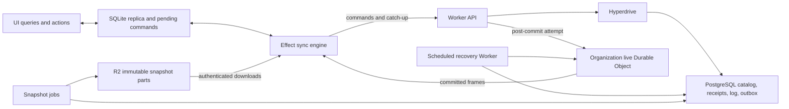

# PostgreSQL and Cloudflare sync engine implementation plan

Status: proposed implementation, no runtime changes made by this document.

Prepared 2026-09-06 against commit `5a3d9f52` on `main`.

Reviewed 2026-09-13 against the current working tree and upstream documentation. Section 17 records the additional implementation gates. This remains a design plan, not evidence that the replacement outperforms PowerSync.

Keep PostgreSQL authoritative and replace PowerSync with an application-owned replication protocol. Run the sync API, live delivery, recovery scheduling, and snapshot distribution on Cloudflare. Keep local SQLite on web, Electron, and Android. D1 continues to own authentication.

Target the latest published Effect v4 release candidate at implementation time. On 2026-09-13, the npm `rc` tag resolves to **4.0.0-rc.115** and Alchemy's `latest` tag resolves to **2.0.0-beta.77**. After a successful `vp install`, this checkout has RC 111 and Alchemy beta.74, matching its declared pins. The RC 112/beta.76 source observations below are historical, not the current installed tree. Phase 0 verifies the proposed RC 115/beta.77 pair with Drizzle and all Effect adapters before upgrading together. Effect's `latest` tag still selects v3; use the explicit v4 RC tag/version.

The architecture can provide immediate local feedback and low-latency remote updates. A strict sub-10-ms Worker CPU budget remains an acceptance test, not a property established by using Effect, Hyperdrive, or Durable Objects.

## 1. Decisions and scope

| Decision                                                 | Implementation consequence                                                                                  |
| -------------------------------------------------------- | ----------------------------------------------------------------------------------------------------------- |
| PostgreSQL is the only inventory authority               | Every accepted command commits there before it is confirmed                                                 |
| Application commands own writes                          | UI and imports cannot bypass receipts or change capture                                                     |
| One ordered log per organization                         | A PostgreSQL row lock serializes catalog commits within that organization                                   |
| Durable Objects own live delivery only                   | An object may cache frames and keep delivery metadata, but cannot accept a sale independently of PostgreSQL |
| Devices persist a confirmed replica and pending commands | Remote changes cannot overwrite unsent user intent                                                          |
| Replication is at least once                             | Receipts and transactional apply make repeats harmless                                                      |
| Predefined subscriptions                                 | No arbitrary SQL or general incremental query engine on the server                                          |
| JSON protocol first                                      | TypeScript and Kotlin share explicit wire fixtures; binary encoding is a measured follow-up                 |
| Existing Drizzle schema/migration ownership stays        | Add replication tables through the existing PostgreSQL migration workflow                                   |
| Latest Effect RC                                         | Pin an exact verified release across first-party packages and validate Alchemy/Drizzle compatibility        |

Cloudflare-only here applies to synchronization infrastructure. The PostgreSQL host remains external; current infrastructure provisions Neon.

Do not add Effect Cluster, Workflow, a second authoritative database, a CRDT framework, or a permanent WAL reader in the first implementation. None is required for the application-owned command path. External writers would require a separately designed capture mechanism before they are allowed.

## 2. Verified starting point

Paths in this document are repository-relative unless used as links.

| Existing code                                        | What to preserve or replace                                                                                                     |
| ---------------------------------------------------- | ------------------------------------------------------------------------------------------------------------------------------- |
| `apps/server/src/inventory/mutation-database.ts`     | Effect-native Drizzle/PostgreSQL transactions, stock checks, version checks, receipts; split by responsibility during migration |
| `packages/db/src/postgres/schema.ts`                 | Authoritative domain tables and `inventoryMutationReceipts`                                                                     |
| `packages/db/src/postgres/infra.ts`                  | Neon provisioning and Hyperdrive; query caching is already disabled                                                             |
| `apps/server/infra.ts`                               | Alchemy-managed Worker/runtime, smart placement, auth/config acquisition                                                        |
| `apps/server/src/http/api.ts`                        | Existing Effect HttpApi endpoint style                                                                                          |
| `apps/server/src/http/app.ts`                        | HttpApiBuilder/HttpRouter composition, CORS, typed auth recovery                                                                |
| `packages/contracts/src/store/invoice-allocation.ts` | Shared stock allocation rules and conservation semantics                                                                        |
| `packages/contracts/src/sync/*`                      | Existing entity codecs, managed columns, canonical JSON/hash helpers                                                            |
| `packages/client-db/src/open.ts`                     | Replace PowerSync lifecycle and six eager collection preloads                                                                   |
| `packages/client-db/src/invoice-writes.ts`           | Preserve durable local sale intent; replace PowerSync projection persistence                                                    |
| `apps/web/src/lib/inventory/actions.ts`              | Keep application actions; replace PowerSyncTransactor and upload-drain coupling                                                 |
| `apps/desktop/electron/inventory-http.ts`            | Preserve trusted IPC sender, URL allowlist, auth injection, cancellation                                                        |
| `apps/android/.../data/powersync/*`                  | Replace PowerSync driver/connector with native SQLite and the common protocol                                                   |
| `scripts/check-powersync-migration.mjs`              | Currently requires PowerSync; replace its assertions in stages, not by deleting checks early                                    |

There is currently no `packages/sync` package or organization live Durable Object. The latest merge restored PowerSync. Do not treat the deleted custom engine as working infrastructure to reconnect.

The current server uses `drizzle-orm/effect-postgres` over `@effect/sql-pg`, not promise-based Drizzle wrapped in Effect. Preserve that integration. PostgreSQL transaction IDs currently used for PowerSync acknowledgments are not the new replication cursor.

Historical constraint: commit `54cc17d9` records a snapshot route exceeding the Workers CPU limit. Avoid full-catalog copying or repeated per-row JSON accounting inside a bootstrap request.

### 2.1 Lessons from the Linear investigation

The requested [reverse engineering study](https://github.com/wzhudev/reverse-linear-sync-engine) describes durable pending transactions, an accepted-but-unsynchronized state, ordered delta integration, selective hydration with coverage indexes, and undo as another transaction. Its client observations are useful design evidence; they do not establish Linear's private PostgreSQL commit algorithm or a Cloudflare CPU result.

For this app, retain confirmed rows separately from optimistic intent, wait for authoritative integration before clearing accepted intent, and track whether history is loaded completely. Use domain-specific conflict rules for inventory. Avoid adopting its mutable model/decorator framework, inferred global ordering, or general last-writer-wins behavior as an inventory specification. These are application design choices informed by the study. Sections 7.3 and 9.5 make the resulting contracts concrete.

## 3. Guarantees to encode before implementing endpoints

1. A locally saved command survives application restart after its SQLite transaction commits.
2. One operation ID and canonical payload produce at most one authoritative business effect.
3. Reusing an operation ID with different content returns a protocol error.
4. Business rows, command decision, client sequence advancement, and replication record commit atomically.
5. A replica never advances past changes it has not durably applied.
6. An invoice, its items, stock updates, and movements become visible as one local transaction.
7. Unsent and unconfirmed local intent survives downloads, reconnects, and snapshot replacement.
8. Upload conflict does not stop downloads or unrelated command processing.
9. A socket is an acceleration path. PostgreSQL retains the information required for recovery.
10. User, organization, subscription, epoch, and schema compatibility are checked at ingress.
11. Work, buffers, pages, subscriptions, and outstanding frames have explicit bounds.
12. A terminal rejection has a durable decision. A transport failure or unknown commit outcome does not become a rejection.

“Exactly once” describes the business effect under these constraints, not transport delivery. After a timeout, retry the identical persisted command or query its receipt.

## 4. Runtime and module ownership



Proposed module placement:

```text
packages/contracts/src/sync/
  protocol.ts              wire commands, decisions, cursors, frames
  subscriptions.ts         supported subscription definitions
  limits.ts                negotiated caps and protocol bounds
  api.ts                   shared sync HttpApi, without server auth imports
  fixtures/                language-neutral compatibility examples

packages/db/src/postgres/
  replication.schema.ts    cursor, replica, log, outbox, snapshot metadata
packages/db/src/shared/
  store.schema.ts          SQLite domain representation

apps/server/src/inventory/
  catalog-commands.ts      product/category business operations
  stock-commands.ts        receipt, adjustment, pack conversion
  invoice-commands.ts      invoice validation and allocation
  command-transaction.ts   one atomic command decision and commit
apps/server/src/sync/
  catalog-log.ts           bounded committed reads and subscription projection
  replicas.ts              registration, sequencing, receipts
  delivery-outbox.ts       durable delivery claims and retries
  snapshots.ts             resumable snapshot state transitions
  live.ts                  hibernating organization delivery object
  handlers.ts              thin HttpApi handlers
  errors.ts                infrastructure failures and public mapping

packages/sync/src/
  engine.ts                scoped upload/download supervision
  replica.ts               apply, reconcile, generation switching
  outbox.ts                durable local command lifecycle
  transport.ts             HttpApiClient and live transport interfaces
  status.ts                distinct connection/progress/problem states

packages/client-db/src/
  sqlite.ts                host-provided local SQL adapter contract
  queries.ts               indexed local catalog queries
  reactivity.ts            post-commit invalidation and result subscriptions
  open.ts                  authenticated workspace acquisition and disposal
```

These are ownership targets, not instructions to create empty files. Introduce a module when its behavior lands. Keep domain calculations independent of Cloudflare and transport. `packages/sync` depends on contracts and narrow persistence interfaces; it must not import Electron, DOM globals, Kotlin, or server infrastructure.

Keep the existing server's Alchemy/HttpRouter runtime as the owner. Reuse layer definitions and appropriate memoization instead of adding a second ManagedRuntime around each handler. Request identity, RuntimeContext, SQL leases, and request cancellation stay request-scoped. Never cache the current actor in a shared service or reuse request-bound network objects across Worker events.

On web/Electron, one ManagedRuntime owns the active authenticated workspace's engine and local database. Dispose it on workspace switch. Inside a browser database worker, own the SQL connection there; bridge UI calls across a narrow message interface. On Android, use structured Kotlin coroutines with equivalent lifecycle semantics rather than embedding Effect JavaScript.

For Durable Objects, construct a lightweight instance-scoped service graph. Each fetch/message/alarm handler runs a bounded effect. Durable progress belongs in storage and socket attachments. Do not depend on an Effect fiber surviving hibernation or eviction, and do not keep permanent sleeping fibers/timers alive inside an object.

### 4.1 Deep modules and their interfaces

Apply the requested codebase-design guidance from [SKILL.md](/home/madmax/.codex/skills/codebase-design/SKILL.md) and [DEEPENING.md](/home/madmax/.codex/skills/codebase-design/DEEPENING.md). A module's interface includes ordering, failures, lifecycle, and cost assumptions as well as its methods. Depth comes from hiding those obligations from callers. File count and Context.Service count are not measures of design quality.

Use these external seams:

| Module                           | Interface presented to callers                                                                                 | Implementation knowledge kept local                                                                                                            |
| -------------------------------- | -------------------------------------------------------------------------------------------------------------- | ---------------------------------------------------------------------------------------------------------------------------------------------- |
| Local catalog workspace          | Submit typed intent; observe typed queries, command outcomes, and sync status; acquire/release workspace scope | SQLite ownership, immutable command IDs, durable save, upload, delta integration, coverage, optimistic reconciliation, invalidation, reconnect |
| Authoritative command processing | Execute an authenticated command and return its durable decision                                               | Organization lock, stock rules, savepoints, deduplication, replica sequence, row capture, receipts, outbox commit                              |
| Catalog replication              | Read a bounded authorized range or acquire a resumable snapshot                                                | Log layout, fixed horizons, subscription projection, retention pins, snapshot jobs and manifest publication                                    |
| Live delivery                    | Announce a committed target; serve an authorized resumable connection                                          | DO identity, hibernation, target persistence, gap repair, frame caching, slow consumers, retry alarms                                          |

Application actions must not call `enqueue`, `persistOverlay`, `wakeUpload`, and `invalidate` in a prescribed order. They submit once to the local catalog workspace. That module returns only after durable local save, and exposes later authoritative decisions separately. Query results include coverage/freshness, so screens never infer completeness from an empty array. Opening a workspace starts its scoped workflows without forcing callers to await a network bootstrap.

The authoritative command module must not expose `lockOrganization`, `writeReceipt`, or `appendChanges` for handlers to coordinate. Those are private implementation steps inside one transaction. Keep pure invoice allocation and conflict comparison directly callable internally; do not create a Context.Service for each pure helper.

Internal seams require concrete adapters:

| Dependency                  | Concrete adapters and verification                                                                                                           |
| --------------------------- | -------------------------------------------------------------------------------------------------------------------------------------------- |
| Owned remote sync transport | Production HttpApi/live adapter; scripted loss/reordering adapter for engine tests                                                           |
| Local persistence           | Browser-worker SQLite adapter; real SQLite test adapter with the same transaction contract; Electron initially reuses browser persistence    |
| Authoritative storage       | Existing PostgreSQL/Drizzle adapter against Hyperdrive in production and real PostgreSQL in tests; no generic multi-database repository port |
| Cloudflare live/R2 access   | Alchemy binding adapter; fault-injection adapter for delivery/job tests; deployed tests prove actual platform behavior                       |
| Pure domain rules           | Direct functions tested through command outcomes and conservation properties; no injected wrapper                                            |

Kotlin implements the portable protocol and behavioral contracts independently; it is not an adapter that implements a TypeScript Effect interface. Keep test adapters private to the module that needs the seam. Do not export raw database handles or fiber controls to make tests convenient.

Apply the deletion test at each phase: removing the local workspace module would force persistence/reconciliation rules into many screens, so it earns its place. Removing a service that merely forwards `write` to another service adds no caller complexity, so collapse it. During extraction of mutation-database.ts, group behavior around command invariants; do not replace one large file with a chain of shallow services.

Test callers and maintainers through the same interface: submit, interrupt transport, reopen, observe rows and outcomes. Once those tests cover a behavior, replace redundant pass-through mocks and call-count tests. Keep focused SQL concurrency tests where actual storage semantics are the subject. A change to the internal queue layout should not rewrite application tests.

### 4.2 Alchemy-native Effect and Cloudflare wiring

The repository pins and currently installs Alchemy `2.0.0-beta.74`. The original review used a locally installed beta.76. As of the September 13 review, the proposed beta.77 declares Effect `>=4.0.0-rc.112 || >=4.0.0`; this peer range does not prove RC 115 compatibility. The API details below originate from beta.76 source and Alchemy v2 documentation. The current beta.74 PostgreSQL proxy and request composition were rechecked locally; recheck the other APIs after alignment. Do not copy v1 `alchemy/cloudflare` examples into this stack.

**Initialization and request execution.** Resolve resource bindings and construct typed handlers in Worker Init. Init participates in deployment planning and isolate initialization; actual requests execute the returned HttpEffect. Build shared contracts outside the Worker and attach server-only authorization during composition. Alchemy's guide builds the router handler once with `yield* HttpRouter.toHttpEffect(routes)`. [Alchemy Effect HTTP guide](https://alchemy.run/cloudflare/apis/effect-http-api/).

For this repository, investigate the existing `Effect.scoped(Effect.flatten(HttpRouter.toHttpEffect(routes)))` fetch expression: it executes route construction inside each request. Move pure route construction into Init after proving the route layer acquires no request-bound resources there. Preserve the host-provided event scope around executing the returned handler. Never close the route construction scope immediately and retain a handler backed by disposed services. Test two simultaneous users and count route-layer builds to establish both reuse and identity isolation. This is an implementation task, not a change made by this plan.

**PostgreSQL acquisition.** Keep `alchemy/SQL/Postgres` with the existing Effect Drizzle integration. Installed `SQL.Postgres` returns an Init-safe proxy: it resolves the URL and memoizes the actual pool in the current execution scope on first use. `PostgresLayer` provides both PgClient and SqlClient from the same acquisition. Thus a reusable module can hold the proxy without retaining a request's physical connection. Preserve explicit Drizzle transaction handles for atomic commands. Verify pool finalization and unknown-commit behavior in concurrent event tests. See installed `node_modules/alchemy/src/SQL/Postgres.ts` and [Alchemy Hyperdrive](https://alchemy.run/cloudflare/data/hyperdrive/).

**DO initialization.** Use `Cloudflare.DurableObject<...>()` with an outer Effect for bindings/state reference and an inner Effect for per-activation storage reads, attachment restoration, and returned methods. Host the delivery class in one Worker; use a separate class declaration and `.make(...)` implementation if another Worker consumes it through `.from(HostWorker)`. Keep runtime imports out of binding-only consumers. Resolve `Cloudflare.DurableObjectState` outside, but invoke its RuntimeContext-dependent methods inside activation or event execution. Accept hibernating connections through Alchemy's `Cloudflare.upgrade()` and return `webSocketMessage`, close/error, and alarm handlers. Reconstruct bounded session metadata from `state.getWebSockets()` and checked attachments on every activation. [Alchemy DurableObject reference](https://alchemy.run/providers/cloudflare/workers/durableobject/) and [cross-Worker binding](https://alchemy.run/cloudflare/compute/cross-worker-durable-object/).

Only the host implementation sees native sockets and DO storage. Internal Worker-to-DO calls can use Alchemy's typed method bridge. Public clients retain the portable HTTP/frame schemas. Do not add RpcDurableObject or an Effect-specific wire codec merely to call one internal delivery method. [Alchemy RPC guidance](https://alchemy.run/cloudflare/apis/effect-rpc/).

Preserve `RuntimeContext` in Cloudflare-facing method requirements when the underlying binding requires it. Do not cast it away to satisfy a host-neutral interface. The host adapter supplies execution context at the actual event seam; client-side modules remain free of Alchemy imports. A Layer supplies stable dependencies, not a fabricated request context.

**Scopes and post-response work.** Alchemy owns event scopes; its Worker bridge closes them through platform waitUntil. Resolve `Cloudflare.WorkerExecutionContext` during Init and invoke `exec.waitUntil(effect)` in a handler for a bounded delivery attempt. In a DO, use `state.waitUntil(effect)` where appropriate. Acquire disposable I/O in event execution, not Init. Do not put a PostgreSQL commit, receipt, or the sole recovery record in a response finalizer: critical durable state must exist before success is returned. An outer request's nested scope may close earlier than the host event scope; verify the actual scope that owns each SQL operation. [Alchemy Workers guide](https://alchemy.run/cloudflare/compute/workers/); implementation comments in `Cloudflare/Workers/Worker.ts` and `DurableObject.ts`.

**Recovery scheduling.** Register `Cloudflare.Workers.cron(expression, handler)` during Init and provide `Cloudflare.Workers.CronEventSourceLive`. The callback performs one bounded lease/dispatch pass. Report failures inside it because the event source may catch them. Use one directly managed DO alarm for the coalesced delivery target; do not add Alchemy's multi-event scheduler without a need for multiple named jobs. PostgreSQL remains the source of pending recovery work. [Alchemy Cron guide](https://alchemy.run/cloudflare/messaging/cron/).

**R2 and Config.** Declare a snapshot bucket in infrastructure; bind read/write capability to the builder and read capability to the download module, with the corresponding Alchemy binding layers. Resolve sync settings and `Config.redacted` secrets during Init so Alchemy discovers their deployment bindings. Keep MAC/ticket secrets redacted until their cryptographic call sites, and preserve the existing stage-isolation rules. Never discover a required Config value only inside fetch. [Alchemy HTTP resource wiring](https://alchemy.run/cloudflare/apis/effect-http-api/) and [Secrets & env](https://alchemy.run/cloudflare/security/secrets-env/).

Phase 0 must demonstrate plan-safe construction, required bindings/layers, clean per-event finalization, and hibernation restoration with the selected Alchemy/Effect pair. Do not replace these checks with an unverified generic ManagedRuntime example.

## 5. Effect v4 RC implementation rules

API names below were checked against local RC 112 source and bundled `ai-docs`. Recheck them after the Phase 0 version alignment if a newer RC has shipped.

| Concern                         | Use                                                                 | Avoid                                                       |
| ------------------------------- | ------------------------------------------------------------------- | ----------------------------------------------------------- |
| Application service             | `Context.Service<Self, Shape>()("id")`                              | v3 `Context.Tag`, automatic `Effect.Service.Default`        |
| Implementation                  | `Layer.effect`, `Service.of`, explicit `Layer.provide`              | Fresh dependency graphs per operation                       |
| Business operation              | `Effect.fn("Catalog.operation")` and `Effect.gen`                   | Promise services hidden inside generators                   |
| Boundary data                   | `Schema.Struct` plus derived type/interface; `Schema.TaggedUnion`   | Duplicated handwritten DTO types                            |
| Expected infrastructure failure | `Schema.TaggedError`                                                | `Schema.TaggedErrorClass`, blanket `orDie`                  |
| Typed recovery                  | `Effect.catchTag`, `catchTags`, `catch`, `catchIf`                  | v3 `catchAll` or swallowing all causes                      |
| Child work                      | `forkChild`, `forkScoped`, captured scope with `forkIn`             | v3 `forkDaemon`; detached durable jobs                      |
| Retry                           | `Schedule.exponential`, `jittered`, `upTo`, typed `Effect.retry`    | Retry every error forever                                   |
| Pages/events                    | `Stream.paginate`, `fromQueue`, `runForEach`                        | v3 `paginateEffect`; whole-log `runCollect`                 |
| Single-flight work              | `Semaphore.make(1)` with permits; coalesced wake signals            | Sleep-based locks; semaphore treated as a distributed lock  |
| UI status                       | `SubscriptionRef` with `SubscriptionRef.changes(ref)`               | Polling state or broadcasting entire catalogs               |
| Query invalidation              | `effect/unstable/reactivity/Reactivity`                             | Assuming database writes automatically notify every query   |
| HTTP                            | shared HttpApi + `HttpApiClient.make`; Effect HttpClient            | Separate hand-maintained web HTTP contracts                 |
| SQL                             | existing Effect Drizzle transaction and explicit transaction handle | Mixing unrelated SQL clients inside one logical transaction |
| Tests                           | `@effect/vitest`, `TestClock` from `effect/testing`, Deferred/Queue | Real sleeps for ordering or retry tests                     |

Use named exports consistent with this repository. A self-importing module namespace convention is not required to write idiomatic Effect.

Keep pure allocation, comparison, hashing preparation, and projection functions synchronous and typed. Create Effects at I/O and workflow boundaries; do not fork one fiber per row or add a span for each column.

Schema decoding belongs at trust boundaries. Compile/reuse codecs in the module or owning layer. Do not decode identical data again at every service hop. Database rows still require checked conversion where driver types differ, especially bigint, boolean, and JSON values.

Use Config at acquisition boundaries for page sizes, retry bounds, and retention. Cloudflare resource bindings are required services, not defaultable Context.Reference values. The documented FetchHttpClient.Fetch reference may wrap the existing authenticated fetch adapter, but absence of the host adapter must not fall back to unauthenticated global fetch silently.

### 5.1 Errors and command decisions

Model conflict and rejection as serializable terminal command decisions. Model unavailable storage, rate limiting, and unavailable transport as typed operational failures. This makes it possible to persist a rejection and consume its sequence without retrying it forever.

Example service shape, with protocol-specific models supplied by the implementation:

```ts
import { Context, Effect, Layer, Schema } from "effect";

export class SyncUnavailable extends Schema.TaggedError<SyncUnavailable>()("SyncUnavailable", {
  operation: Schema.String,
  cause: Schema.Defect(),
}) {}

export const DeliveryTarget = Schema.Struct({
  organizationId: Schema.String,
  epoch: Schema.String,
  throughSequence: Schema.String,
});
export interface DeliveryTarget extends Schema.Schema.Type<typeof DeliveryTarget> {}

export class LiveDelivery extends Context.Service<
  LiveDelivery,
  {
    readonly publishThrough: (target: DeliveryTarget) => Effect.Effect<void, SyncUnavailable>;
  }
>()("@store/server/LiveDelivery") {}

export const makeLiveDeliveryLayer = (publish: LiveDelivery["Service"]["publishThrough"]) =>
  Layer.effect(
    LiveDelivery,
    Effect.succeed(
      LiveDelivery.of({
        publishThrough: Effect.fn("LiveDelivery.publishThrough")(publish),
      }),
    ),
  );
```

The example demonstrates RC API shape, not production validation. Production identifiers use the repository's constrained branded schemas; sequence strings use validated canonical nonnegative decimal encoding.

Classify PostgreSQL/Drizzle driver failures once at the adapter boundary. Preserve retryable connection failures, serialization failures, deadlocks, constraints, and unknown commit outcomes. Keep internal causes out of public JSON errors. Log them with operation IDs and trace IDs, without customer payloads or credentials.

Use a bounded transaction retry for deadlock/serialization errors only when the transaction has no external side effects. A lost COMMIT acknowledgment must retry with the same operation identity and consult its receipt. It must not allocate a new invoice ID.

## 6. PostgreSQL schema and ordering

Add these tables using Drizzle migrations. Keep organization identity in keys and foreign keys.

| Table                      | Required fields and constraints                                                                                                                                |
| -------------------------- | -------------------------------------------------------------------------------------------------------------------------------------------------------------- |
| `catalog_sync_state`       | organization PK, epoch, current sequence, retention floor, writer mode, protocol floor                                                                         |
| `catalog_replicas`         | organization + replica PK, owner user, device identity, last processed client sequence, last seen, retired state                                               |
| Command receipts           | organization + operation PK; unique organization + replica + client sequence; payload hash, command version, terminal decision, commit sequence, server result |
| `catalog_transactions`     | organization + epoch + commit sequence PK; operation ID, change count, encoded size, committed server timestamp                                                |
| `catalog_changes`          | transaction FK + ordinal PK; table/entity discriminator, entity ID, revision, immutable after-image or removal, subscription routing information               |
| `catalog_delivery_outbox`  | organization + epoch key, target sequence, delivered sequence, lease token, lease expiry, next attempt, attempt count                                          |
| `catalog_snapshot_jobs`    | job ID, organization, epoch, subscription version, starting/ending sequence, phase, table/key cursor, lease, progress                                          |
| `catalog_snapshot_rows`    | staged generation + table + entity key, row data; isolated from live domain tables                                                                             |
| `catalog_snapshots`        | immutable snapshot ID, horizon, schema/subscription version, R2 manifest, ready/retired state                                                                  |
| `catalog_retention_leases` | organization + epoch + lease ID, owner/job, required-after sequence, expiry; used by snapshot builds and bounded download continuations                        |

Evolve `inventoryMutationReceipts` in place or migrate it once with a compatibility adapter. Do not create two competing receipt authorities. Legacy PowerSync receipts lack reliable monotonic replica sequences; label/import them as legacy and preserve their deduplication identities.

Export new replication tables through `packages/db/src/postgres/schema.ts`, the entry passed to `Drizzle.Schema` in `infra.ts`. Creating `replication.schema.ts` alone does not put its tables into that migration input. Verify generated DDL, organization-scoped foreign keys, backfills, and indexes against a populated database before enabling capture.

Store PostgreSQL sequences as bigint. Encode them as decimal strings on the wire and parse them to bigint in TypeScript or Long with range checks in Kotlin. Never use lexical string order. Keep entity revisions, organization commit sequence, and device command sequence as distinct branded types.

PostgreSQL and SQLite cannot literally share a single Drizzle table declaration: their dialect builders, types, defaults, and constraints differ. Share domain/wire schemas and deterministic mapping tests, and keep explicit PostgreSQL and SQLite table definitions. Add field/group revision storage for commands that support disjoint edits, either as constrained columns or a keyed revision table updated in the same transaction. The existing single rowVersion cannot prove that an individual field remained unchanged.

### 6.1 Commit algorithm

Before entering the transaction, authenticate, decode bounded input, compute the canonical hash, and prepare deterministic IDs. Inside the transaction:

1. Lock `catalog_sync_state` for the authenticated organization. Check epoch and writer mode.
2. Check operation receipt. For an identical replay, return its previous decision. Verify actor/replica ownership before exposing the result.
3. Lock/read replica progress in a consistent lock order. Require exactly the next client sequence. A gap is a recoverable protocol state; a stale sequence with no retained receipt requires explicit reconciliation.
4. Validate referenced rows and domain invariants against current authoritative data. Acquire any additional row locks in deterministic key order.
5. Evaluate the command. For accepted work, apply the entire business transaction. For expected business rejection, leave no business changes.
6. Increment the organization sequence through the locked state row, not `nextval()`.
7. Insert a transaction record and its immutable after-images/removals. A terminal rejection may have an empty change set but still has an ordered decision.
8. Store the decision receipt and advance replica progress in the same transaction.
9. Advance the outbox target using `GREATEST(existing, newSequence)` and make it eligible for delivery.
10. Commit. Only now return accepted/rejected status and attempt external delivery.

Use READ COMMITTED for this lock-based algorithm and read business rows in statements after acquiring the organization lock. A combined statement can use a snapshot from before a lock wait. If a different isolation level is chosen, prove its retry behavior explicitly. Keep `lock_timeout` and `statement_timeout` transaction-local, with a bounded overall command deadline. Do not keep a pooled connection waiting indefinitely. PostgreSQL documents statement snapshots and serialization failures in its [transaction isolation reference](https://www.postgresql.org/docs/current/transaction-iso.html).

PostgreSQL sequences and transaction IDs are not commit-order cursors. Transaction A can allocate a number before B but commit after B. Holding the organization state lock through commit prevents that hole for this log. Every writer must use the same lock convention; an in-process Effect Semaphore cannot enforce it across Workers.

Expected failures after SQL writes need a real savepoint rollback before storing a rejection in the outer transaction. Prefer domain validation before writes. Where a constraint can still fail, verify and use the chosen Effect Drizzle nested-transaction/savepoint behavior. Catching a PostgreSQL statement error and continuing in an aborted transaction is invalid. Never catch a domain failure inside the transaction and accidentally commit its partial writes.

Use explicit transaction handles in domain helpers, as the repository already does. Both log insertion and invoice writes must receive that handle. Do not mix Drizzle's transaction callback with a separately acquired SqlClient and assume shared atomicity.

### 6.2 Log content and indexes

Capture final row images from the same transaction, including deletions, all invoice-related tables, and server-generated fields. Do not defer row capture to a later SELECT against live tables. It may observe a later revision.

Index log reads by organization, epoch, sequence, ordinal. Store encoded sizes once when records are created, or produce bounded serialized chunks in PostgreSQL. Avoid serializing each row repeatedly just to choose a response page. Benchmark SQL JSON construction versus Worker encoding before deciding which owns frame production.

Use server time for log timestamps and retention. Keep device occurrence time as audit input only. Enforce immutable entity IDs and server-owned metadata. External writes, deletion jobs, and category/product imports must produce log entries too.

### 6.3 Domain-specific conflict policy

| Command                   | Rule                                                                                            |
| ------------------------- | ----------------------------------------------------------------------------------------------- |
| Product description patch | Allow disjoint field changes; verify expected field revisions for touched fields                |
| Price/pack configuration  | Treat related fields as a versioned group                                                       |
| Receive stock             | Add a uniquely identified movement and update quantities atomically                             |
| Physical stock count      | Require the observation revision; stale absolute counts conflict                                |
| Issue invoice             | Revalidate current available stock and pack/unit conservation; accept or reject the entire sale |
| Delete                    | Stale edits cannot resurrect the entity; restoration is a new command                           |
| Invoice correction        | Record a reversal/correction instead of overwriting historical stock effects                    |

Carry either an expected server revision or an explicit predecessor-operation reference for edits built on another pending local edit. Resolve predecessor references to authoritative receipts on the server. This avoids making a device's second offline edit conflict merely because its first edit incremented the row revision. If the predecessor was rejected, persist a dependency rejection and let the user resolve it.

Commands are immutable once persisted for submission. Reconciliation changes their local projection, not the canonical submitted payload or hash. Conflict resolution creates a new operation ID. Do not silently replace the payload of an operation that may already have reached the server.

Offline sales remain pending until server confirmation. Final offline sales with guaranteed nonnegative shared stock require allocated device stock rights and are outside this first implementation. Distinguish provisional invoice references from final server-assigned invoice numbers.

## 7. Wire protocol and HTTP boundary

Define schemas and compatibility fixtures before transport implementation. The wire contract is independent of Effect's internal runtime so Kotlin can implement it exactly.

| Message           | Required semantics                                                                                                         |
| ----------------- | -------------------------------------------------------------------------------------------------------------------------- |
| Register replica  | Authenticated organization, stable replica ID, protocol/schema versions; return epoch and limits                           |
| Submit commands   | Bounded ordered list, immutable identities and hashes; independent command transactions                                    |
| Command decision  | Accepted, rejected, conflict, dependency rejected, or sequence gap; identify operation and authoritative decision sequence |
| Pull request      | Epoch, subscription handle/version, last applied sequence, page bounds                                                     |
| Change page       | From cursor, through cursor, fixed target horizon, complete transaction groups, continuation/caught-up status              |
| Live hello        | Authorized subscription, last committed client cursor, supported versions                                                  |
| Live frame        | Same transaction/cursor contract as HTTP pages                                                                             |
| Acknowledge       | Last cursor committed locally, never merely received                                                                       |
| Reset required    | Typed reason: expired history, epoch changed, subscription changed, unsupported replica schema                             |
| Snapshot manifest | Immutable ID, epoch, subscription version, horizon, part sizes/hashes, schema compatibility                                |

Suggested endpoint group:

```text
POST /api/sync/replicas
POST /api/sync/commands
POST /api/sync/pull
POST /api/sync/receipts
POST /api/sync/live-ticket
GET  /api/sync/live
POST /api/sync/snapshot
GET  /api/sync/snapshots/:snapshotId/parts/:partId
```

POST pull keeps long cursors/subscription arguments out of URLs. Snapshot part paths are immutable but authorization is evaluated before any cached bytes are served. Keep command and error envelopes small. A request-level malformed body or failed authentication is an HTTP failure; a well-formed command conflict is a durable typed decision in the response.

Put the portable SyncApi contract in `packages/contracts`. The server attaches its organization-auth middleware when composing routes. Clients must not import server auth services or `apps/server` to obtain endpoint types. Reuse the established HttpApiEndpoint/HttpApiGroup construction style and build the TypeScript client with HttpApiClient.make once per workspace.

Bound the request body before decoding large JSON. Bound array counts, string lengths, invoice item counts, and nested collection sizes through Schema. Enforce decompressed limits where applicable. Distinguish oversized input from unsupported protocol and malformed data.

### 7.1 Cursor and transaction rules

Use a cursor containing epoch, subscription identity/version, and commit sequence. Authenticate it with a MAC or use an opaque server handle so clients cannot invent subscription scope. Authentication still checks authorization; possession of a cursor is not authorization.

At pull start, select a target sequence H. Read immutable log records only through H. On continuation, keep H fixed until that catch-up pass finishes. Return only complete transaction groups. If a transaction exceeds the usual page size, use an explicit bounded large-transaction path with client staging and atomic publication, or reject commands beyond the supported transaction maximum before execution. Never partially advance over a transaction.

Filtered subscriptions may legitimately skip global sequence values. The server returns an explicit covered range/cursor even when no visible row changed. Clients cannot infer missing data from a numeric gap alone. They must reject a frame whose `from` cursor does not match their state, then pull from their persisted cursor.

Bind any command watermark to the page horizon. Do not return the latest replica sequence from a newer database state and use it to remove optimistic work before its changes are applied. An accepted HTTP receipt stops retries, but only corresponding authoritative integration clears its optimistic effect. A rejected receipt can clear the rejected effect once that decision is durably stored locally.

For snapshots and expired-log recovery, request explicit receipts for outstanding operation IDs. Keep invoice deduplication permanent through durable identities even if routine history is compacted. Never infer that an old operation did not execute merely because a short-lived receipt record was pruned.

Return receipt lookup states that distinguish a retained decision, provably unprocessed identity, and expired/unknown evidence. Preserve replica high-water and retirement evidence beyond ordinary log retention; never reuse a retired replica ID or reset its client sequence on an epoch change. A restored or cloned local database with a reused sequence and different operation must stop for reconciliation. Issue a new replica identity for future submissions only after resolving old pending commands. Unknown evidence never authorizes resubmitting a sale with a fresh ID.

### 7.2 Subscription design

Start with a fixed operational catalog subscription and explicitly requested history buckets. Define the operational working set precisely before shipping: categories, product fields required offline, relevant batches, and summaries required by the UI. Do not replicate all historical stock movements on every device by default.

Use fixed monthly history buckets rather than an implicit rolling predicate that changes membership without a write. Subscribe/unsubscribe explicitly when the desired window changes. Subscription definitions have versions and field allowlists.

Track which subscriptions retain each local entity. Removing one subscription cannot delete a row required by another. Preserve dependency closure for foreign keys and historical invoice references, or deliberately use a projection-specific schema with documented weaker local constraints. Do not claim identical local/server constraints while omitting referenced rows.

Define a canonical row image per projection schema. Store its last applied organization sequence and deletion sequence independently of subscription coverage. An older history stream may advance its own coverage but cannot overwrite a newer operational row. Equal-revision, unequal-content images are a protocol/integrity failure. Subscription removal only releases that subscription's ownership; it is distinct from an authoritative entity deletion. Apply all visible changes from one transaction together, and track optimistic incorporation per affected projection so stock can settle even if a history subscription is still loading.

During the initial implementation, derive subscription membership deterministically from transaction after-images and required prior routing keys. A category or organization field that changes membership needs an explicit removal from the previous subscription and insertion into the new one. No query-by-query server dependency graph is required.

### 7.3 Partial data needs a coverage contract

Implement explicit local coverage records keyed by organization, epoch, subscription definition/version, and partition key. A history query returns rows plus one of `unloaded`, `loading`, `completeThrough(cursor)`, or `failed`. An empty complete partition is different from a partition that has never been downloaded. This is the application-specific use of the selective hydration lesson in section 2.1.

Acquire coverage through the same snapshot/log protocol as other replicated data. For a newly requested month, start a partition generation at horizon H, apply its complete snapshot, and catch up before publishing coverage. A one-off query against current PostgreSQL rows cannot establish coverage at an unrelated cursor. Coalesce concurrent requests for the same partition; transport batches remain bounded. Keep this coordination inside the local catalog workspace module.

Apply coverage metadata and its rows atomically. If a late partition page races a newer live update, stage and reconcile it before publication; it must not overwrite a newer confirmed revision or resurrect a tombstone. Reconnect, epoch reset, schema change, authorization change, and incomplete import must update or invalidate coverage explicitly. Live permission checks still govern every data request.

Eviction removes coverage along with data only when no active query, other subscription, or pending command requires it. Ordinary offline reads use available coverage without a network wait. Screens display unavailable or stale history through the query result, while operational stock and pending commands retain their stronger persistence policy.

## 8. Reliable outbox delivery and hibernating live objects

### 8.1 PostgreSQL outbox

Coalesce pending work by organization and epoch using target/delivered sequences. A higher target supersedes lower notifications because clients recover from the log. Durable changes themselves are never dropped.

Normal path: after commit, attempt bounded delivery immediately. Use the host's Cloudflare execution-context integration for work allowed to continue after a response; do not use forkDetach as a durability mechanism. A delayed or failed delivery must not change the command's accepted outcome.

Recovery path: a scheduled Worker claims a bounded set of eligible organizations using a short PostgreSQL transaction, lease tokens, and `FOR UPDATE SKIP LOCKED`. Commit claims before any external calls. Dispatch with bounded concurrency, then acknowledge only the claimed target and matching lease token. A later commit advancing target remains pending. Expired claims become eligible again.

Use database time for distributed leases. Never hold a PostgreSQL lock while sending websocket frames. Index eligibility so the scheduled pass scans pending work, not every organization. Keep each scheduled pass within the selected CPU budget. Persist unfinished progress for another actual scheduled/alarm/queue event; an Effect loop, waitUntil call, or self-recursion does not reset that event's CPU budget.

If only minutely scheduled recovery is enabled, a missed immediate notification can remain delayed until the next recovery pass. State that recovery latency separately from normal live latency. Add more prompt durable dispatch only if product requirements justify its cost. Client resume/visibility checks provide another catch-up path.

Cloudflare Queues is available on Workers Free, currently with 10,000 operations/day and fixed 24-hour message retention. It is an optional dispatch/job adapter, not excluded for being Paid-only. For snapshot continuations, benchmark small queue messages that identify PostgreSQL jobs; keep recovery scans because PostgreSQL commit and queue send cannot be atomic. A queue delivery or dead-letter entry cannot replace the domain log or durable job record. Direct DO delivery remains the normal low-latency path. [Queues pricing and limits](https://developers.cloudflare.com/queues/platform/pricing/).

### 8.2 Live object behavior

Use one live object per organization initially. It owns socket attachments, authorized subscriptions, acknowledged cursor, send window, and a bounded recent-frame cache. PostgreSQL still determines the true head.

Outbox RPC provides a target sequence. The object fetches required immutable ranges through the application adapter or receives verified frames from a trusted internal caller. Handle duplicate and out-of-order targets using monotonic max logic. On a missing range, pull the range; do not advance a cursor to the announced target.

Persist receipt of the delivery target and any required alarm before acknowledging the outbox dispatch. If delivery spans multiple events, the alarm resumes bounded work after eviction. Schedule retry explicitly after exhausted alarm retries. Never treat “socket.send returned” as proof that the device committed data.

Close the catch-up/subscription race: register the socket and its resume cursor, obtain/recheck a current target, catch up through that target, and then deliver later transactions. Test a commit occurring between registration and head discovery. Bound data accumulated while catching up; switch to catch-up mode when that bound is exceeded.

Pre-encode each frame once per subscription/version, not once per socket. Limit frames outstanding per socket. A slow or backgrounded client receives a resume signal or reconnect requirement rather than an unlimited queue. Fan-out is bounded work and must be measured against the object event CPU target.

Cache row frames by the complete authorization/projection identity, including epoch, subscription parameters, schema, and field permissions. Keep user-specific receipts and command outcomes outside shared frames unless separately scoped. Enforce both byte and count windows with application ACKs; reject an ACK beyond the sent cursor or for another epoch/subscription. After hibernation, restore a bounded acknowledged position or force HTTP resume. Do not infer delivery from an empty runtime send buffer.

Use the native Cloudflare hibernation API for acceptWebSocket, message handlers, and attachment restoration. Effect owns the bounded handler workflow, not the socket's persistent lifetime. Avoid generic socket server loops that keep the object active. Built-in ping handling may maintain the connection; application-level lease refresh and freshness checks remain explicit.

### 8.3 Authentication and revocation

Use an authenticated ticket endpoint because browser WebSocket constructors cannot attach arbitrary bearer headers. Issue a short-lived, single-use ticket bound to user, organization, subscription, protocol, and allowed origin. Keep long-lived access credentials out of URLs. If the ticket travels in the handshake URL, redact it from logs and consume it once.

Reuse first-party auth. Enforce a bounded authorization lease for open sockets, and send revocation notifications when membership changes. Auth remains in D1, so revocation and PostgreSQL writes are not one cross-database transaction; document the chosen authorization window. Recheck authority for every command and snapshot request. A strict immediate-revocation requirement would need stronger coordination than a cached JWT alone.

Consume ticket nonces atomically in the destination DO before accepting the socket; a signed expiry alone does not make a ticket single-use. Keep nonce state only through the ticket lifetime. Recheck the lease before sending protected frames after wakeup. Schedule the object's one alarm for the earliest pending delivery retry or authorization expiry, then recompute the next deadline. Delivery retries must not postpone revocation. Test a revoked idle socket through hibernation and a lost revocation notification. Data already stored on an offline device cannot be remotely erased until it reconnects.

A workspace switch closes the socket, cancels its transport, clears UI subscriptions, and hides the previous replica immediately. Do not destroy a persisted unsent command queue as a side effect of ordinary disconnect. Store user-isolated pending commands according to the explicit sign-out/data-removal policy.

## 9. Local replica, outbox, and Effect lifecycle

### 9.1 Local persistence model

Use confirmed domain tables plus a durable command outbox and a sparse optimistic overlay. Do not keep two complete catalogs in JavaScript. Each overridden row retains enough metadata to recompute its visible value from confirmed state and pending commands. Queries combine the overlay with confirmed rows through views or indexed adapters.

Local metadata includes epoch, applied cursor per subscription, schema version, active generation, pending command lifecycle, conflict records, command dependencies, and per-row subscription retention. Scope storage by environment/API origin, user identity, and organization; the scope must prevent cross-user data reuse on shared machines.

Persist the canonical command payload and generated IDs once. The same SQLite transaction applies its optimistic projection. A local storage failure returns “not saved”; it must not leave a successful-looking permanent UI mutation.

Use explicit states such as pending, sending, accepted-awaiting-replication, conflicted, rejected, and integrated. Sending is a recoverable local attempt state, not server evidence. After a crash, sending returns to receipt lookup/retry with the original identity.

Apply a downloaded transaction, its receipt information, any affected overlay reconciliation, and cursor advancement in one SQLite transaction. Only then publish invalidations. Recompute only pending commands touching affected rows and their dependency closure, not the entire outbox/catalog on each frame.

If a transaction is received twice, it produces no second stock effect. Download applies authoritative row images; it does not re-execute server stock movements as increments. Only local optimistic projection executes pending command intent.

Handle interruption around local commit/publication explicitly. A serial database owner should publish a committed generation or conservatively invalidate after an interrupted attempt whose commit status is uncertain. Subscribers must not remain stale because cancellation occurred between SQLite commit and in-memory notification.

### 9.2 Engine services and fibers

The engine layer acquires its dependencies and forks scoped consumers, then returns. It must not await first sync or run an infinite loop while building the layer.

Use separate upload and download workflows. Serialize local database apply through one database owner/permit. Do not hold that permit during HTTP or websocket waits. Serialize command submission per replica; several commands can share a transport batch, but retain per-command decisions and boundaries.

Use Queue.sliding<void>(1) only for replaceable wake signals such as “check the durable outbox” or “pull toward the current target.” Store the highest target separately with atomic max. Never use a sliding queue for authoritative frames or pending commands. For a callback producing frames, enforce a finite queue and stop/reconnect on overflow if the browser callback cannot apply backpressure.

On network loss, upload and download enter retryable states. On auth expiry, a single refresh operation coordinates both. On schema incompatibility, pause the relevant workflow and preserve durable state. Expected per-command conflicts update their records and allow subsequent independent commands; defects stop the affected worker and remain observable.

Use Effect.acquireRelease for listeners, SQL handles, and socket adapters. Propagate AbortSignal through promise adapters. Use forkScoped for workspace-owned upload/download/status streams. Use forkChild for bounded work joined within one operation. No detached fibers may own the only copy of a command or delivery task.

### 9.3 Retry policy

Example RC 112 syntax for a narrow retryable operation:

```ts
import { Effect, Schedule } from "effect";

export const retryUnavailable = <A, R>(operation: Effect.Effect<A, SyncUnavailable, R>) =>
  operation.pipe(
    Effect.retry(
      Schedule.exponential("200 millis").pipe(
        Schedule.jittered,
        Schedule.upTo({ times: 4, duration: "5 seconds" }),
      ),
    ),
  );
```

This permits at most five attempts including the initial attempt. The schedule's duration bound is evaluated between attempts; it is not a substitute for an operation timeout. Add a real request deadline separately. The example's SyncUnavailable is the tagged error from section 5.1.

For rate limits, respect Retry-After and persist the next allowed upload time. For long offline periods, finish one bounded retry burst, publish status, and wait for a new connectivity/manual/visibility event or a paced client retry. Do not spin with zero-delay retries.

Retries at HTTP, command, and engine levels must not multiply independently. Choose one owner per attempt category. Only the server's narrow transaction wrapper retries database serialization/deadlock failures; the client retries uncertain delivery using the same immutable command.

### 9.4 Reactive queries

Provide one Reactivity service inside the local workspace runtime. Define stable keys for product rows, product-list membership, batch sets, invoice groups, and aggregate summaries. Invalidation is process-local; it is not network synchronization or automatic SQL dependency analysis.

After a local transaction commits, invalidate the union of affected keys. Include old and new membership keys when a product changes category or visibility. Subscribe through Reactivity.stream or the selected SqlClient.reactive integration and suppress unchanged result emissions with an appropriate equality comparison.

Use SubscriptionRef for lightweight connection/progress/problem state. Its changes stream emits current state and later updates. Publish at meaningful state transitions, not per byte or per row, and dispose subscribers. Keep upload problems separate from download progress so “conflicted” does not mean “disconnected.”

Preserve TanStack DB only where it helps application queries without eagerly materializing the entire replica. Choose one invalidation owner; do not run duplicate SQL watchers, Reactivity reruns, TanStack refetches, and broad React state replacement for the same change.

For transaction-sensitive UI, query invoice and stock projections at one local generation or publish a combined view. Separate asynchronous query reruns can otherwise briefly render mixed generations even though the underlying SQLite transaction was atomic.

### 9.5 Accepted, integrated, and undo semantics

Persist an accepted receipt's epoch and commit sequence as an integration target. Keep the command's optimistic contribution until every affected local projection has incorporated that commit, or a replacement snapshot plus receipt reconciliation proves incorporation. A cursor from an unrelated history subscription cannot settle an operational stock change. Queries must not count both an authoritative decrement and its still-pending optimistic decrement.

Both arrival orders are valid: the receipt may precede replication, or replication may arrive before the HTTP result. Frames must carry enough scoped operation/replica decision information to reconcile the latter without another optimistic application. Store the decision even if the UI has no mounted listener. Reopening the app reconstructs accepted-awaiting-replication from SQLite, then resumes downloads without resubmitting confirmed work. A lost acknowledgment remains a receipt lookup or identical retry.

Concrete fixture: device A shows 9 units after a pending sale from 10. Its accepted receipt targets sequence 42, but the client still has confirmed sequence 41. The visible quantity remains 9. Applying sequence 42 writes authoritative quantity 9 and retires that sale's optimistic decrement in one transaction; the UI never shows 8 or flashes back to 10. Another device's intervening sale recomputes the pending projection without changing A's immutable command payload.

If undo is added to a catalog edit, submit a new compensating command with a fresh operation ID and current expected revisions. A stock or invoice correction must use the domain reversal rules. Do not rewind the replication cursor or delete an accepted receipt. In the first protocol, cancel drafts only before immutable command/sequence allocation. Once allocated, preserve the command and resolve its outcome before submitting compensation. Do not replace its payload with a no-op under the same identity. A future cancel-before-execution feature needs an explicit server decision protocol that arbitrates cancellation against submission under the same lock. Undo UI can be deferred; these constraints belong in the protocol now.

## 10. Snapshot construction and retention

Never copy a full organization inside the first device request. The bootstrap endpoint finds a ready snapshot or creates a durable build job and returns progress/retry information. The old replica remains usable while replacement builds.

Implement this bounded build algorithm:

1. Create job J, capture starting sequence S under the organization state lock, and register a retention pin for changes after S.
2. Copy each table to generation J with stable primary-key pagination. Each copy step and its progress cursor commit together. Prefer bounded PostgreSQL INSERT SELECT work to reading and reserializing all rows in the Worker.
3. After all table scans finish, capture H from authoritative state.
4. Replay all committed after-images and deletions with S < sequence <= H into J, in order. Stage all of each transaction before marking it applied. Since every write is logged, this repairs the changes that raced the paginated scan.
5. Freeze J at H. Export bounded parts to deterministic R2 keys with checksums and encoded/decompressed size limits. Verify an existing object's checksum on retry rather than silently accepting different bytes under the same key.
6. Publish a ready manifest only after every part exists and verifies. Its horizon is H, not the build completion time.
7. Retain changes after H for the supported download/continuation lease. Release obsolete build pins only once another recovery path is available.

This relies on immutable row identity, complete write capture, retained deletion records, and staging isolation. Encode those assumptions in tests. If a retention pin expires or required history is missing, abandon the build and restart; never publish a best-effort snapshot as complete.

A live paginated scan is not a PostgreSQL MVCC snapshot. Do not hold a repeatable-read transaction open across user HTTP requests or assume Hyperdrive keeps the same session for later pages.

Clients verify the manifest and parts, import in bounded transactions, catch up after H, reconcile outstanding receipts, and switch active generations atomically. Preserve the local outbox outside replaceable generations. Old-schema pending commands need a lossless upgrade or explicit resolution before they can be submitted.

Set explicit online/offline retention policies before launch. Expired cursors receive ResetRequired and a current snapshot; they do not request unlimited historical replay. Tombstones cannot be discarded while a valid cursor or build still requires them. Archive large immutable history separately, and reserve space locally for staging or provide a bounded in-place repair mode with proven restart behavior.

Snapshot jobs are durable state machines driven by scheduled events or alarms. An Effect Schedule inside a transient Worker is not a persistent scheduler. Optional Queues/Workflows can be evaluated if the chosen Cloudflare plan and job volume justify them, without changing the snapshot protocol.

### 10.1 Retention and publication races

Define retention floor F as the lowest valid applied cursor; complete transactions after F remain readable. Capture/validate epoch, floor, horizon, and each returned page in one short consistent read transaction, or protect the range with a valid lease. A READ COMMITTED floor check followed by a later SELECT can race cleanup. Missing rows must never become an empty covered page. Continue a fixed horizon only while its lease/floor remains valid; otherwise reset explicitly.

Serialize lease creation/renewal and floor advancement through the same `catalog_sync_state` row lock used to capture a build's starting sequence, using database time. Keep these metadata transactions short. Publish a new floor and its authorized deletion range atomically; delete physical log rows in bounded later batches. GC must not cross an active build/download lease. Cap lease duration, count, and pinned bytes per organization so abandoned clients cannot retain history forever. Client ACKs are flow-control observations, not permission to delete recovery evidence globally.

Coalesce snapshot requests with a unique active job for each organization/epoch/subscription/schema. Serve a reusable compatible snapshot whose remaining catch-up fits the budget; do not rebuild for every device. Lease tokens fence every staging/progress/ready update. Make export bytes deterministic and use immutable, attempt-specific object keys when concurrent exporters could differ. Publish the winning manifest with a compare-and-set; readers cannot observe a stale builder's parts. Retain complete transaction metadata and scoped decision evidence through build repair, not only row images.

Snapshot replacement must preserve new commands created during import. At generation switch, briefly take the local database owner, reconcile against the current outbox, and publish rows, coverage, and overlay together. Test a sale saved between the first imported part and the final switch. Require row counts and partition identity in the manifest as well as hashes; a verified part alone does not establish that every required table or empty partition was exported.

## 11. Host integration and low-end device behavior

### Web

Mount the shell before opening the replica or syncing. Open SQLite in a dedicated database worker and select OPFS storage after feature detection. Evaluate the latest `@effect/sql-sqlite-wasm` package against the actual browser/storage requirements; its release exists, but its storage and worker integration must be verified before adopting it.

Establish one database owner across tabs, with a lease/leadership protocol appropriate to the selected VFS. Do not assume every OPFS implementation supports concurrent handles. Forward query subscriptions and actions through the owner. On leader termination, reopen durable state and retry uncertain commands by identity.

Handle quota exhaustion and unavailable persistence before claiming offline durability. Virtualize large lists, use indexed keyset queries, and limit historical data. First paint and reading an existing replica must not wait for websocket connection or first remote sync.

### Electron

Initially keep the database in the renderer's worker, preserving the current security boundary and avoiding an unrelated native database migration. Keep authentication in the main-process broker.

Add exact allowlisted sync endpoints and approved cursor/content headers to inventory-http.ts. Do not broaden it to arbitrary URLs. Preserve trusted sender verification, request limits, abort propagation, and credential stripping. Add a response-byte limit: the current broker calls `response.arrayBuffer()` without one. Read with a bounded stream, reject oversized bodies even without Content-Length, and abort requests when the requesting renderer disappears.

Obtain a scoped live ticket through the broker and connect from the renderer with that ticket. Do not expose the main-process access/refresh token. Bounded snapshot parts fit the current ArrayBuffer IPC response shape; larger streaming IPC should be a separate measured change.

### Android

Replace the PowerSync Kotlin driver/connector with native SQLite and structured coroutine workers. Keep the wire protocol language-neutral. Generate or validate schema artifacts and use the same command, receipt, ordering, and rejection fixtures as TypeScript.

Replace whole-table snapshot reconstruction with indexed observable queries for visible products, stock, and details. Suspend background live transport appropriately and resume from the persisted cursor on foreground/network recovery. Persistent business commands must survive process death. The current Android connector explicitly lacks invoice upload; do not count invoice parity as already implemented.

## 12. Performance budgets and measured gates

Initial fixture envelope, pending actual business volume: 10,000 products, 50,000 batches, 100,000 historical movements, and 20 active devices in one organization. Include a stress fixture at ten times catalog/history size. These are benchmark inputs, not promised product limits.

| Measure                         | Initial target                                              |
| ------------------------------- | ----------------------------------------------------------- |
| Routine Worker event CPU        | p99 below 8 ms, plus maximum-supported-payload tests        |
| Local durable feedback          | p95 below 50 ms on the selected low-end device              |
| Remote commit-to-visible update | p95 below 500 ms on a documented healthy network            |
| UI thread                       | No sync-induced task over 50 ms                             |
| Routine change frame            | Start at 16–32 KiB encoded; measure and adjust              |
| Snapshot client concurrency     | Start with one or two parts in flight                       |
| Catch-up                        | Incremental memory growth independent of total history size |
| Delivery buffers                | Explicit per-socket count and byte caps                     |

Measure Worker CPU, Durable Object CPU, PostgreSQL time, lock wait, network time, and client apply time separately. Effect spans measure elapsed work, not Cloudflare CPU. Include cold runtime/layer acquisition and garbage collection pressure in deployed measurements.

Use bounded SQL statements instead of per-row network calls where practical. Preserve the existing cache-disabled Hyperdrive and smart placement. Never move secret resolution, schema migration, OpenAPI generation, or snapshot construction into the normal request path.

Do not promise arbitrary atomic invoice sizes below 10 ms. Establish supported limits from real measurements. If a valid business transaction cannot fit, choose a larger execution budget or revise the transaction workflow explicitly. Splitting an invoice into independently committed stock decrements is not an acceptable optimization.

Measure bytes per edit, sale, idle hour, bootstrap, and offline catch-up. Track PostgreSQL connection/query cost and outbox recovery cost too. Low client bandwidth does not imply low server cost.

RC 112 adds SchemaBinary. Keep it behind a negotiated codec boundary for a later experiment against JSON with compression. It must improve combined server CPU, client CPU, bytes, and compatibility. Kotlin needs an independent compatible decoder and evolution fixtures. Review arena-backed buffer ownership before retaining/transferring encoded bytes. Do not deploy a TypeScript-only binary protocol to Android accidentally.

The RC 112 Effect EventLog module was also inspected during the original review. It supplies typed event/journal machinery, but its presence does not prove atomicity with this PostgreSQL transaction, correct stock authority, or Kotlin compatibility. Use the explicit application log initially; adopting EventLog later requires proving those invariants rather than replacing tables by name.

### 12.1 Throughput, placement, and total cost

Measure the organization lock's hold time T separately from SQL execution time and Worker CPU. Serial service capacity is approximately bounded by 1/T; at 25 ms average hold time that is about 40 commands/second before queueing overhead. This is arithmetic, not a benchmark result. Add per-organization admission limits, bounded lock waits, and fair snapshot/import scheduling. Benchmark a busy checkout while an import and snapshot repair run. Larger tenants must pass the same latency gate; adding Workers or live DO shards does not remove the PostgreSQL serialization point. If it fails, redesign ordering/partitioning before rollout and prove multi-product invoice atomicity again.

Bound log records examined and SQL work as well as response bytes. A sparse history subscription must not scan a million unrelated changes to return one tiny page. Index routing keys where useful, cap the examined range, and return covered progress only through the range actually examined. Use EXPLAIN ANALYZE with buffers on representative isolated data for pull, outbox claims, receipt lookup, working-set queries, and snapshot pagination. Measure rows scanned/returned, SQL round trips, WAL growth, index size, vacuum pressure, and staged bytes.

Compare Smart Placement with a supported explicit placement hint near the actual Neon primary. Keep Hyperdrive's direct Neon origin and disabled query cache. Hyperdrive pools connections, but cannot remove sequential query round trips. Budget aggregate origin connections across API, recovery, snapshots, and remaining PowerSync consumers. Cloudflare currently applies Worker placement to fetch handlers, not RPC methods or named entrypoints; measure the DO-to-database and scheduled paths independently. [Hyperdrive behavior](https://developers.cloudflare.com/hyperdrive/concepts/how-hyperdrive-works/) and [Worker placement](https://developers.cloudflare.com/workers/configuration/placement/).

Choose DO placement deliberately on first use; a recovery dispatcher should not accidentally determine every organization's delivery location. Location hints are best effort. Measure the full client/API/PostgreSQL/DO/client route before adding a second Worker or regional delivery layer. [Durable Object data location](https://developers.cloudflare.com/durable-objects/reference/data-location/).

Separate warm commit-to-visible latency from first-online-action latency after Neon suspension. Include a 24-hour idle-stage cost measurement: a minutely PostgreSQL recovery scan can keep an otherwise idle compute active, while suspending it adds cold-start latency. Choose recovery latency versus idle cost explicitly; do not hide that tradeoff in the sub-500-ms target. [Neon scale to zero](https://neon.com/docs/introduction/scale-to-zero).

Before cutover, compare this engine with an optimized PowerSync baseline using the same dataset, device, network, and write rules. Report bootstrap bytes/time, idle traffic, p95/p99 local apply and confirmation latency, memory, maximum sustainable organization write rate, and total monthly sync infrastructure cost. The migration proceeds only after correctness gates and agreed measurable benefits pass. A smaller wire payload by itself is insufficient.

## 13. Implementation phases

Each phase should produce a working slice with the listed exit evidence. Keep PowerSync authoritative for replication until shadow validation and cutover are complete.

### Phase 0: align the latest RC and baseline the current system

- Resolve the explicit Effect RC tag again. RC 115 is the September 13 candidate; pin the selected version exactly after compatibility verification.
- Align root manifests, pnpm catalog, overrides, direct @effect dependencies, and test/runtime adapters. Check Alchemy and the Effect Drizzle RC integration rather than forcing incompatible peers.
- Align Alchemy with that RC; beta.77 is the September 13 candidate while this checkout uses beta.74/RC111. Verify the Init/event split in section 4.2, including reusable router construction, per-event SQL release, and Config/resource discovery.
- Run the normal `vp install` with project-approved lifecycle scripts and verify actual installed versions. Update stale local version guidance when implementation updates dependencies.
- Establish the current check/test baseline and a deployed CPU baseline for catalog writes and representative invoices.
- Record actual tenant size, peak commands/second, online devices, required offline duration, recovery/revocation bounds, and allowed offline-sale semantics. Use the provisional fixture envelope until those numbers are known. Complete the browser persistence and migration feasibility spikes in section 17 before committing to full implementation.

Exit: reproducible dependency tree, current RC snippets typecheck, baseline failures separated from new regressions, measurable workload definition.

### Phase 1: protocol and correctness fixtures

- Add branded identifiers, canonical sequence encoding, versioned commands, decisions, cursors, subscriptions, and frame schemas.
- Reuse business contracts without exposing server-managed columns as writable fields.
- Add TypeScript/Kotlin fixtures for accepted/rejected/duplicate/dependent commands, deletion, epoch changes, malformed frames, and oversized data.
- Define canonical payload hashing byte-for-byte, including absent versus null, numeric ranges, and key order. The server recomputes it; a supplied hash is not trusted.
- Review the four deep module interfaces from section 4.1 with real caller examples. Keep transaction/invalidation choreography private and justify each injected adapter with production and test needs.

Exit: portable schemas and fixtures cover the invariants before networking exists.

### Phase 2: PostgreSQL atomic log and hardest command

- Add replication state, receipt extensions, immutable changes, and outbox migrations.
- Extract the current invoice transaction into a transaction-owned service while preserving allocation behavior.
- Implement organization locking, replica sequencing, terminal decision persistence, and log insertion.
- Route existing catalog/import/invoice writes through change capture during coexistence. Ensure the legacy writer also respects the new organization lock.
- Implement pull for the initial operational subscription with fixed horizons and complete transactions.

Exit: real PostgreSQL concurrency tests pass; deployed invoice and pull CPU measurements meet the selected limits. Stop and redesign here if the hardest command fails its budget.

### Phase 3: durable local engine with HTTP recovery

- Add packages/sync with host-neutral Effect services and scoped upload/download consumers.
- Add local SQLite confirmed tables, sparse overlay, outbox, receipts, cursors, and generation metadata.
- Implement immutable submission, atomic apply, duplicate handling, dependency reconciliation, and explicit conflict state.
- Persist accepted integration targets and verify receipt-first, delta-first, and restart-before-integration histories through the local workspace interface.
- Add bounded HttpApiClient transport and independent download progress.

Exit: two devices converge through HTTP alone after disconnects and crashes. WebSockets are not needed to establish correctness.

### Phase 4: live delivery and outbox recovery

- Provision the organization delivery Durable Object in the existing Alchemy stack.
- Add live-ticket auth, native hibernating sockets, bounded frames, resume/ack protocol, and recovery alarms.
- Add immediate post-commit dispatch and indexed scheduled outbox recovery with leases.
- Test catch-up/live handoff, out-of-order dispatcher delivery, single-use tickets, mixed permission caches, and authorization expiry sharing the recovery alarm.

Exit: lost post-commit delivery recovers without another user write; hibernation/restart preserves correct resume behavior; fan-out fits its measured budget.

### Phase 5: reusable snapshots, partial history, and retention

- Implement snapshot state machine, staging repair, R2 parts/manifests, and retention pins.
- Add resumable client import, receipt reconciliation, atomic generation switch, and history buckets.
- Add coverage states, empty-partition evidence, coalesced partition acquisition, and protection against stale hydration overwriting newer live changes.
- Implement tombstone/log cleanup and orphaned snapshot cleanup in bounded jobs. Prove the page/GC, lease/GC, stale-builder, and concurrent-local-command races in section 10.1.

Exit: bootstrap succeeds while writes continue, resumes after crashes, and stays within the CPU/memory/byte budgets. Expired history resets without losing pending commands.

### Phase 6: application and platform integration

- Preserve the catalog action/query interface while replacing PowerSync internals.
- Wire local Reactivity and bounded query result subscriptions. Remove eager whole-catalog hydration where it is unnecessary.
- Update Electron endpoint/header allowlists and ticket flow.
- Implement Android SQLite transport/worker parity, including pending-sale behavior and receipt reconciliation.
- Add clear saved-locally, awaiting-confirmation, caught-up, and conflict states. Follow the existing UI typography and icon conventions when UI implementation starts.

Exit: realistic web, Electron, and Android user flows pass under offline, slow-device, auth-refresh, and workspace-switch conditions.

### Phase 7: shadow operation and organization cutover

- Keep PostgreSQL business authority unchanged. Feed a read-only custom replica from captured writes while PowerSync serves normal clients.
- Compare canonical per-table state at the same known horizon, not two independently changing snapshots. Compare stock invariants and invoice totals as well as row counts/hashes.
- Ship clients that understand the new backend and can preserve/drain or explicitly translate outstanding PowerSync commands. Complete the concrete two-store handover in section 17.1 before changing writer mode.
- Under the organization lock, change writer mode and epoch to fence incompatible clients. Old endpoints must read and enforce the same fence; routing changes alone are insufficient.
- Preserve legacy operation IDs and receipts during translation so an uncertain old upload cannot become a second sale.
- Activate a verified snapshot and resume the new clients. Increase rollout only after convergence and performance gates hold.

Rollback: fence new writes first. PostgreSQL still contains the accepted domain data, but the new client outbox may contain unsubmitted commands and old PowerSync projections may differ. Reconcile/drain or explicitly translate those commands, verify the old replication projection, and then restore old-client access. Do not discard the outbox or switch flags while incompatible writers remain active.

Exit: pilot organizations remain consistent through a full business cycle and a rollback rehearsal, with no lost pending intent.

### Phase 8: remove PowerSync and compatibility code

- Remove PowerSync SDKs, connectors, credential endpoints, configuration, CI variables, and obsolete tests after all supported clients migrate.
- Replace check-powersync-migration assertions with custom sync authority, isolation, and dependency checks.
- Update AGENTS.md, CONTEXT.md, package READMEs, and sync guidance to describe the shipped system.
- Retire logical replication slots/publications only after verifying no remaining consumer needs them; retaining an unused slot can retain WAL. Keep this an explicit operational cleanup step.
- Delete legacy adapters once callers are migrated; do not maintain two permanent sync paths.

Exit: one supported command/replication protocol, all required checks pass, no active PowerSync consumer, and documented operational recovery.

## 14. Test strategy and acceptance evidence

Use @effect/vitest it.effect for Effect workflows, TestClock for retry/lease behavior within the Effect runtime, and Deferred/Queue for deterministic race positioning. Real PostgreSQL tests must exercise locks, savepoints, rollback, and commit ordering. SQLite or an in-memory fake cannot prove those properties. PostgreSQL lease-time tests need a controllable repository/database-time boundary; advancing TestClock alone does not change the server's clock.

| Test                           | Failure to inject                                     | Required evidence                                                        |
| ------------------------------ | ----------------------------------------------------- | ------------------------------------------------------------------------ |
| Local durability               | Kill after outbox commit before network               | Same command resumes with original identity                              |
| Unknown commit result          | Drop HTTP/COMMIT acknowledgment                       | Exactly one invoice and stock effect                                     |
| Commit ordering                | Pause A while B attempts same organization            | B cannot publish a higher cursor that skips A                            |
| Cross-organization concurrency | Pause one organization's command                      | Other organizations can commit                                           |
| Domain rejection               | Invalid stock or expected constraint failure          | No partial business writes; durable rejection decision                   |
| Device sequence                | Duplicate, missing, reordered commands                | Deterministic replay/gap handling                                        |
| Last-item sale                 | Two devices sell the last unit                        | One accepted; other explicitly rejected/pending resolution               |
| Pending edit chain             | Two offline edits to the same product                 | Predecessor dependency handled without payload mutation                  |
| Remote/local overlap           | Remote change arrives before upload receipt           | Pending intent preserved; no double optimistic stock effect              |
| Accepted before integration    | Restart after receipt, before its delta               | Accepted intent persists and settles once, without double decrement      |
| Partial coverage               | Empty result before/after complete partition load     | Unloaded and known-empty remain distinguishable                          |
| Late hydration                 | Older partition page arrives after live delete/update | No resurrection or revision regression                                   |
| Apply crash                    | Kill between row writes and cursor update             | Entire transaction rolls back or is fully present                        |
| Apply publication              | Interrupt after commit before UI signal               | Subscriptions recover the committed generation                           |
| Delivery gap                   | Kill Worker immediately after database commit         | Recovery outbox reaches clients without another write                    |
| Dispatcher lease               | Crash claimant; overlap retries                       | Lease recovery, no missed higher target                                  |
| Live handoff                   | Commit during socket registration/catch-up            | No lost range                                                            |
| Slow consumer                  | Stop client acknowledgments                           | Memory stays bounded; client resumes correctly                           |
| Snapshot races                 | Insert/update/delete during scans                     | Final generation equals authority at H                                   |
| Snapshot crash                 | Interrupt any copy/export/import step                 | Idempotent resume or safe restart                                        |
| Retention                      | Expire old cursor/build lease                         | Explicit reset, pending operations preserved                             |
| Schema evolution               | Old client with queued commands                       | Compatible upgrade or explicit pause, no silent data loss                |
| Tenant isolation               | Reuse cursor/ticket under another user/org            | Rejected before data delivery                                            |
| Revocation                     | Membership removed with socket open                   | Chosen lease/revocation bound enforced                                   |
| Multi-tab ownership            | Terminate database leader                             | Safe reopen and no duplicated authority effects                          |
| Platform lifecycle             | Android process death; Electron renderer restart      | Durable progress and command recovery                                    |
| Alchemy Init                   | Build deployment graph with request I/O instrumented  | No SQL/socket activity; expected Config and resource bindings discovered |
| Event isolation                | Concurrent requests from different organizations      | Shared construction; separate auth context and finalized SQL leases      |

Add property-based command histories with randomized message loss, duplication, delay, reconnect, and crash points. Assert convergence after quiescence, stock conservation, receipt uniqueness, and cursor monotonicity. Persist failing seeds as language-neutral regression fixtures.

For each implementation phase, run `vp check`, `vp test`, and the relevant package scripts through `vp run`. The repository also defines `vp run check` with migration invariants and Turborepo checks; run it when those invariants change. Run the relevant build scripts for server/web/desktop bundling changes. Android changes require its documented core tests, app tests, and assembleDebug checks. Do not treat TypeScript checks as an Android protocol test.

Deploy performance tests to an isolated Cloudflare stage with representative PostgreSQL data. Measure warm/cold events, maximum supported invoices, large catch-up, reconnect storms, concurrent tenants, and hibernation wakeups. Simulated CPU throttling helps diagnosis but does not replace a physical low-end Android/browser test.

## 15. Operational readiness

Emit structured metrics for command attempt/decision, unknown commit result, oldest pending local command, replication lag, cursor reset, outbox age, lease reclaim, socket send backlog, snapshot phase duration, and local apply duration. Correlate by operation ID, replica ID, organization ID, epoch, and sequence without logging row payloads.

Provide runbooks for stuck upload, accepted-but-not-visible command, stalled outbox, retention exhaustion, snapshot corruption, schema incompatibility, PostgreSQL restore, and organization cutover/rollback.

After a PostgreSQL restore, fence writers, change the replication epoch, invalidate old snapshots/cursors, and reconcile outstanding operation receipts before resuming. Never reset only the sequence counter while leaving old clients connected. Restored authority may predate an acknowledged sale; operational reconciliation must identify that explicitly.

Back up business data and long-lived deduplication evidence. Track the storage cost of log rows, indexes, staging generations, and snapshots separately. Bound how long failed builds pin history and alert before storage exhaustion. Keep a tested process for preserving/exporting pending commands before deliberate local data deletion.

## 16. Evidence, references, and preparation limits

The architecture and thresholds above are proposed design decisions. No deployed CPU benchmark or end-to-end sync implementation was performed while writing this plan.

Effect references:

- [Effect RC releases](https://github.com/Effect-TS/effect/releases): latest release listing verified as RC 112 on 2026-09-06; re-resolve before Phase 0.
- [Effect v4 service migration](https://github.com/Effect-TS/effect/blob/main/migration/services.md): Context.Service and explicit layer construction.
- [Effect Schema migration](https://github.com/Effect-TS/effect/blob/main/migration/schema.md): v4 data/codec API changes.
- Installed RC 112 sources inspected: `node_modules/effect/src/Context.ts`, `Schema.ts`, `Effect.ts`, `Schedule.ts`, `Stream.ts`, `Queue.ts`, `Semaphore.ts`, `SubscriptionRef.ts`, `unstable/sql/SqlClient.ts`, `unstable/reactivity/Reactivity.ts`, `unstable/eventlog/EventLog.ts`, `unstable/encoding/SchemaBinary.ts`, `unstable/http/FetchHttpClient.ts`, and `unstable/httpapi/HttpApiClient.ts`. API searches and selected implementation reads establish the names used here; they are not a full source audit.
- Bundled official examples inspected under `node_modules/effect/ai-docs/src/`: services, ManagedRuntime integration, SQL, and Effect testing.
- Project guidance: `.agents/skills/effect/SKILL.md`, its schema/layer/stream/schedule/HTTP/config/testing references, and `.agents/skills/effect-efficiency/SKILL.md`. Current guidance asks for installed-version verification; historical examples must not override the selected RC's types.

Alchemy and codebase design references:

- [Alchemy Effect HTTP](https://alchemy.run/cloudflare/apis/effect-http-api/), [Workers](https://alchemy.run/cloudflare/compute/workers/), [DurableObject](https://alchemy.run/providers/cloudflare/workers/durableobject/), [Hyperdrive](https://alchemy.run/cloudflare/data/hyperdrive/), [Cron](https://alchemy.run/cloudflare/messaging/cron/), and [Secrets & env](https://alchemy.run/cloudflare/security/secrets-env/): current v2 composition guidance, cross-checked against installed beta.76.
- Installed Alchemy source inspected: `src/SQL/Postgres.ts`, `src/Cloudflare/Workers/Worker.ts`, `DurableObject.ts`, `DurableObjectState.ts`, and `CronEventSource.ts`. RuntimeContext and execution-scope behavior must be verified again after dependency alignment.
- [Codebase design skill](/home/madmax/.codex/skills/codebase-design/SKILL.md) and [deepening guidance](/home/madmax/.codex/skills/codebase-design/DEEPENING.md): small interfaces, private internal seams, concrete adapters, and behavior tests through caller interfaces.
- [Requested Linear sync study](https://github.com/wzhudev/reverse-linear-sync-engine): client-side prior art; section 2.1 separates observations from this application's design choices.

Infrastructure and protocol references:

- [Workers limits](https://developers.cloudflare.com/workers/platform/limits/): CPU versus wall time and per-plan limits.
- [Hyperdrive behavior](https://developers.cloudflare.com/hyperdrive/concepts/how-hyperdrive-works/) and [query caching](https://developers.cloudflare.com/hyperdrive/concepts/query-caching/): pooled PostgreSQL access and freshness constraints.
- [Hibernating WebSockets](https://developers.cloudflare.com/durable-objects/best-practices/websockets/) and [alarms](https://developers.cloudflare.com/durable-objects/api/alarms/): event lifecycle and recovery scheduling.
- [Worker execution context](https://developers.cloudflare.com/workers/runtime-apis/context/): post-response work has a bounded lifetime.
- [PostgreSQL sequence functions](https://www.postgresql.org/docs/current/functions-sequence.html) and [SELECT locking](https://www.postgresql.org/docs/current/sql-select.html): sequence behavior, row locks, and SKIP LOCKED.
- [PostgreSQL logical decoding](https://www.postgresql.org/docs/current/logicaldecoding-explanation.html): background for future external-writer capture and replication-slot cleanup.
- [SQLite browser persistence](https://sqlite.org/wasm/doc/trunk/persistence.md): OPFS worker/storage choices and concurrency constraints.
- [Replicache reconciliation](https://doc.replicache.dev/concepts/how-it-works) and [Electric HTTP protocol](https://electric.ax/docs/sync/api/http): prior-art references for pending intent and resumable ordered changes, not dependencies to add.

Original September 6 preparation environment: a lockfile-preserving, scripts-disabled dependency install failed because the sandbox could not open pnpm's store database; elevated installation was declined. No dependency versions were changed. `vp env doctor` passed its checks and noted that nvm is also present. That investigation used installed Effect RC 112 source. On September 13, normal `vp install` succeeded with the existing lockfile and installed RC111/beta.74. Historical checks below must not be read as today's baseline.

Document verification: the two TypeScript examples were extracted into a temporary module and passed strict TypeScript checking against installed RC 112. The document passed `vp fmt ... --check`; its local links, code fences, and whitespace were checked. These are API-shape and document checks, not runtime correctness or CPU evidence.

Original September 6 baseline: `vp check` passed formatting and reported 61 lint/type errors in existing files, including mutation-database.ts and PowerSync contracts/tests. `vp test` passed 48 suites and 289 tests; seven suites failed to load because dependencies such as `@powersync/common`, `@tanstack/powersync-db-collection`, and `@store/db/store.schema` were unresolved.

September 13 baseline after successful `vp install`: `vp check` passed formatting and reported no lint/type errors; `vp test` passed all 56 suites and 339 tests. This review changes only the plan. Existing runtime tests establish the current PowerSync baseline, not the proposed engine's correctness or performance. Re-run checks after the Phase 0 dependency upgrade.

## 17. September 13 architecture review and additional gates

Keep the proposed authority split and HTTP-first implementation order. An application-owned engine is reasonable for fixed inventory commands and bounded subscriptions, but its benefit over an optimized PowerSync configuration remains unmeasured. The following gaps must close before the corresponding phase exits.

| Gap found                                                                              | Concrete requirement                                                                               | Phase                    |
| -------------------------------------------------------------------------------------- | -------------------------------------------------------------------------------------------------- | ------------------------ |
| Pending sales and PowerSync CRUD occupy different stores                               | Journal a resumable two-store migration and preserve original operation identities                 | 0 feasibility, 7 cutover |
| PowerSync replay touches business rows and rewrites its acknowledgement transaction ID | Separate immutable sync decisions from legacy acknowledgement refresh                              | 2                        |
| Older overlapping streams can regress confirmed rows                                   | Canonical row revisions, deletion evidence, subscription ownership, and per-projection integration | 1, 3, 5                  |
| Pull/GC and lease/GC races can silently skip history                                   | Consistent page reads and serialized floor/lease updates                                           | 2, 5                     |
| Concurrent snapshot workers or local edits can race publication                        | Fenced builder progress and atomic reconciliation against the latest local outbox                  | 5                        |
| One organization lock caps throughput                                                  | Measure lock hold/wait time and checkout latency during bulk work                                  | 0, 2                     |
| Small responses do not bound database scans                                            | Scan budgets, routing indexes, query plans, and storage/vacuum measurements                        | 2, 5                     |
| Tickets, frame caches, and alarm scheduling lack precise permission boundaries         | Atomic nonce consumption, scoped caches, and expiry-aware alarm arbitration                        | 4                        |
| Browser SQLite choice remains an untested dependency                                   | Prove VFS, worker, ownership, durability, and browser/Electron compatibility early                 | 0, 3                     |
| Old app versions and restored replicas can reuse incompatible state                    | Compatibility matrix, replica retirement evidence, and lossless command preservation               | 1, 6, 7                  |
| Electron response memory is currently unbounded                                        | Cap streamed response bytes before assembling IPC buffers                                          | 6                        |
| Current version and baseline statements are stale                                      | Record reproducible installed versions and validate the selected upgrade pair                      | 0                        |

### 17.1 Concrete PowerSync handover

The current `packages/client-db/src/sale-outbox.ts` stores a whole JSON map in `localStorage` under `tabaaq.sale-outbox.${organizationId}`. It falls back to an in-memory map without localStorage and returns an empty map on decoding failure. This is separate from PowerSync's SQLite CRUD queue and is not scoped by user or API environment. `open.ts` opens both stores and its dispose path disconnects and clears PowerSync. The migration must inspect raw persisted sale data before cleanup and must not interpret decode failure as an empty queue.

1. Ship a compatibility client with a local migration journal before organization cutover. Coordinate all tabs/windows; fence the legacy uploader and new local submissions at handover. A server writer fence still protects against older uncooperative clients.
2. Inventory both the PowerSync CRUD transactions and the separate sale-outbox JSON. Preserve transaction boundaries and canonical original commands using supported SDK behavior. Do not infer pending business intent from the currently visible optimistic rows. PowerSync documents the [CRUD queue and completion contract](https://docs.powersync.com/configuration/app-backend/client-side-integration).
3. Persist decoded commands, original payload/hash version, actor/environment evidence, and source identifiers into a durable migration journal/new outbox. Mark the import phase committed before acknowledging or deleting either source. Resuming the same copy must deduplicate by original identity.
4. Reconcile receipts with the old command identity before translation. Keep accepted operations as integration targets and preserve unknown outcomes for identical replay. The existing legacy receipt lacks the new sequence contract; import it as legacy evidence, not a fabricated device sequence.
5. An organization-only storage key cannot prove the actor/API origin. Use available command and authenticated membership evidence; quarantine ambiguous or malformed entries for explicit recovery. Never silently upload them as the currently signed-in user or discard them. Verify quota and disk failure before declaring the migration saved.
6. Seed the new confirmed generation from a verified server snapshot, then project only unresolved commands. Do not copy PowerSync's optimistic visible rows into the confirmed tables. Validate row/domain invariants and the recorded migration counts.
7. Atomically publish local migration completion and switch ownership. Keep recoverable legacy data until receipt reconciliation and crash tests prove removal is safe. Separate ordinary workspace close from destructive cleanup. Test crashes between every source read, destination commit, source acknowledgement, and generation switch.

In `apps/server/src/inventory/mutation-database.ts`, duplicate catalog/import/invoice submissions deliberately issue no-op UPDATEs and refresh `inventoryMutationReceipts.transactionId` so PowerSync sees a fresh acknowledgement. During coexistence, those legacy acknowledgements must follow the writer fence/lock convention, but must not overwrite a custom protocol's immutable decision sequence or create a second business effect. Record a new capture transaction only when the chosen capture contract requires one; avoid treating no-op acknowledgement refresh as a new sale or changed row revision. After cutover, an identical replay returns its stored decision without those PowerSync-specific writes.

### 17.2 Portable protocol and upgrade rules

Specify the wire version, command/hash version, replica schema version, subscription version, and epoch separately. Maintain a table of server/client combinations that may read, write, or only recover/export pending commands. Roll out additive server readers before new writers. Keep decoding and receipt lookup for supported queued command versions until their migration is complete; a new deployment must not make yesterday's durable outbox unreadable.

Do not assume `canonicalJson` is a cross-language standard. The current helper sorts JavaScript object keys and then uses JSON.stringify. Pin its behavior for legacy identities. Define the new hash input as an explicit versioned envelope and supply byte-level TypeScript/Kotlin fixtures for Unicode, escaping, null/absent fields, numeric-looking keys, array order, and safe numeric bounds. Normalize or reject non-finite numbers, negative zero, malformed Unicode, and duplicate input keys according to a documented boundary policy. Keep money/quantities within the shared integer representation where the domain allows it, and encode 64-bit sequences as canonical decimal strings. An implementation change must not alter the hash of an already-persisted command.

Allocate replica sequences in the same local transaction that stores validated commands. Freeze the supported command limits/version with each submission. Batch responses identify each operation independently because a lost response can follow a committed prefix. A malformed envelope, unsupported command version, or sequence gap does not consume a sequence. Preserve that record and pause dependent uploads for upgrade/recovery rather than deleting it to unblock the queue. Downloads continue. Valid business rejections consume their sequence as specified in section 6.1. Test a supported command that was queued before a server rollout lowers limits.

Additive row fields still require explicit projection/version rules. Never advance a cursor past an unknown table, undecodable required field, or unsupported transaction. Pause/reset with durable pending intent intact. Run golden fixtures in real Kotlin serialization and SQLite, including cursor overflow and restored-device sequence reuse. A TypeScript-only generated schema is insufficient evidence.

### 17.3 Browser persistence feasibility and ownership

Phase 0 must compare the already-used wa-sqlite family with the candidate Effect adapter on the actual supported browsers. The RC115 `@effect/sql-sqlite-wasm` package declares `@effect/wa-sqlite` as a peer. SQLite.org's VFS documentation is background, not proof that this adapter uses the same VFS or locking behavior. Record the selected implementation, journal/sync settings, schema migration behavior, and required headers.

Keep one physical database owner and one upload authority per replica across tabs. Prefer an actual platform lock plus a database generation fence over a wall-clock lease alone; a backgrounded tab may resume after its lease appeared to expire. Messages must include workspace/owner generation so a stale response cannot update a newly opened organization. Feature-detect the chosen coordination mechanism and define a supported single-tab fallback if shared ownership is unavailable. Test suspension, BFCache restore, worker death, and app upgrade with an older tab still open.

SQLite's OPFS VFS choices have different locking and COOP/COEP requirements. Verify sign-in popups, remote product images, WASM/worker loading, and the Electron custom origin under the actual chosen headers before rollout. Request/check persistent storage where supported and expose storage failure accurately; a committed browser database can still be lost when a user clears site data or storage is evicted. Reserve quota for the current replica, replacement generation, and pending commands. Never downgrade pending commands to an in-memory store while reporting a durable save. [SQLite persistence](https://sqlite.org/wasm/doc/trunk/persistence.md) and [browser storage persistence/eviction](https://developer.mozilla.org/en-US/docs/Web/API/Storage_API/Storage_quotas_and_eviction_criteria).

### 17.4 Additional failure and performance evidence

Extend section 14 with these required histories:

- Legacy CRUD and sale-outbox entries survive a crash at every handover step; malformed/ambiguous entries remain recoverable.
- Receipt replay during PowerSync coexistence preserves the new decision sequence and creates one invoice/stock effect.
- Two subscriptions deliver the same row out of order, then unsubscribe separately; no revision regression, resurrection, or premature overlay removal occurs.
- Cleanup advances the floor between a pull's metadata and row reads; the client receives a consistent range or an explicit reset.
- A build lease expires, a new builder wins, and the old one resumes; only the winning manifest becomes ready.
- A user saves a new sale while a replacement snapshot imports; the final generation preserves that sale's pending intent.
- Ticket replay, permission-different sockets, and hibernating authorization expiry cannot leak frames or postpone revocation indefinitely.
- A large valid import competes with checkout and snapshot work; admission, lock wait, memory, and p99 latency stay within published limits.
- A sparse history request returns bounded progress without scanning the entire organization log in one event.
- A queued command crosses a client/server upgrade or replica restore; it remains decodable and cannot reuse a processed sequence with different content.
- An Electron response omits Content-Length and exceeds the cap; the broker aborts without accumulating the full body.

Publish a small benchmark record per release with dataset seed, platform/build, database region/compute, workload rate, warm/cold classification, query counts, CPU, latency percentiles, and cost assumptions. Gate rollout on those records rather than describing the architecture as optimized in advance.

Review sources additionally checked on September 13: [Effect RC metadata](https://registry.npmjs.org/effect/4.0.0-rc.115), [Alchemy beta.77 metadata](https://registry.npmjs.org/alchemy/2.0.0-beta.77), [Effect SQLite WASM metadata](https://registry.npmjs.org/@effect%2fsql-sqlite-wasm/4.0.0-rc.115), [Alchemy Effect HTTP composition](https://alchemy.run/cloudflare/apis/effect-http-api/), [Cloudflare alarms](https://developers.cloudflare.com/durable-objects/api/alarms/), and [hibernating WebSockets](https://developers.cloudflare.com/durable-objects/best-practices/websockets/). Added protocol and migration rules are this application's design decisions, informed by these documented constraints and the inspected repository code.
